# diffpes

[](https://github.com/debangshu-mukherjee/diffpes/blob/main/LICENSE)
[](https://pepy.tech/projects/diffpes)
[](https://pypi.python.org/pypi/diffpes)
[](https://pypi.python.org/pypi/diffpes)
[](https://diffpes.readthedocs.io/en/latest/?badge=latest)
[](https://github.com/debangshu-mukherjee/diffpes/actions/workflows/tests.yml)
[](https://codecov.io/gh/debangshu-mukherjee/diffpes)
[](https://doi.org/10.5281/zenodo.19037631)
[](https://github.com/astral-sh/ruff)
[](https://github.com/astral-sh/ty)
[](https://docs.jax.dev/)
[](https://github.com/debangshu-mukherjee/diffpes)

Differentiable ARPES simulation in JAX: from tight-binding or DFT electronic
structure to band structures, spectra, Fermi surfaces, and detector-level
photoemission data. Gradients flow through the entire chain.

<p align="center">
  <b><a href="https://diffpes.readthedocs.io/en/latest/tutorials/">Tutorials</a></b> ·
  <b><a href="https://diffpes.readthedocs.io/en/latest/guides/">Guides</a></b> ·
  <b><a href="https://diffpes.readthedocs.io/en/latest/api/">API reference</a></b>
</p>

```bash
pip install diffpes
```

## From bands to spectra

<p align="center">
  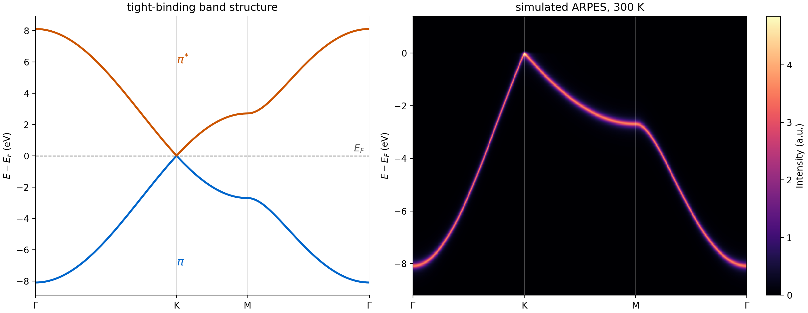
</p>

The graphene π bands and their simulated ARPES spectrum: the occupied band
is bright. The Fermi function at 300 K cuts off the unoccupied band.

<p align="center">
  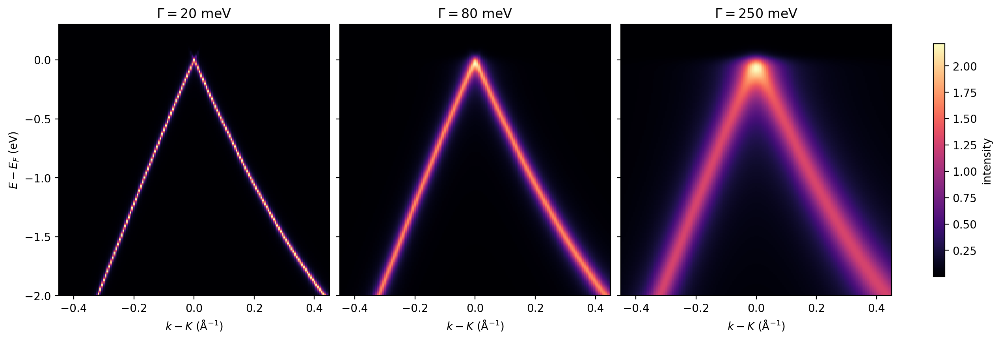
</p>

The self-energy is an explicit model parameter — the same cut at 20, 80,
and 250 meV linewidth.

<p align="center">
  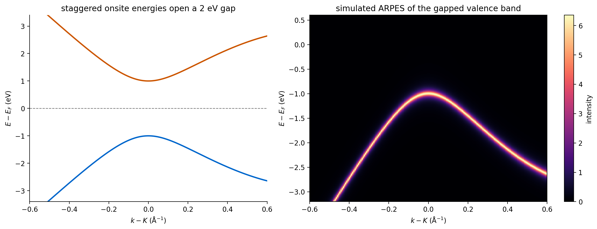
</p>

Stagger the two onsite energies and the Dirac crossing opens into a gap;
ARPES sees the valence band.

<p align="center">
  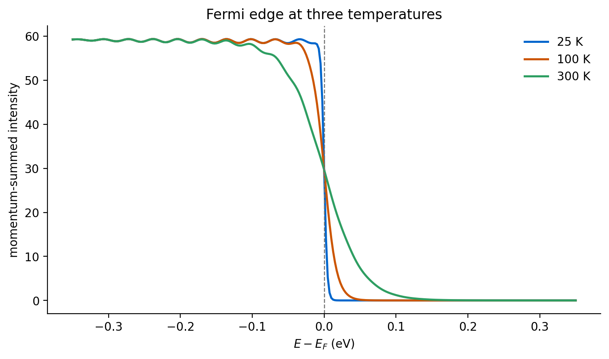
</p>

The Fermi edge at 25, 100, and 300 K.

## Across the Brillouin zone

<p align="center">
  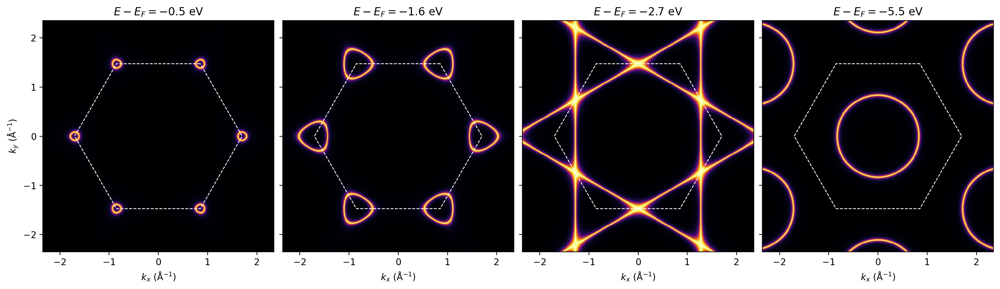
</p>

Constant-energy slices: Dirac points grow into trigonally warped pockets,
touch at the van Hove singularity, and close into a ring around Γ.

<p align="center">
  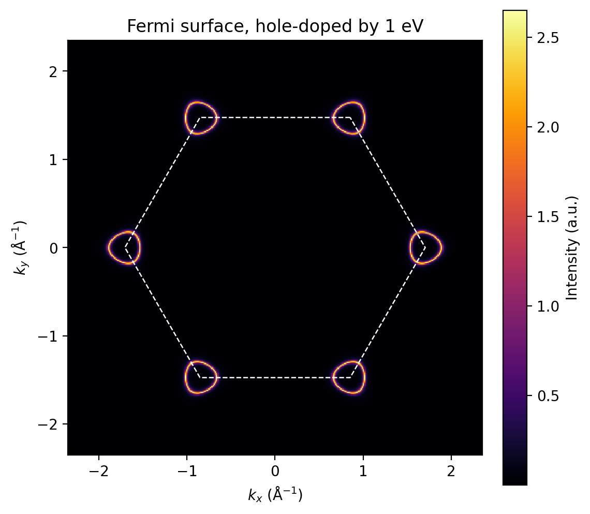
</p>

Move the Fermi level and the Fermi surface follows — hole-doped by 1 eV.

<p align="center">
  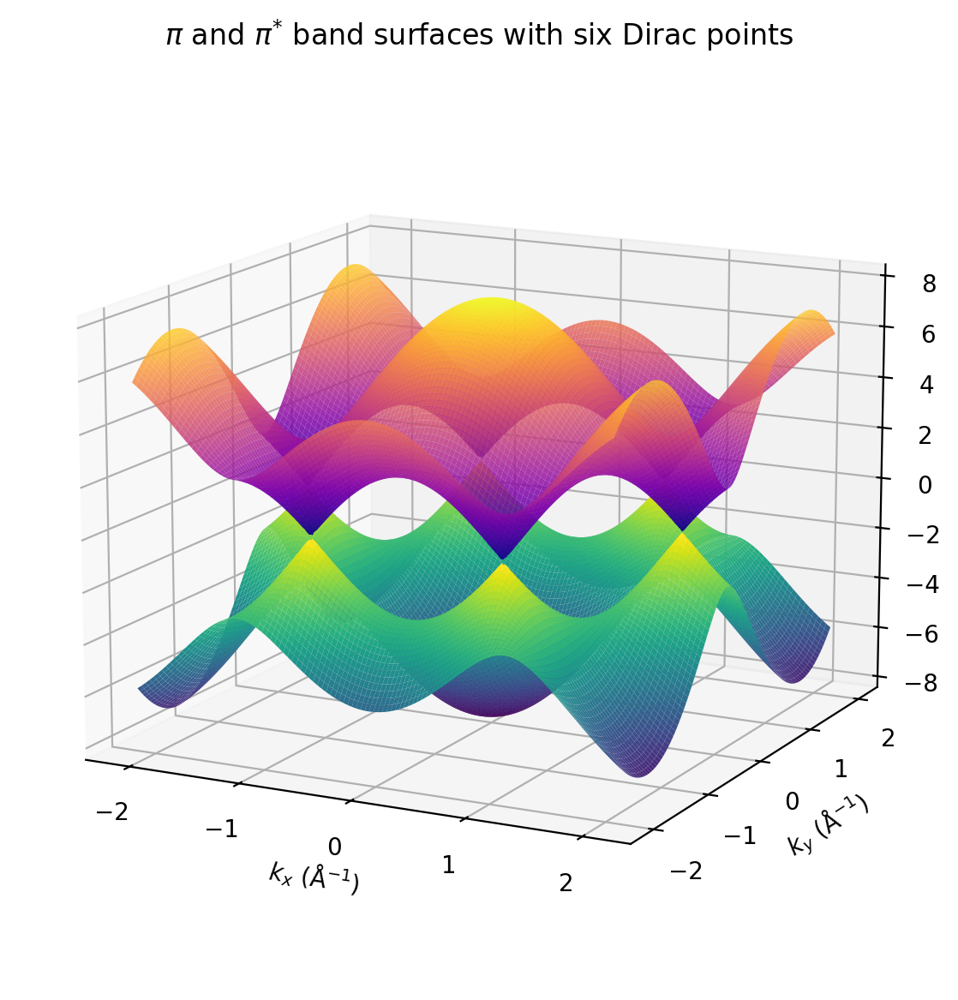
</p>

<p align="center">
  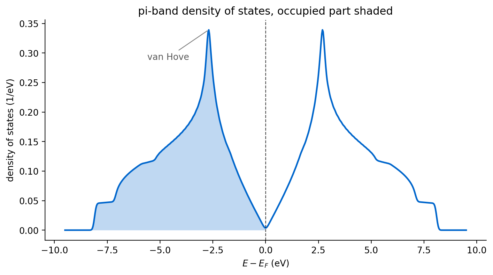
</p>

## The intensity cube

<p align="center">
  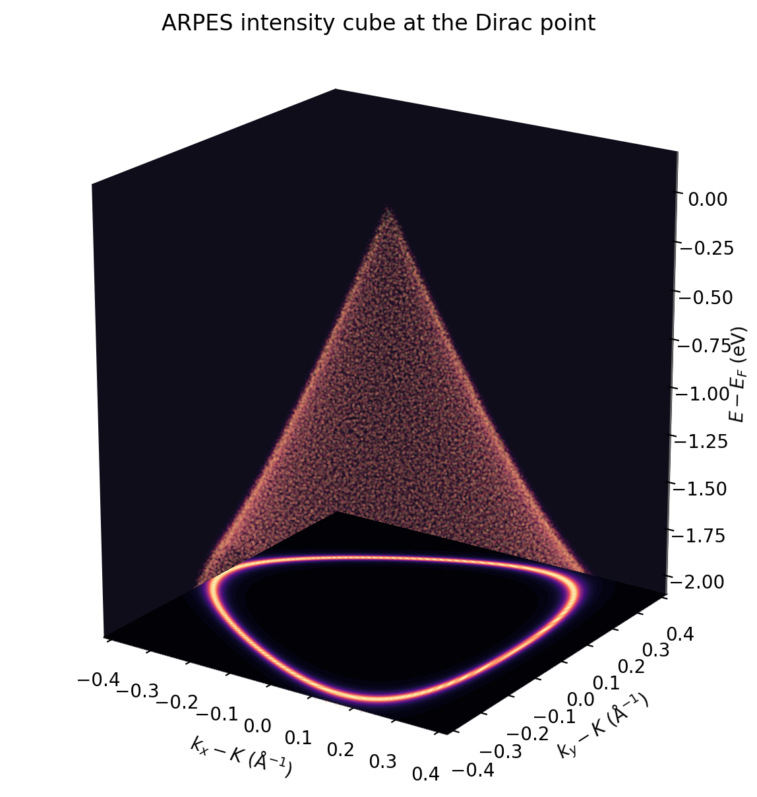
</p>

The full cube I(kx, ky, E) around one Dirac point, rendered by intensity
transparency over its deepest constant-energy slice.

<p align="center">
  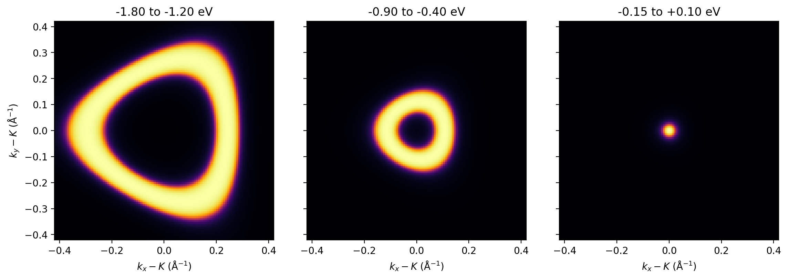
</p>

Energy-window integrals of the cube — rings collapse onto the cone apex.

<p align="center">
  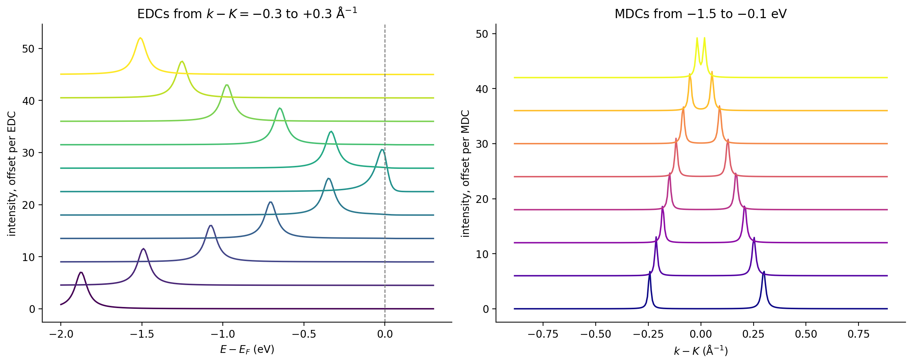
</p>

EDC and MDC stacks pulled from the same cut.

## Through the detector

<p align="center">
  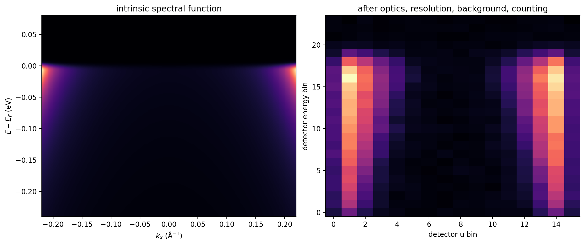
</p>

The same physics before and after the instrument: analyser calibration,
point-spread functions, transmission, background, exposure, and counting.

<p align="center">
  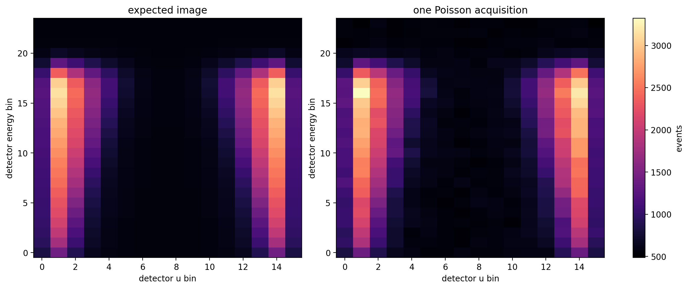
</p>

Expected counts and one reproducible Poisson acquisition.

<p align="center">
  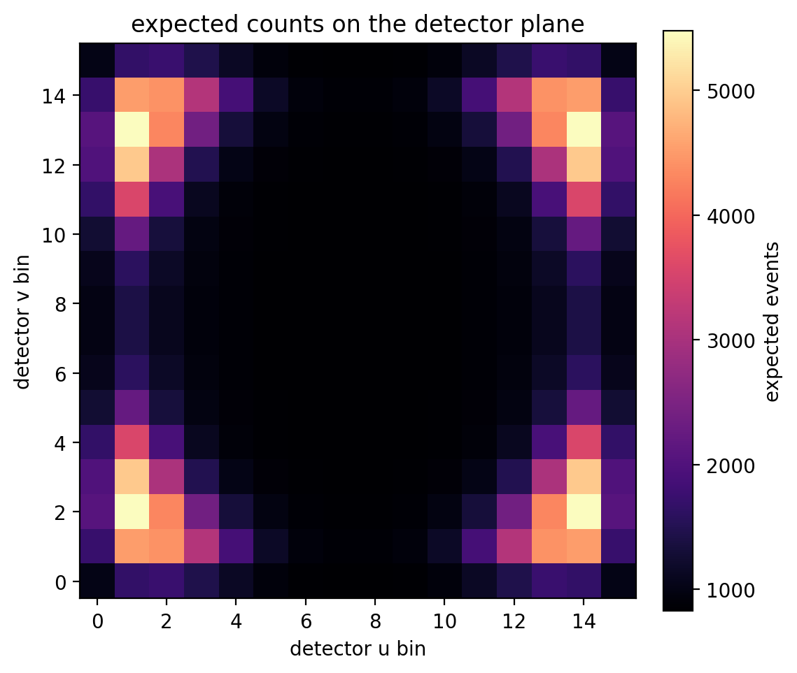
</p>

<p align="center">
  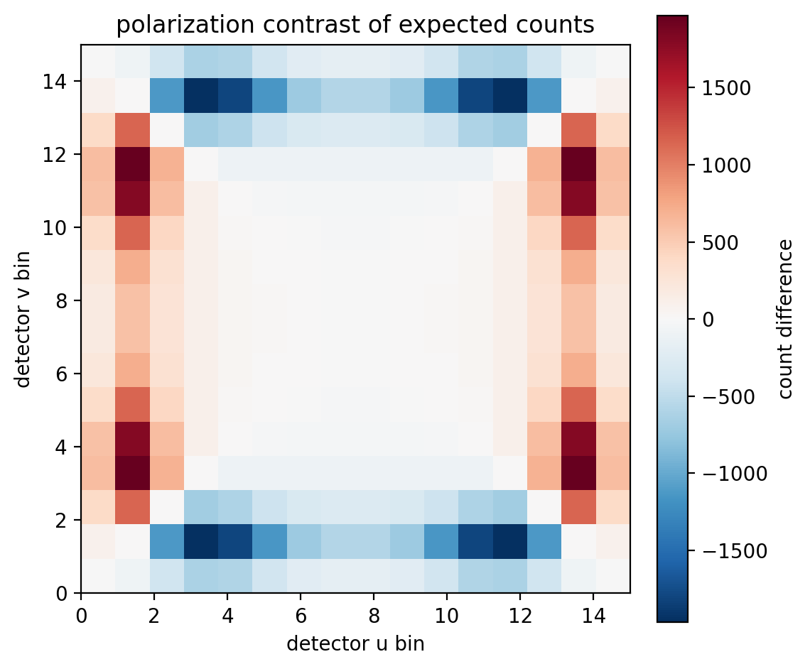
</p>

Rotate the photon polarization and difference the two acquisitions —
matrix-element contrast at the detector.

## First spectrum

This script is complete — a graphene π-band model, a momentum cut through
the Dirac point, and the finite-temperature spectral function:

```python
import jax.numpy as jnp
import matplotlib.pyplot as plt

from diffpes.plots import plot_arpes_spectrum
from diffpes.simul import assemble_spectral_intensity_bands_chunk
from diffpes.tightb import (
    build_kpath,
    diagonalize_tb,
    kpath_arc_length,
    kpoints_frac_to_cart,
)
from diffpes.types import (
    make_arpes_spectrum,
    make_crystal_geometry,
    make_orbital_basis,
    make_self_energy_model,
    make_tb_model,
)

# Graphene pi bands: two carbon sites, six nearest-neighbour hoppings.
a = 2.46
crystal = make_crystal_geometry(
    lattice=jnp.asarray(
        [[a, 0.0, 0.0], [a / 2, a * 3**0.5 / 2, 0.0], [0.0, 0.0, 20.0]]
    ),
    positions=jnp.asarray([[0.0, 0.0, 0.0], [1 / 3, 1 / 3, 0.0]]),
    species=("C", "C"),
)
basis = make_orbital_basis(
    atom_indices=(0, 1), n=(2, 2), l=(0, 0), m=(0, 0), labels=("pz_A", "pz_B")
)
model = make_tb_model(
    hopping_amplitudes=-2.7 * jnp.ones(6, dtype=jnp.complex128),
    onsite_energies=jnp.zeros(2),
    soc_lambdas=jnp.zeros(0),
    geometry=crystal,
    basis=basis,
    hopping_pairs=((0, 1), (0, 1), (0, 1), (1, 0), (1, 0), (1, 0)),
    hopping_cells=(
        (0, 0, 0), (-1, 0, 0), (0, -1, 0),
        (0, 0, 0), (1, 0, 0), (0, 1, 0),
    ),
    shell_index=(-1, -1),
)

# A straight momentum cut through the Dirac point at K.
path = build_kpath(
    jnp.asarray([[0.0, 0.0, 0.0], [0.5, 1.0, 0.0]]),
    crystal,
    301,
    ("Gamma", "K'"),
)
bands = diagonalize_tb(model, path.kpoints)

# Occupied spectral function: Lorentzian self-energy + Fermi cutoff at 300 K.
energies = jnp.linspace(-9.2, 1.2, 480)
intensity = assemble_spectral_intensity_bands_chunk(
    bands.eigenvalues,
    jnp.ones((path.kpoints.shape[0], energies.shape[0], 2)),
    energies,
    make_self_energy_model(gamma=0.09),
    jnp.asarray(0.0),
    300.0,
    allow_degenerate_value_only=True,
)
spectrum = make_arpes_spectrum(
    intensity,
    energies,
    kpath_arc_length(path, crystal),
    kpoints_frac_to_cart(path.kpoints, crystal),
)
plot_arpes_spectrum(spectrum, cmap="magma")
plt.show()
```

## From DFT

<p align="center">
  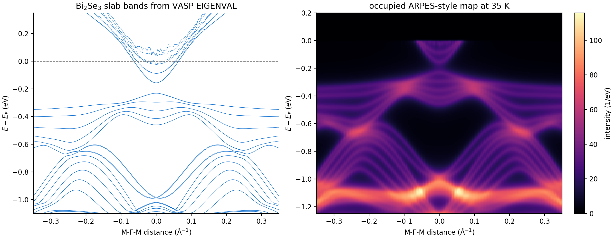
</p>

A real material, straight from VASP output: the Bi₂Se₃ slab bands along
M–Γ–M and their occupied spectrum at 35 K.

<p align="center">
  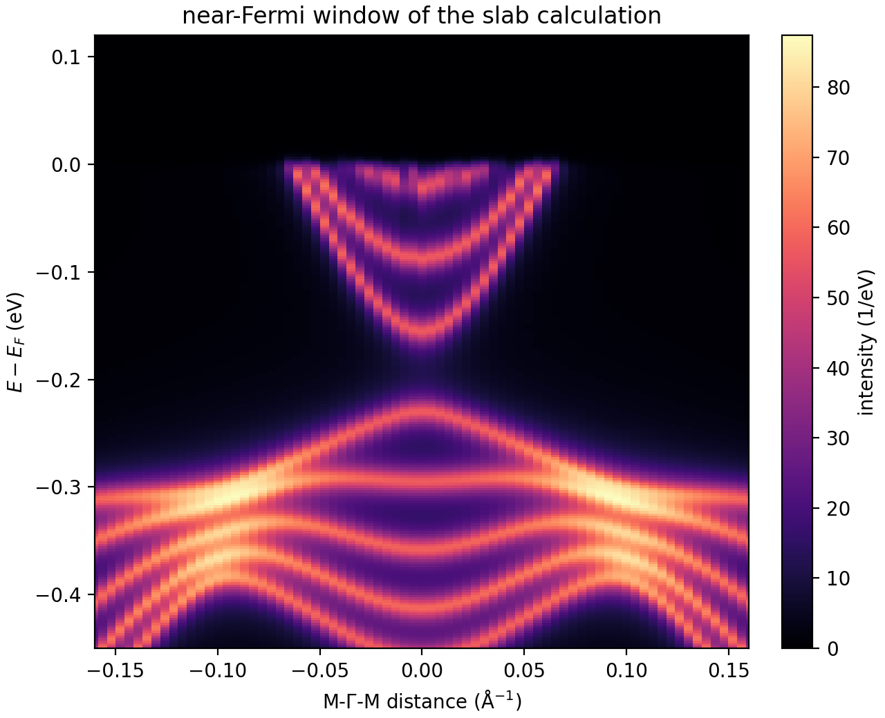
</p>

The near-Fermi window of the same calculation, sharpened to a 12 meV
linewidth.

<p align="center">
  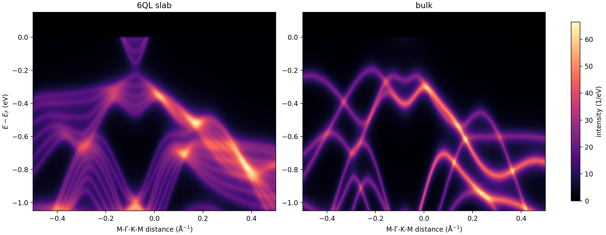
</p>

Slab and bulk calculations on the same M–Γ–K–M path: the slab carries
states inside the bulk gap.

<p align="center">
  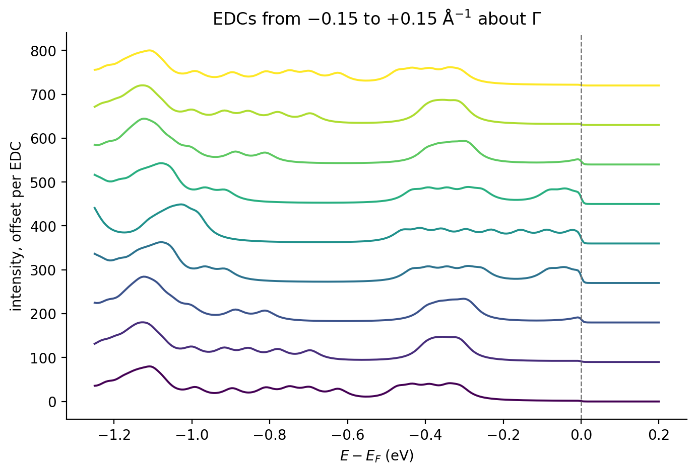
</p>

EDCs around Γ from the same map.

<p align="center">
  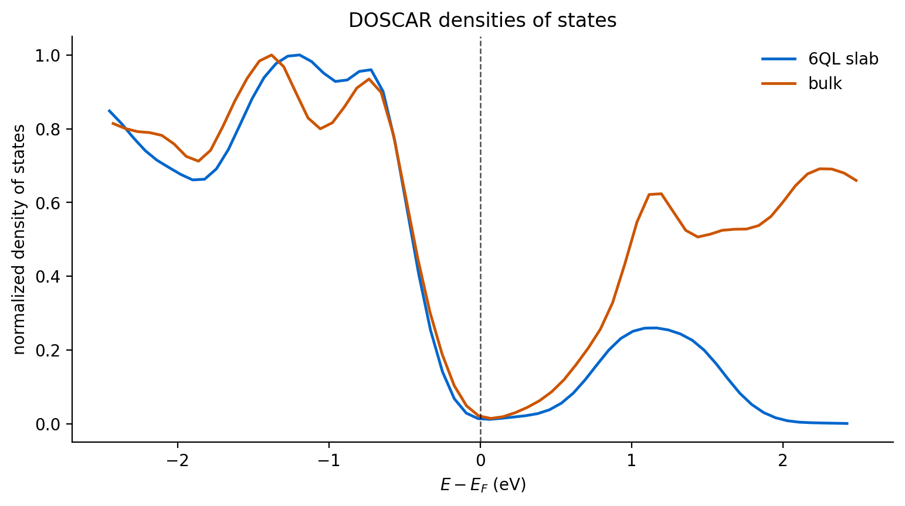
</p>

<p align="center">
  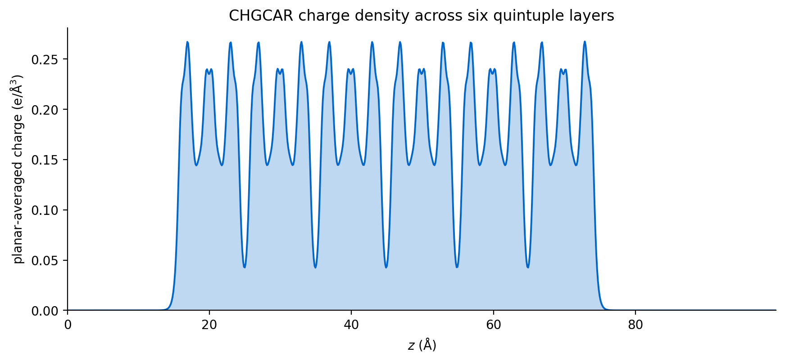
</p>

DOSCAR densities of states and the CHGCAR charge density, resolving all
six quintuple layers.

`diffpes.inout` reads `EIGENVAL`, `PROCAR`, `POSCAR`, `KPOINTS`, `OUTCAR`,
`DOSCAR`, `CHGCAR`, `WAVECAR`, Wannier90 `hr.dat`/`tb.dat`, and Cartesian
hopping lists. Parsed eigenvalues and orbital projections drop into the same
spectral calls as tight-binding models, so a converged VASP calculation
becomes a simulated ARPES measurement.

## Differentiable end to end

`jax.grad`, `jax.vmap`, and `jax.jit` work through the whole pipeline —
crystal geometry, hoppings, self-energy, matrix elements, experiment
geometry, and detector response to expected counts. Fit any of it to
measured spectra by gradient descent.

## Agent-runnable experiments

The `automatons/` directory provides standalone experiments for automated
diffpes workflows.
Each file supports discovery, parameter validation, smoke execution, and a
final JSON result.

Run a small example with:

```bash
JAX_PLATFORMS=cpu MPLCONFIGDIR=/tmp/dp-mpl .venv/bin/python \
  automatons/forward_bands.py --smoke --outdir /tmp/dp-bands --json
```

Read the [experiment catalog](https://github.com/debangshu-mukherjee/diffpes/blob/main/automatons/INDEX.md)
before selecting a file.
Read the [agent guide](https://github.com/debangshu-mukherjee/diffpes/blob/main/docs/source/guides/running-experiments-as-an-agent.md)
for the complete execution protocol.
