# Minimal Intrinsic ARPES Spectrum

Start with an ARPES spectrum immediately. This first calculation uses a two-orbital graphene tight-binding model on one momentum line.
It assigns uniform photoemission weight to every band and a constant Lorentzian linewidth.
It omits final-state, beamline, and detector effects. Those assumptions isolate the part of
`I(k, E)` set by dispersion, occupation, and lifetime broadening.

Tutorial 2 keeps this fast intrinsic source but removes the one-line momentum
cut: it builds the full `I(kx, ky, E)` cube.


## 1. Set the Minimal Source Assumptions

The electronic structure is intentionally small so every calculation is quick.
`make_tb_model` is the source-specific step: replace it with a Wannier or
tight-binding Hamiltonian once you have one for your material. At this stage,
the spectrum has equal band visibility and one momentum-independent linewidth.


```python
import os

os.environ["JAX_PLATFORMS"] = "cpu"

import diffpes as dp
import jax.numpy as jnp
import numpy as np


FERMI_ENERGY_EV = 0.00
TEMPERATURE_K = 40.0
LINEWIDTH_EV = 0.025

lattice_constant_ang = 2.46
crystal = dp.types.make_crystal_geometry(
    lattice=jnp.asarray(
        [
            [lattice_constant_ang, 0.0, 0.0],
            [
                lattice_constant_ang / 2.0,
                lattice_constant_ang * jnp.sqrt(3.0) / 2.0,
                0.0,
            ],
            [0.0, 0.0, 12.0],
        ]
    ),
    positions=jnp.asarray(
        [[0.0, 0.0, 0.0], [1.0 / 3.0, 1.0 / 3.0, 0.0]]
    ),
    species=("C", "C"),
)
basis = dp.types.make_orbital_basis(
    atom_indices=(0, 1),
    n=(2, 2),
    l=(1, 1),
    m=(0, 0),
    labels=("A pz", "B pz"),
)
model = dp.types.make_tb_model(
    hopping_amplitudes=-2.7 * jnp.ones(6, dtype=jnp.complex128),
    onsite_energies=jnp.zeros(2),
    soc_lambdas=jnp.zeros(0),
    geometry=crystal,
    basis=basis,
    hopping_pairs=((0, 1), (0, 1), (0, 1), (1, 0), (1, 0), (1, 0)),
    hopping_cells=(
        (0, 0, 0),
        (-1, 0, 0),
        (0, -1, 0),
        (0, 0, 0),
        (1, 0, 0),
        (0, 1, 0),
    ),
    shell_index=(-1, -1),
)
```

## 2. Simulate the Spectrum Immediately

The first result is the occupied intensity map. It is the fast answer to
what this minimal Hamiltonian predicts before any matrix-element or detector
assumptions are introduced. `plot_spectral_cut` renders the intensity on
physical axes with a Fermi line and a momentum guide at K.


```python
path_fractional = jnp.linspace(
    jnp.asarray([0.47, 1.0 / 3.0, 0.0]),
    jnp.asarray([0.86, 1.0 / 3.0, 0.0]),
    401,
)
path_cartesian = dp.tightb.kpoints_frac_to_cart(path_fractional, crystal)
path_distance = np.asarray(
    jnp.linalg.norm(path_cartesian - path_cartesian[0], axis=1)
)
dirac_path_index = path_fractional.shape[0] // 2
path_distance = path_distance - path_distance[dirac_path_index]
path_eigenvalues = dp.tightb.eigvalsh_bands(model, path_fractional)
path_relative_energy = np.asarray(path_eigenvalues) - FERMI_ENERGY_EV
energy_axis = jnp.linspace(-3.0, 0.18, 401)
band_weights = jnp.broadcast_to(
    jnp.ones_like(path_eigenvalues)[:, None, :],
    (
        path_eigenvalues.shape[0],
        energy_axis.shape[0],
        path_eigenvalues.shape[1],
    ),
)
intensity = dp.simul.assemble_spectral_intensity_bands_chunk(
    path_eigenvalues,
    band_weights,
    energy_axis,
    dp.types.make_self_energy_model(gamma=LINEWIDTH_EV),
    jnp.asarray(FERMI_ENERGY_EV),
    TEMPERATURE_K,
    allow_degenerate_value_only=True,
)

fig, ax, image = dp.plots.plot_spectral_cut(
    intensity,
    path_distance,
    energy_axis,
    momentum_guides=(0.0,),
    xlabel=r"momentum through K ($\AA^{-1}$)",
    title="intrinsic ARPES spectrum from the minimal model",
)
```


    
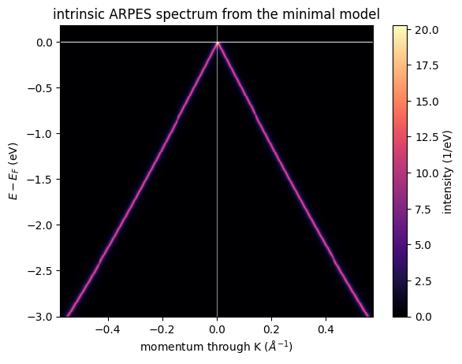
    


## 3. Plot the Model Bands

This momentum cut passes through K and crosses the Dirac cone. The energy axis
is always reported as `E - E_F`, which is also the convention of the spectral
assembler below. `plot_band_dispersion` draws the band lines with the Fermi
guide.


```python
path_fractional = jnp.linspace(
    jnp.asarray([0.47, 1.0 / 3.0, 0.0]),
    jnp.asarray([0.86, 1.0 / 3.0, 0.0]),
    401,
)
path_cartesian = dp.tightb.kpoints_frac_to_cart(path_fractional, crystal)
path_distance = np.asarray(
    jnp.linalg.norm(
        path_cartesian - path_cartesian[0], axis=1
    )
)
dirac_path_index = path_fractional.shape[0] // 2
path_distance = path_distance - path_distance[dirac_path_index]
path_eigenvalues = dp.tightb.eigvalsh_bands(model, path_fractional)
path_relative_energy = (
    np.asarray(path_eigenvalues) - FERMI_ENERGY_EV
)

fig, ax, lines = dp.plots.plot_band_dispersion(
    path_relative_energy,
    momentum_axis=path_distance,
    color="tab:blue",
    xlabel=r"momentum through K ($\AA^{-1}$)",
    title="minimal graphene bands",
)
```


    
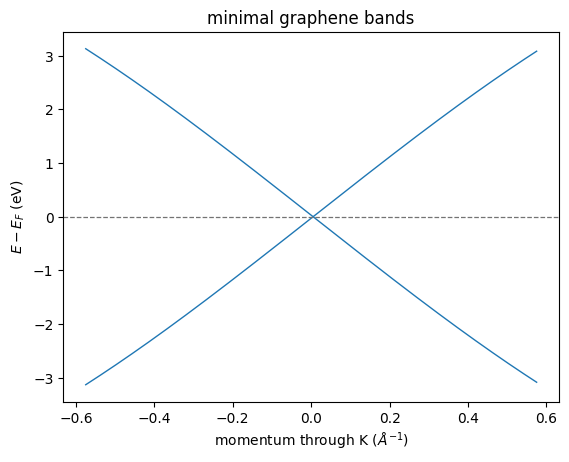
    


## 4. Locate the Bands Inside the Spectrum

The same intensity is now overlaid with the bare band loci. This separates the
dispersion from the spectral redistribution caused by the Fermi function and
the intrinsic linewidth. `plot_bands_over_spectrum` draws thin white band
lines over the intensity image.


```python
fig, ax, image = dp.plots.plot_bands_over_spectrum(
    intensity,
    path_distance,
    energy_axis,
    path_relative_energy,
    xlabel=r"momentum through K ($\AA^{-1}$)",
    title="bare bands over the intrinsic ARPES spectrum",
)
```


    
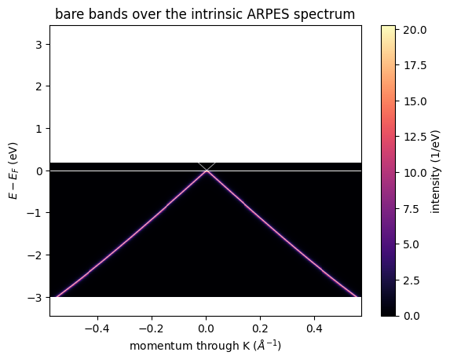
    


## 5. Read Energy and Momentum Cuts

An EDC follows intensity against energy at one momentum. An MDC follows
intensity against momentum at one energy. They are the two quick diagnostics
for linewidths, dispersions, and peak positions. `plot_edc_mdc_panels` draws
both cuts side by side and states each selected value in the panel titles.


```python
selected_path_index = int(0.78 * (path_distance.shape[0] - 1))
selected_k_inv_ang = float(path_distance[selected_path_index])
selected_energy_ev = -0.60
selected_energy_index = int(
    np.argmin(np.abs(np.asarray(energy_axis) - selected_energy_ev))
)

fig, axes, lines = dp.plots.plot_edc_mdc_panels(
    intensity,
    path_distance,
    energy_axis,
    k_value=selected_k_inv_ang,
    energy_value=selected_energy_ev,
)
```


    
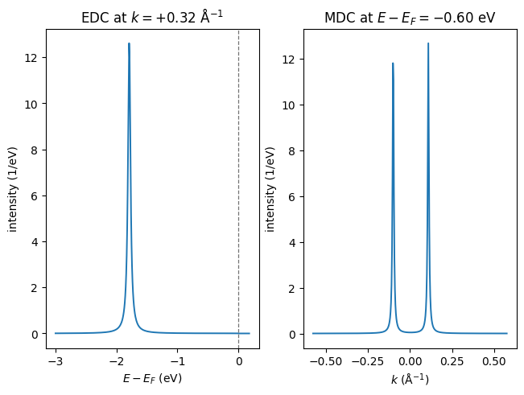
    


## 6. Vary the Lifetime Broadening

Change `LINEWIDTH_EV` above for the simulation you want to inspect. The
comparison below shows the direct spectral consequence of a 20 meV and an
80 meV intrinsic linewidth at the same momentum. `plot_curve_family` overlays
the two labeled EDCs on one energy axis.


```python
narrow_intensity = dp.simul.assemble_spectral_intensity_bands_chunk(
    path_eigenvalues,
    band_weights,
    energy_axis,
    dp.types.make_self_energy_model(gamma=0.020),
    jnp.asarray(FERMI_ENERGY_EV),
    TEMPERATURE_K,
    allow_degenerate_value_only=True,
)
broad_intensity = dp.simul.assemble_spectral_intensity_bands_chunk(
    path_eigenvalues,
    band_weights,
    energy_axis,
    dp.types.make_self_energy_model(gamma=0.080),
    jnp.asarray(FERMI_ENERGY_EV),
    TEMPERATURE_K,
    allow_degenerate_value_only=True,
)
fig, ax, lines = dp.plots.plot_curve_family(
    energy_axis,
    (
        narrow_intensity[selected_path_index],
        broad_intensity[selected_path_index],
    ),
    labels=("20 meV linewidth", "80 meV linewidth"),
    xlabel=r"$E - E_F$ (eV)",
    ylabel="intensity (1/eV)",
    title="linewidth control in one EDC",
)
guide = ax.axvline(0.0, color="0.35", linewidth=0.8)
```


    
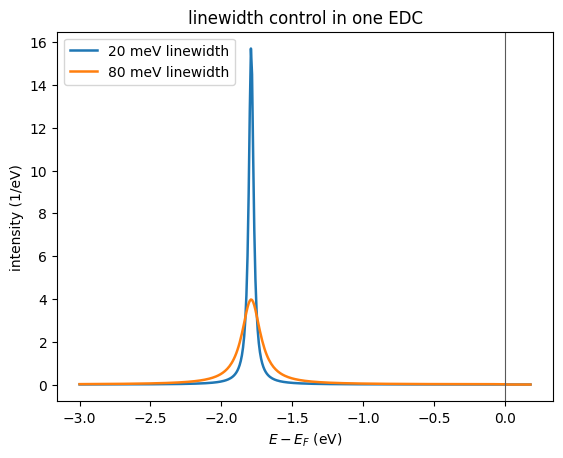
    


## 7. Compare Line Shapes and Intrinsic Controls

These views make the simple source assumptions inspectable.
`plot_distribution_curves` stacks selected EDCs and MDCs that follow the cone.
`plot_spectral_cut_series` compares the two linewidth maps on one shared color
scale. `plot_curve_family` contrasts fixed-position cuts, and
`plot_momentum_profile` integrates the occupied weight over one energy window.


```python
probe_path_indices = (dirac_path_index - 90, dirac_path_index, dirac_path_index + 90)
probe_colors = ("tab:blue", "tab:green", "tab:orange")
edc_positions = tuple(float(path_distance[index]) for index in probe_path_indices)
fig, ax, lines = dp.plots.plot_distribution_curves(
    intensity,
    path_distance,
    energy_axis,
    kind="edc",
    positions=edc_positions,
    colors=probe_colors,
    title="EDCs trace the two sides of the Dirac cone",
)

mdc_energies_ev = (-1.20, -0.80, -0.40)
fig, ax, lines = dp.plots.plot_distribution_curves(
    intensity,
    path_distance,
    energy_axis,
    kind="mdc",
    positions=mdc_energies_ev,
    colors=probe_colors,
    xlabel=r"momentum through K ($\AA^{-1}$)",
    title="MDC peaks approach K toward the Dirac point",
)
ax.axvline(0.0, color="0.35", linewidth=0.8)

fig, axes, images = dp.plots.plot_spectral_cut_series(
    (narrow_intensity, broad_intensity),
    path_distance,
    energy_axis,
    titles=("20 meV intrinsic linewidth", "80 meV intrinsic linewidth"),
    xlabel=r"momentum through K ($\AA^{-1}$)",
)

fig, ax, lines = dp.plots.plot_curve_family(
    path_distance,
    (
        narrow_intensity[:, selected_energy_index],
        broad_intensity[:, selected_energy_index],
    ),
    labels=("20 meV linewidth", "80 meV linewidth"),
    xlabel=r"momentum through K ($\AA^{-1}$)",
    ylabel="intensity (1/eV)",
    title=f"linewidth control in the MDC at {selected_energy_ev:.2f} eV",
)
ax.axvline(0.0, color="0.35", linewidth=0.8)

hot_intensity = dp.simul.assemble_spectral_intensity_bands_chunk(
    path_eigenvalues,
    band_weights,
    energy_axis,
    dp.types.make_self_energy_model(gamma=LINEWIDTH_EV),
    jnp.asarray(FERMI_ENERGY_EV),
    250.0,
    allow_degenerate_value_only=True,
)
near_fermi = np.asarray(energy_axis) >= -0.25
fig, ax, lines = dp.plots.plot_curve_family(
    np.asarray(energy_axis)[near_fermi],
    (
        np.asarray(intensity)[dirac_path_index, near_fermi],
        np.asarray(hot_intensity)[dirac_path_index, near_fermi],
    ),
    labels=("40 K", "250 K"),
    xlabel=r"$E - E_F$ (eV)",
    ylabel="intensity (1/eV)",
    title="temperature rounds the occupied Fermi edge at K",
)
ax.axvline(0.0, color="0.35", linewidth=0.8)

fig, ax, line = dp.plots.plot_momentum_profile(
    intensity,
    path_distance,
    energy_axis,
    energy_window=(-1.00, -0.20),
    color="tab:purple",
    xlabel=r"momentum through K ($\AA^{-1}$)",
    ylabel="energy-integrated intensity",
    title="occupied spectral weight from -1.00 to -0.20 eV",
)
guide = ax.axvline(0.0, color="0.35", linewidth=0.8)
```


    
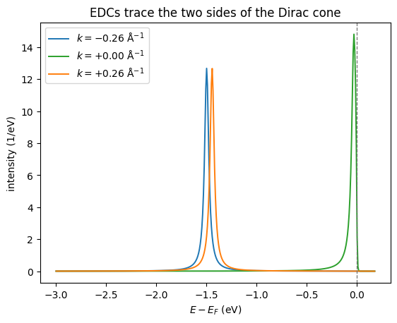
    


    
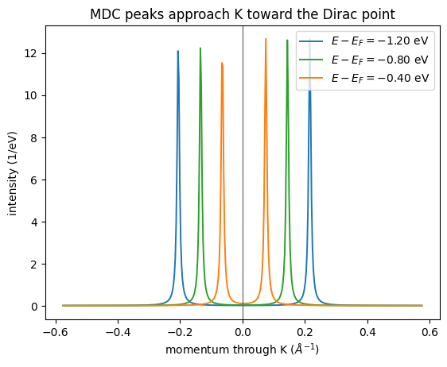
    


    
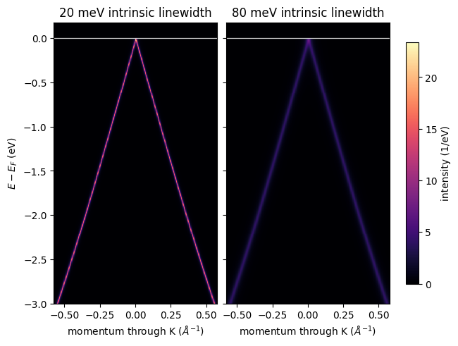
    


    
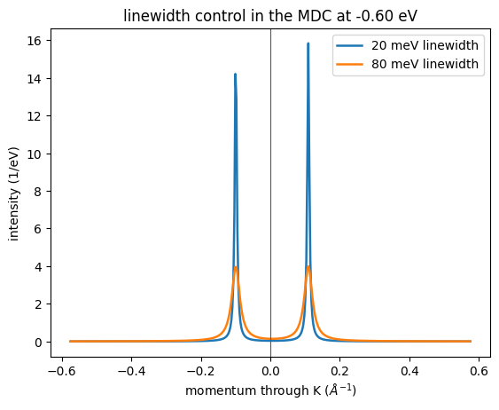
    


    
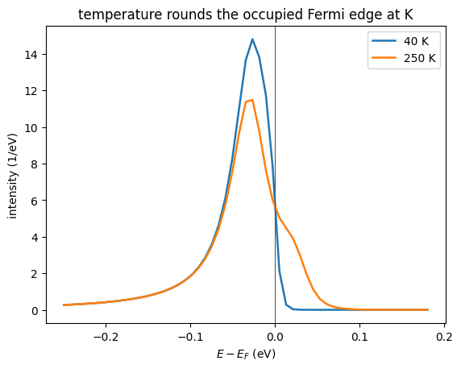
    


    
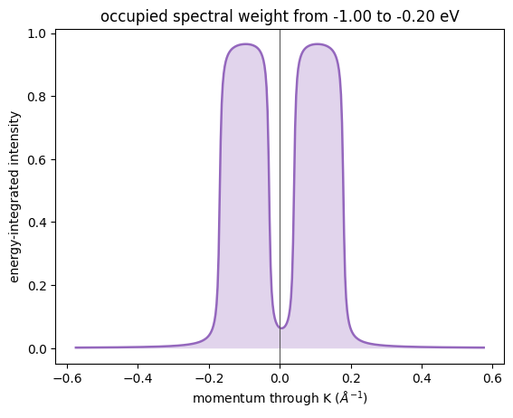
    

