# Intrinsic ARPES Cube

Tutorial 1 treated ARPES as a single momentum cut. Here that geometric approximation is relaxed.
One high-resolution `I(kx, ky, E)` source cube appears as a transparent volume.
It also supplies energy-momentum cuts, constant-energy maps, energy windows, EDCs, and MDCs.

The source remains deliberately simple: graphene tight binding, uniform band
weight, a constant linewidth, and no final state, beamline, or detector.
Tutorial 3 replaces the compact dispersion with a material-specific VASP band
calculation.


## 1. Keep the Minimal Source, Add In-Plane Momentum

The raster spans one Dirac point. `n_k` and `n_energy` are the two resolution
controls; reduce them for an interactive draft or increase them for a denser
final figure. This is an intrinsic source volume, not a detector-count cube.


```python
import os

os.environ["JAX_PLATFORMS"] = "cpu"

import jax.numpy as jnp
import matplotlib.pyplot as plt
import numpy as np

from diffpes.plots import (
    plot_cube_scatter,
    plot_curve_family,
    plot_distribution_curves,
    plot_momentum_map_grid,
    plot_spectral_cut,
    plot_spectral_cut_series,
)
from diffpes.simul import (
    assemble_spectral_intensity_bands_chunk,
    constant_energy_slice,
    energy_window_map,
)
from diffpes.tightb import eigvalsh_bands, kpoints_cart_to_frac, kpoints_frac_to_cart
from diffpes.types import (
    make_arpes_cube,
    make_crystal_geometry,
    make_orbital_basis,
    make_self_energy_model,
    make_tb_model,
    slice_edc,
    slice_mdc,
)

n_k = 121
n_energy = 181
lattice_constant_ang = 2.46
crystal = make_crystal_geometry(
    lattice=jnp.asarray(
        [
            [lattice_constant_ang, 0.0, 0.0],
            [
                lattice_constant_ang / 2.0,
                lattice_constant_ang * jnp.sqrt(3.0) / 2.0,
                0.0,
            ],
            [0.0, 0.0, 12.0],
        ]
    ),
    positions=jnp.asarray(
        [[0.0, 0.0, 0.0], [1.0 / 3.0, 1.0 / 3.0, 0.0]]
    ),
    species=("C", "C"),
)
basis = make_orbital_basis(
    atom_indices=(0, 1),
    n=(2, 2),
    l=(1, 1),
    m=(0, 0),
    labels=("A pz", "B pz"),
)
model = make_tb_model(
    hopping_amplitudes=-2.7 * jnp.ones(6, dtype=jnp.complex128),
    onsite_energies=jnp.zeros(2),
    soc_lambdas=jnp.zeros(0),
    geometry=crystal,
    basis=basis,
    hopping_pairs=((0, 1), (0, 1), (0, 1), (1, 0), (1, 0), (1, 0)),
    hopping_cells=(
        (0, 0, 0),
        (-1, 0, 0),
        (0, -1, 0),
        (0, 0, 0),
        (1, 0, 0),
        (0, 1, 0),
    ),
    shell_index=(-1, -1),
)
dirac_fractional = jnp.asarray([[2.0 / 3.0, 1.0 / 3.0, 0.0]])
dirac_cartesian = np.asarray(
    kpoints_frac_to_cart(dirac_fractional, crystal)[0]
)
half_width_inv_ang = 0.55
kx_axis = jnp.linspace(
    dirac_cartesian[0] - half_width_inv_ang,
    dirac_cartesian[0] + half_width_inv_ang,
    n_k,
)
ky_axis = jnp.linspace(
    dirac_cartesian[1] - half_width_inv_ang,
    dirac_cartesian[1] + half_width_inv_ang,
    n_k,
)
mesh_kx, mesh_ky = jnp.meshgrid(kx_axis, ky_axis, indexing="ij")
cartesian_kpoints = jnp.stack(
    (mesh_kx, mesh_ky, jnp.zeros_like(mesh_kx)), axis=-1
).reshape((-1, 3))
fractional_kpoints = kpoints_cart_to_frac(cartesian_kpoints, crystal)
eigenvalues = eigvalsh_bands(model, fractional_kpoints)
energy_axis = jnp.linspace(-1.60, 0.12, n_energy)
cube_weights = jnp.ones(
    (eigenvalues.shape[0], energy_axis.shape[0], eigenvalues.shape[1])
)
cube_flat = assemble_spectral_intensity_bands_chunk(
    eigenvalues,
    cube_weights,
    energy_axis,
    make_self_energy_model(gamma=0.025),
    jnp.asarray(0.0),
    40.0,
    allow_degenerate_value_only=True,
)
cube = make_arpes_cube(
    cube_flat.reshape((n_k, n_k, n_energy)),
    kx_axis,
    ky_axis,
    energy_axis,
    provenance="high-resolution graphene source cube",
)
cube_intensity = np.asarray(cube.intensity)
```

## 2. Read the Center Spectrum First

Before rotating the cube, look at its two central energy-momentum cuts. They
are the direct high-resolution ARPES spectra through the Dirac point.
`plot_spectral_cut_series` renders both cuts on one shared color scale with
one spanning colorbar. Both panels use the momentum axis relative to the K
point, so the two cuts align.


```python
center_index = n_k // 2
relative_momentum = np.asarray(cube.kx_axis) - dirac_cartesian[0]
fig, axes = plt.subplots(
    1, 2, figsize=(12.0, 4.8), sharey=True, constrained_layout=True
)
plot_spectral_cut_series(
    (cube_intensity[:, center_index, :], cube_intensity[center_index, :, :]),
    relative_momentum,
    cube.energy_axis,
    titles=(r"central $k_x-E$ spectrum", r"central $k_y-E$ spectrum"),
    axes=tuple(axes),
    xlabel=r"$k - K$ ($\mathrm{\AA}^{-1}$)",
)
plt.show()
```


    
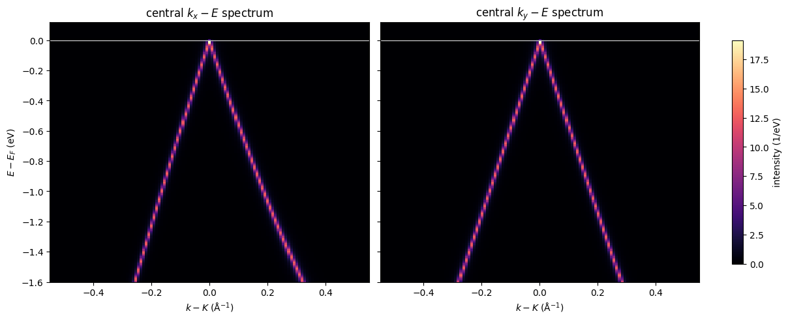
    


## 3. See the Source Cube in Three Dimensions

A sparse thresholded point cloud keeps the volume transparent.
`plot_cube_scatter` draws every voxel of a stride-4 display cube above an
intensity floor of 0.006 of the cube maximum. Bright points carry more
opacity, so both branches and their changing cross-sections remain visible
at once.


```python
display_stride = 4
display_cube = make_arpes_cube(
    cube.intensity[::display_stride, ::display_stride, ::display_stride],
    cube.kx_axis[::display_stride],
    cube.ky_axis[::display_stride],
    cube.energy_axis[::display_stride],
    provenance="down-sampled display cube",
)
fig, ax, points = plot_cube_scatter(
    display_cube,
    intensity_floor=0.006,
    cmap="inferno",
    point_size=5.0,
    alpha_power=0.5,
    alpha_scale=0.85,
    elev=22.0,
    azim=-54.0,
    title="transparent ARPES intensity volume",
)
plt.show()
```


    
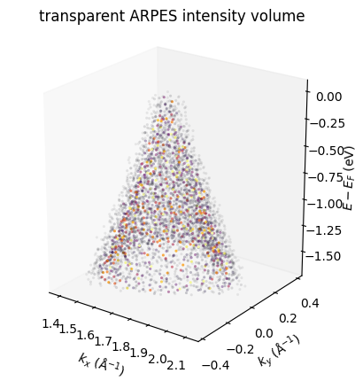
    


## 4. Move the Momentum Cuts Away From the Center

Offset `kx-E` and `ky-E` views show how a cut changes when it misses the
Dirac point. `plot_spectral_cut_series` keeps both panels on one common
color scale, so the intensity comparison stays honest.


```python
offset_index = center_index + 24
fig, axes = plt.subplots(
    1, 2, figsize=(12.0, 4.6), sharey=True, constrained_layout=True
)
plot_spectral_cut_series(
    (cube_intensity[:, offset_index, :], cube_intensity[offset_index, :, :]),
    relative_momentum,
    cube.energy_axis,
    titles=(r"$k_x-E$ cut at offset $k_y$", r"$k_y-E$ cut at offset $k_x$"),
    axes=tuple(axes),
    xlabel=r"$k - K$ ($\mathrm{\AA}^{-1}$)",
)
plt.show()
```


    
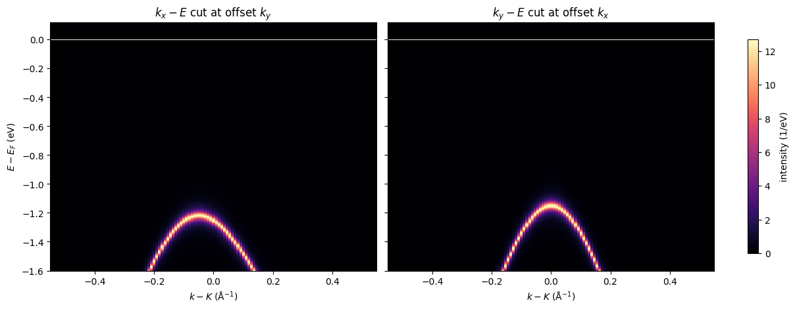
    


## 5. Inspect Constant-Energy Maps

`constant_energy_slice` interpolates the volume at the requested energy.
`plot_momentum_map_grid` places the three slices on one shared color scale.
The pockets contract toward the Dirac point as the slice approaches the
Fermi level.


```python
slice_energies_ev = (-1.20, -0.65, -0.20)
fig, axes = plt.subplots(
    1, 3, figsize=(12.6, 3.9), sharey=True, constrained_layout=True
)
plot_momentum_map_grid(
    tuple(
        constant_energy_slice(cube, slice_energy_ev)
        for slice_energy_ev in slice_energies_ev
    ),
    cube.kx_axis,
    cube.ky_axis,
    titles=tuple(
        f"E = {slice_energy_ev:.2f} eV"
        for slice_energy_ev in slice_energies_ev
    ),
    axes=tuple(axes),
    colorbar_label="intensity (1/eV)",
)
plt.show()
```


    
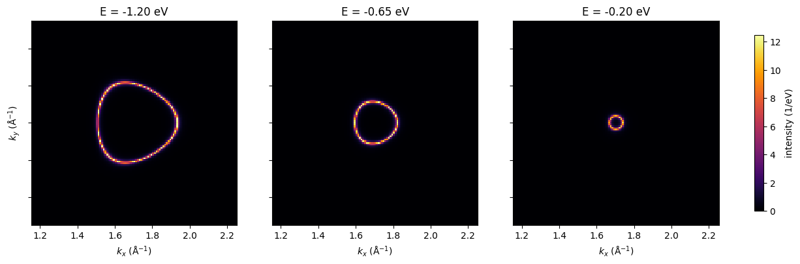
    


## 6. Integrate the Windows You Measure

Energy-window maps are usually more robust than a single sampled plane.
`energy_window_map` integrates the cube over finite binding-energy
intervals, and `plot_momentum_map_grid` compares the three windows on one
scale.


```python
energy_windows_ev = ((-1.35, -1.10), (-0.78, -0.52), (-0.30, -0.08))
fig, axes = plt.subplots(
    1, 3, figsize=(12.6, 3.9), sharey=True, constrained_layout=True
)
plot_momentum_map_grid(
    tuple(
        energy_window_map(cube, lower_ev, upper_ev)
        for lower_ev, upper_ev in energy_windows_ev
    ),
    cube.kx_axis,
    cube.ky_axis,
    titles=tuple(
        f"{lower_ev:.2f} to {upper_ev:.2f} eV"
        for lower_ev, upper_ev in energy_windows_ev
    ),
    axes=tuple(axes),
    colorbar_label="integrated intensity",
)
plt.show()
```


    
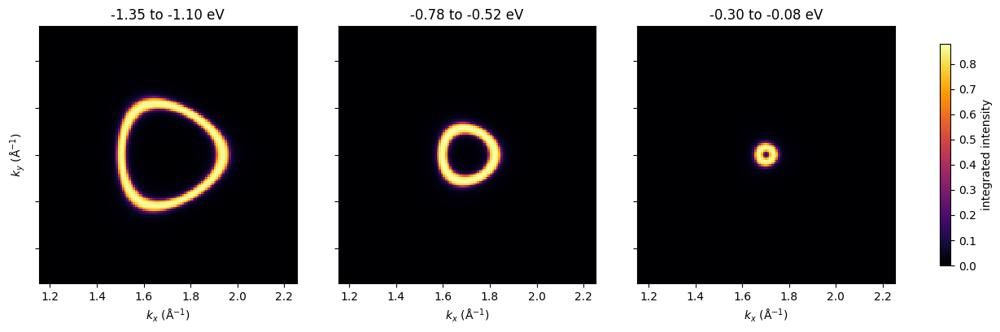
    


## 7. Extract an EDC and an MDC From the Cube

The public slicers interpolate on the stored physical axes. This keeps a
chosen momentum or energy meaningful even when you later change the raster
density. `plot_curve_family` draws each interpolated curve on its own
panel.


```python
edc_kx = float(cube.kx_axis[center_index + 18])
edc_ky = float(cube.ky_axis[center_index])
mdc_energy_ev = -0.65
edc = slice_edc(cube, edc_kx, edc_ky)
mdc_map = slice_mdc(cube, mdc_energy_ev)
fig, axes = plt.subplots(1, 2, figsize=(11.0, 3.8))
plot_curve_family(
    cube.energy_axis,
    (edc,),
    ax=axes[0],
    colors=("tab:blue",),
    xlabel=r"$E - E_F$ (eV)",
    ylabel="intensity (1/eV)",
    title="interpolated EDC",
)
axes[0].axvline(0.0, color="0.35", linewidth=0.8)
plot_curve_family(
    cube.kx_axis,
    (mdc_map[:, center_index],),
    ax=axes[1],
    colors=("tab:orange",),
    xlabel=r"$k_x$ ($\mathrm{\AA}^{-1}$)",
    ylabel="intensity (1/eV)",
    title=f"central MDC at {mdc_energy_ev:.2f} eV",
)
plt.show()
```


    
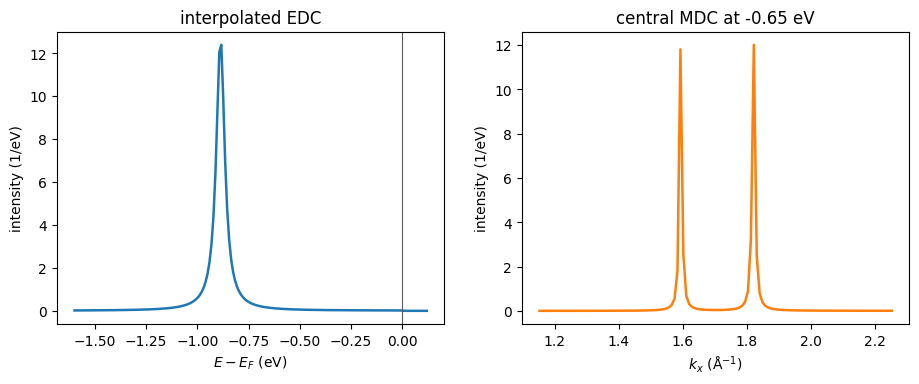
    


## 8. Compare More Views of the Same Simulated Cube

The remaining figures follow the same simulated intensity through diagonal
and parallel cuts, line-shape series, peak loci, and a broad
occupied-energy map. `plot_spectral_cut`, `plot_spectral_cut_series`,
`plot_distribution_curves`, `plot_curve_family`, and
`plot_momentum_map_grid` render these complementary reductions of one
source cube.


```python
diagonal_indices = np.arange(n_k)
diagonal_momentum = np.sqrt(2.0) * (np.asarray(cube.kx_axis) - dirac_cartesian[0])
plot_spectral_cut(
    cube_intensity[diagonal_indices, diagonal_indices, :],
    diagonal_momentum,
    cube.energy_axis,
    momentum_guides=(0.0,),
    xlabel=r"diagonal momentum through K ($\mathrm{\AA}^{-1}$)",
    title="diagonal energy-momentum spectrum through the cube",
)
plt.show()

parallel_indices = (center_index - 24, center_index, center_index + 24)
parallel_titles = tuple(
    fr"$k_y-K_y$ = {float(cube.ky_axis[ky_index] - dirac_cartesian[1]):+.2f}"
    + r" $\AA^{-1}$"
    for ky_index in parallel_indices
)
fig, axes = plt.subplots(
    1, 3, figsize=(13.0, 4.2), sharey=True, constrained_layout=True
)
plot_spectral_cut_series(
    tuple(cube_intensity[:, ky_index, :] for ky_index in parallel_indices),
    cube.kx_axis,
    cube.energy_axis,
    titles=parallel_titles,
    axes=tuple(axes),
    xlabel=r"$k_x$ ($\mathrm{\AA}^{-1}$)",
)
plt.show()

edc_indices = (center_index - 30, center_index, center_index + 30)
edc_positions = tuple(
    float(cube.kx_axis[kx_index] - dirac_cartesian[0])
    for kx_index in edc_indices
)
plot_distribution_curves(
    cube_intensity[:, center_index, :],
    relative_momentum,
    cube.energy_axis,
    kind="edc",
    positions=edc_positions,
    colors=("tab:blue", "tab:green", "tab:orange"),
    legend_title=r"$k_x-K_x$",
    title="EDC series along the central $k_x$ cut",
)
plt.show()

mdc_series_energies = (-1.20, -0.80, -0.40)
fig, ax, mdc_lines = plot_distribution_curves(
    cube_intensity[:, center_index, :],
    relative_momentum,
    cube.energy_axis,
    kind="mdc",
    positions=mdc_series_energies,
    colors=("tab:blue", "tab:green", "tab:orange"),
    xlabel=r"$k_x-K_x$ ($\mathrm{\AA}^{-1}$)",
    title="MDC series contracts toward the Dirac point",
)
ax.axvline(0.0, color="0.35", linewidth=0.8)
plt.show()

central_cut = cube_intensity[:, center_index, :]
left_peak_indices = np.argmax(central_cut[:center_index, :], axis=0)
right_peak_indices = center_index + np.argmax(central_cut[center_index:, :], axis=0)
peak_energy_mask = (np.asarray(cube.energy_axis) >= -1.25) & (
    np.asarray(cube.energy_axis) <= -0.12
)
fig, ax, branch_lines = plot_curve_family(
    np.asarray(cube.energy_axis)[peak_energy_mask],
    (
        np.asarray(cube.kx_axis)[left_peak_indices][peak_energy_mask]
        - dirac_cartesian[0],
        np.asarray(cube.kx_axis)[right_peak_indices][peak_energy_mask]
        - dirac_cartesian[0],
    ),
    labels=("left MDC maximum", "right MDC maximum"),
    colors=("tab:blue", "tab:orange"),
    xlabel=r"$E - E_F$ (eV)",
    ylabel=r"$k_x-K_x$ ($\mathrm{\AA}^{-1}$)",
    title="Dirac dispersion recovered from central-cut MDC maxima",
)
ax.axhline(0.0, color="0.35", linewidth=0.8)
plt.show()

occupied_map = energy_window_map(cube, -1.50, -0.10)
plot_momentum_map_grid(
    (occupied_map,),
    cube.kx_axis,
    cube.ky_axis,
    titles=("occupied momentum distribution from -1.50 to -0.10 eV",),
    crosshair=(float(dirac_cartesian[0]), float(dirac_cartesian[1])),
    colorbar_label="energy-integrated intensity",
)
plt.show()
```


    
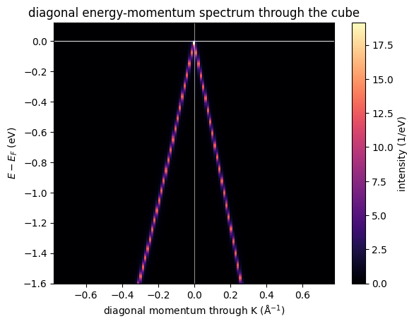
    


    
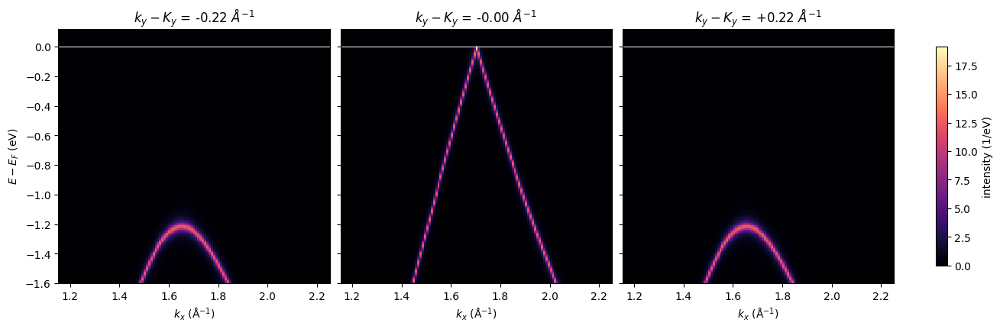
    


    
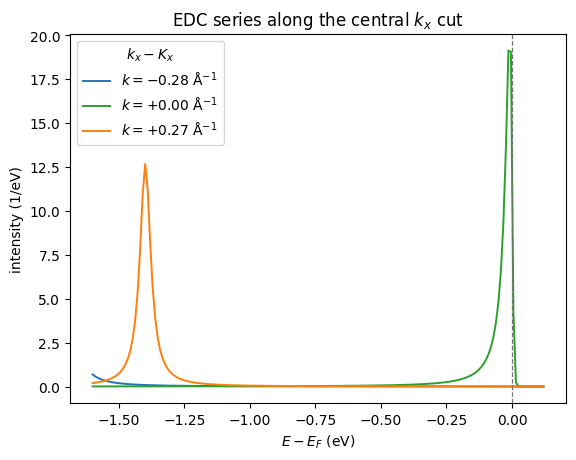
    


    
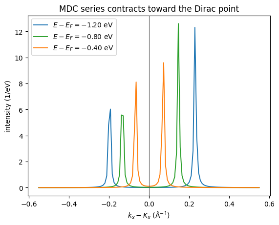
    


    
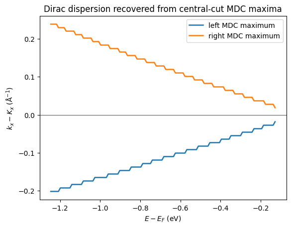
    


    
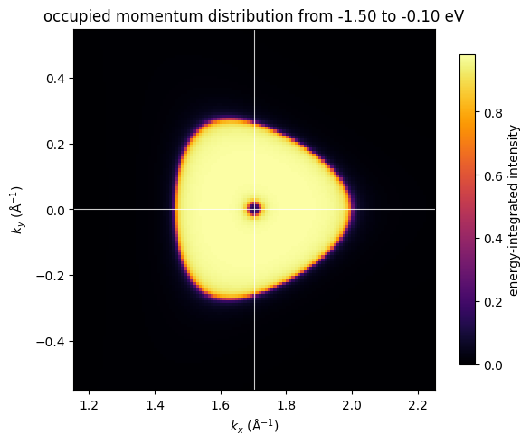
    

