# VASP Bands to an ARPES-Style Map

Tutorials 1 and 2 used a compact model to expose the simulation workflow. This
notebook relaxes the source-model approximation: point it at a line-mode VASP
calculation and turn its material-specific bands into a physical `I(k, E)`
map. The bundled Bi2Se3 paths are only a runnable example.

The map still uses equal band weights and a constant linewidth. `EIGENVAL` does not carry the phases needed for a coherent matrix-element calculation.
This is therefore an intrinsic ARPES-style spectral proxy, not a prediction of absolute brightness. A line-mode VASP run also cannot make a material cube;
that needs a 2D/3D mesh or a Wannier/tight-binding Hamiltonian. Tutorial 4
adds orbital contrast from PROCAR.


## 1. Replace the Toy Dispersion With Your VASP Run

Keep POSCAR, OUTCAR, EIGENVAL, and KPOINTS from the same calculation. If the
Fermi energy is in DOSCAR rather than OUTCAR, replace the one `read_outcar`
call with that value. Set `PATH_LABEL` for the symmetry path in your own run.
The bundled example paths are relative to this notebook's directory. The
import cell loads the VASP readers, the spectral assembler, and the plotting
functions from `diffpes.plots`.


```python
import os

os.environ["JAX_PLATFORMS"] = "cpu"

import jax.numpy as jnp
import matplotlib.pyplot as plt
import numpy as np
from pathlib import Path

import diffpes as dp

CALCULATION_DIR = (
    Path("..") / ".." / "data" / "DFT" / "Bi2Se3" / "6QL" / "Output few bands"
)
BAND_DIR = CALCULATION_DIR / "MGM"
POSCAR_PATH = CALCULATION_DIR / "POSCAR"
OUTCAR_PATH = CALCULATION_DIR / "OUTCAR_SCF"
EIGENVAL_PATH = BAND_DIR / "EIGENVAL"
KPOINTS_PATH = BAND_DIR / "KPOINTS"
PATH_LABEL = "M-Gamma-M"

for required_path in (
    POSCAR_PATH,
    OUTCAR_PATH,
    EIGENVAL_PATH,
    KPOINTS_PATH,
):
    assert required_path.is_file(), required_path
```

## 2. Simulate the Intrinsic ARPES Map First

`read_eigenval` keeps absolute VASP eigenvalues. The cell below shifts the
display to the Fermi level, centers the bundled path on Gamma, and immediately
assembles the occupied intrinsic spectrum. `plot_spectral_cut` renders the
occupied intensity on the physical path with the Fermi line, a Gamma guide,
and the three MDC energies used later. `plot_band_dispersion` draws the same
eigenvalues as lines on the arc-length axis.


```python
fermi_energy_ev = float(dp.inout.read_outcar(str(OUTCAR_PATH)).fermi_energy)
geometry = dp.inout.read_poscar(str(POSCAR_PATH))
bands = dp.inout.read_eigenval(
    str(EIGENVAL_PATH), fermi_energy=fermi_energy_ev
)
kpath_info = dp.inout.read_kpoints(str(KPOINTS_PATH))
bands, kpath_info, _ = dp.inout.dedupe_band_path(bands, kpath_info)
k_distance = np.asarray(
    dp.tightb.kpath_arc_length(dp.types.make_kpath(bands.kpoints), geometry)
)
relative_energies = np.asarray(bands.eigenvalues) - fermi_energy_ev
gamma_index = int(
    np.argmin(np.linalg.norm(np.asarray(bands.kpoints), axis=1))
)
centered_k_distance = k_distance - k_distance[gamma_index]
energy_axis = jnp.linspace(-1.25, 0.20, 301)
visible_bands = np.any(
    (relative_energies >= float(energy_axis[0]) - 0.15)
    & (relative_energies <= float(energy_axis[-1]) + 0.15),
    axis=0,
)
spectral_eigenvalues = jnp.asarray(
    np.asarray(bands.eigenvalues)[:, visible_bands]
)
spectral_weights = jnp.ones(
    (
        spectral_eigenvalues.shape[0],
        energy_axis.shape[0],
        spectral_eigenvalues.shape[1],
    )
)
self_energy = dp.types.make_self_energy_model(gamma=0.030)
arpes_intensity = dp.simul.assemble_spectral_intensity_bands_chunk(
    spectral_eigenvalues,
    spectral_weights,
    energy_axis,
    self_energy,
    jnp.asarray(fermi_energy_ev),
    35.0,
    allow_degenerate_value_only=True,
)
print("band block:", bands.eigenvalues.shape)
print("bands included in the map:", spectral_eigenvalues.shape[1])
print("Fermi energy (eV):", fermi_energy_ev)
```

    band block: (399, 176)
    bands included in the map: 56
    Fermi energy (eV): 0.0178


```python
selected_mdc_energies_ev = (-0.20, -0.50, -0.85)
fig, ax, image = dp.plots.plot_spectral_cut(
    arpes_intensity,
    centered_k_distance,
    energy_axis,
    energy_guides=selected_mdc_energies_ev,
    momentum_guides=(0.0,),
    xlabel=fr"{PATH_LABEL} distance ($\AA^{{-1}}$)",
    title="intrinsic ARPES-style spectrum from VASP bands",
)
plt.show()
```


    
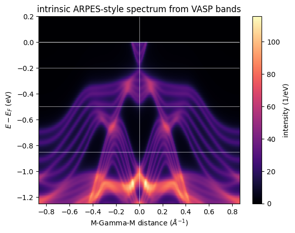
    


```python
fig, ax, lines = dp.plots.plot_band_dispersion(
    relative_energies,
    momentum_axis=centered_k_distance,
    color="tab:blue",
    linewidth=0.4,
    xlabel=fr"{PATH_LABEL} distance ($\AA^{{-1}}$)",
    title="VASP bands on the physical path",
)
ax.set_ylim(-5.0, 1.5)
plt.show()
```


    
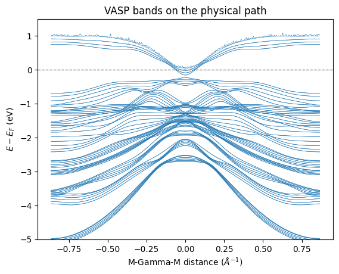
    


## 3. Relate the Image to the Band Structure

The image above is generated directly from these eigenvalues.
`plot_band_dispersion` shows the near-Fermi window that survives occupation.
`plot_band_scatter_weights` colors every state by its Fermi occupation at 35
K. `plot_bands_over_spectrum` overlays the retained bands on the intensity
image, so each bright ridge maps to one eigenvalue branch.


```python
fig, ax, lines = dp.plots.plot_band_dispersion(
    relative_energies,
    momentum_axis=centered_k_distance,
    color="tab:blue",
    linewidth=0.55,
    xlabel=fr"{PATH_LABEL} distance ($\AA^{{-1}}$)",
    title="near-Fermi VASP band window",
)
ax.set_xlim(-0.35, 0.35)
ax.set_ylim(-1.1, 0.35)
plt.show()
```


    
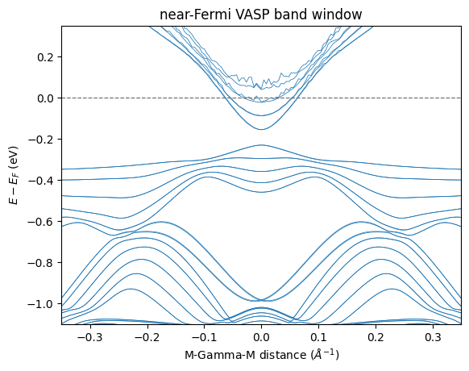
    


```python
temperature_k = 35.0
boltzmann_ev_per_k = 8.617333262e-5
occupation = 1.0 / (
    np.exp(np.clip(relative_energies / (boltzmann_ev_per_k * temperature_k), -60.0, 60.0))
    + 1.0
)
fig, ax, points = dp.plots.plot_band_scatter_weights(
    relative_energies,
    occupation,
    momentum_axis=centered_k_distance,
    mode="color",
    cmap="cividis",
    vmin=0.0,
    vmax=1.0,
    colorbar=True,
    colorbar_label="occupation",
    xlabel=fr"{PATH_LABEL} distance ($\AA^{{-1}}$)",
    title="Fermi occupation of the VASP bands",
)
ax.set_ylim(-1.25, 0.35)
plt.show()
```


    
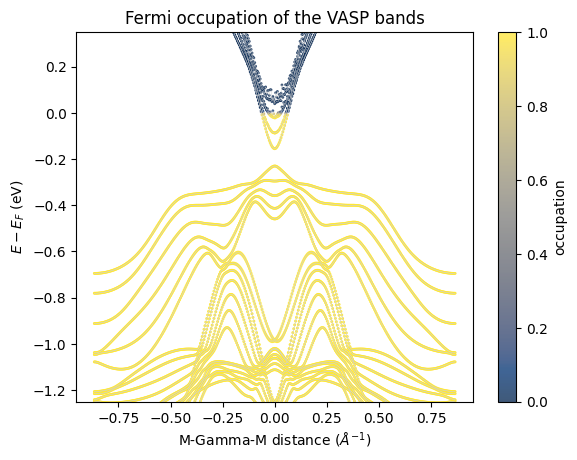
    


```python
fig, ax, image = dp.plots.plot_bands_over_spectrum(
    arpes_intensity,
    centered_k_distance,
    energy_axis,
    relative_energies[:, visible_bands],
    band_linewidth=0.35,
    band_alpha=0.45,
    xlabel=fr"{PATH_LABEL} distance ($\AA^{{-1}}$)",
    title="spectral intensity with the retained VASP bands",
)
plt.show()
```


    
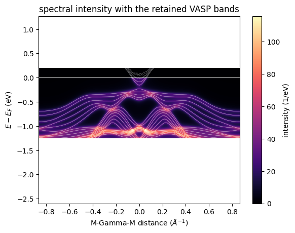
    


## 4. Check One EDC and One MDC

`plot_edc_mdc_panels` draws one energy cut at Gamma beside one momentum cut
at a fixed binding energy. These cuts make it easy to compare the simulated
linewidth and peak locations against an experimental cut through the same
path.


```python
gamma_index = int(np.argmin(np.abs(centered_k_distance)))
cut_energy_ev = -0.35
fig, axes, lines = dp.plots.plot_edc_mdc_panels(
    arpes_intensity,
    centered_k_distance,
    energy_axis,
    k_value=0.0,
    energy_value=cut_energy_ev,
)
plt.show()
```


    
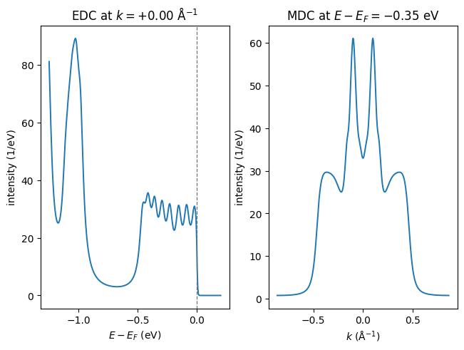
    


## 5. Inspect the Same Intensity in Experimental Views

These views are all cuts or finite integrations of the intrinsic map above.
`plot_spectral_cut` zooms into the near-Fermi window. `plot_momentum_profile`
integrates each binding-energy window with the trapezoid rule.
`plot_distribution_curves` stacks EDCs at three momenta and MDCs at the three
guide energies. `plot_curve_family` compares the Gamma EDC with the
path-integrated spectrum after each curve is scaled by its own maximum.


```python
fig, ax, image = dp.plots.plot_spectral_cut(
    arpes_intensity,
    centered_k_distance,
    energy_axis,
    momentum_guides=(0.0,),
    xlabel=fr"{PATH_LABEL} distance ($\AA^{{-1}}$)",
    title="near-Fermi intrinsic ARPES-style spectrum",
)
ax.set_xlim(-0.45, 0.45)
ax.set_ylim(-0.90, 0.12)
plt.show()
```


    
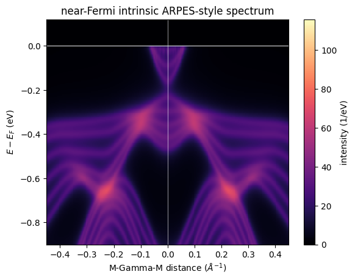
    


```python
energy_values = np.asarray(energy_axis)
energy_windows_ev = ((-0.20, -0.05), (-0.55, -0.35), (-1.00, -0.80))
fig, axes = plt.subplots(1, 3, figsize=(12.6, 3.8), sharey=True)
for ax, (lower_ev, upper_ev) in zip(axes, energy_windows_ev):
    dp.plots.plot_momentum_profile(
        arpes_intensity,
        centered_k_distance,
        energy_axis,
        (lower_ev, upper_ev),
        ax=ax,
        color="tab:purple",
        xlabel=fr"{PATH_LABEL} distance ($\AA^{{-1}}$)",
        ylabel="",
        title=f"{lower_ev:.2f} to {upper_ev:.2f} eV",
    )
    ax.axvline(0.0, color="0.45", linewidth=0.7)
axes[0].set_ylabel("window-integrated intensity")
fig.suptitle("momentum profiles from finite binding-energy windows")
plt.show()
```


    
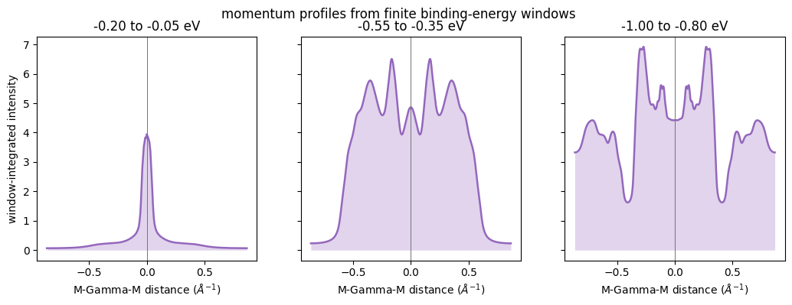
    


```python
edc_positions_inv_ang = (0.0, -0.18, 0.18)
fig, ax, lines = dp.plots.plot_distribution_curves(
    arpes_intensity,
    centered_k_distance,
    energy_axis,
    kind="edc",
    positions=edc_positions_inv_ang,
    title="EDC evolution across the near-Gamma states",
)
plt.show()
```


    
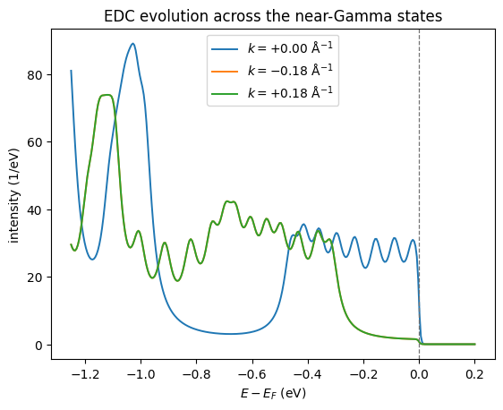
    


```python
fig, ax, lines = dp.plots.plot_distribution_curves(
    arpes_intensity,
    centered_k_distance,
    energy_axis,
    kind="mdc",
    positions=selected_mdc_energies_ev,
    xlabel=fr"{PATH_LABEL} distance ($\AA^{{-1}}$)",
    title="MDC evolution with binding energy",
)
ax.axvline(0.0, color="0.35", linewidth=0.8)
plt.show()
```


    
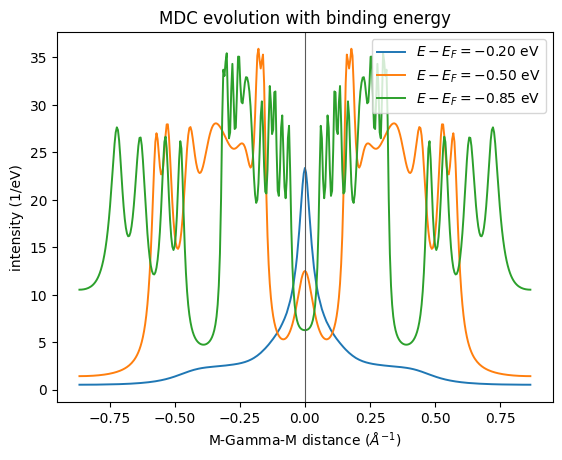
    


```python
gamma_edc = np.asarray(arpes_intensity[gamma_index])
path_integrated_edc = np.asarray(arpes_intensity).sum(axis=0)
fig, ax, lines = dp.plots.plot_curve_family(
    energy_values,
    (
        gamma_edc / gamma_edc.max(),
        path_integrated_edc / path_integrated_edc.max(),
    ),
    labels=("Gamma EDC", "path-integrated spectrum"),
    xlabel=r"$E - E_F$ (eV)",
    ylabel="normalized intensity",
    title="local and momentum-integrated spectral weight",
)
ax.axvline(0.0, color="0.35", linewidth=0.8)
plt.show()
```


    
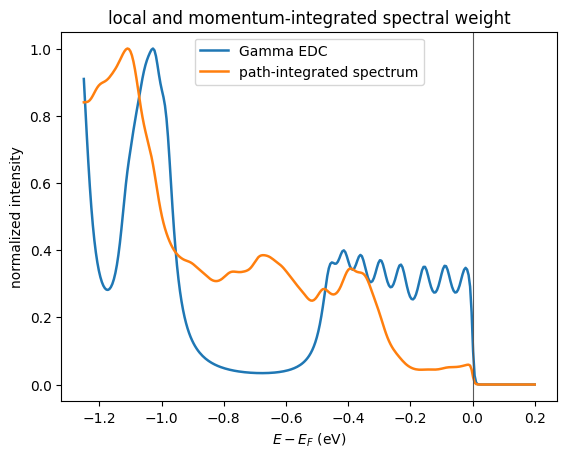
    


## 6. Test Broadening and Temperature Before Comparing Data

The intrinsic approximation leaves linewidth and occupation as explicit
controls. `plot_curve_family` compares the Gamma EDC at three self-energy
widths, then compares two temperatures in local and path-integrated views.
The first figure shows which change alters a peak width. The second shows
which change primarily moves the Fermi-edge cutoff.


```python
narrow_intensity = dp.simul.assemble_spectral_intensity_bands_chunk(
    spectral_eigenvalues,
    spectral_weights,
    energy_axis,
    dp.types.make_self_energy_model(gamma=0.015),
    jnp.asarray(fermi_energy_ev),
    35.0,
    allow_degenerate_value_only=True,
)
broad_intensity = dp.simul.assemble_spectral_intensity_bands_chunk(
    spectral_eigenvalues,
    spectral_weights,
    energy_axis,
    dp.types.make_self_energy_model(gamma=0.075),
    jnp.asarray(fermi_energy_ev),
    35.0,
    allow_degenerate_value_only=True,
)
fig, ax, lines = dp.plots.plot_curve_family(
    energy_values,
    (
        np.asarray(narrow_intensity[gamma_index]),
        np.asarray(arpes_intensity[gamma_index]),
        np.asarray(broad_intensity[gamma_index]),
    ),
    labels=("15 meV", "30 meV", "75 meV"),
    legend_title="self-energy gamma",
    xlabel=r"$E - E_F$ (eV)",
    ylabel=r"intensity (1/eV)",
    title="intrinsic linewidth changes the Gamma EDC",
)
ax.axvline(0.0, color="0.35", linewidth=0.8)
plt.show()
```


    
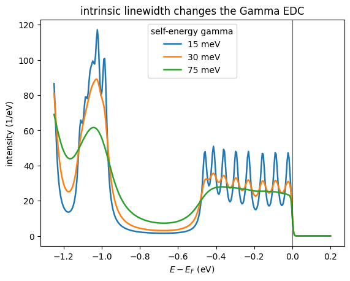
    


```python
cold_intensity = dp.simul.assemble_spectral_intensity_bands_chunk(
    spectral_eigenvalues,
    spectral_weights,
    energy_axis,
    self_energy,
    jnp.asarray(fermi_energy_ev),
    10.0,
    allow_degenerate_value_only=True,
)
warm_intensity = dp.simul.assemble_spectral_intensity_bands_chunk(
    spectral_eigenvalues,
    spectral_weights,
    energy_axis,
    self_energy,
    jnp.asarray(fermi_energy_ev),
    180.0,
    allow_degenerate_value_only=True,
)
fig, axes = plt.subplots(1, 2, figsize=(11.2, 3.8), sharey=True)
dp.plots.plot_curve_family(
    energy_values,
    (
        np.asarray(cold_intensity[gamma_index]),
        np.asarray(warm_intensity[gamma_index]),
    ),
    labels=("10 K", "180 K"),
    ax=axes[0],
    xlabel=r"$E - E_F$ (eV)",
    ylabel=r"intensity (1/eV)",
    title="Gamma EDC",
)
dp.plots.plot_curve_family(
    energy_values,
    (
        np.asarray(cold_intensity).sum(axis=0),
        np.asarray(warm_intensity).sum(axis=0),
    ),
    labels=("10 K", "180 K"),
    ax=axes[1],
    legend=False,
    xlabel=r"$E - E_F$ (eV)",
    title="path-integrated spectrum",
)
for ax in axes:
    ax.axvline(0.0, color="0.35", linewidth=0.8)
plt.show()
```


    
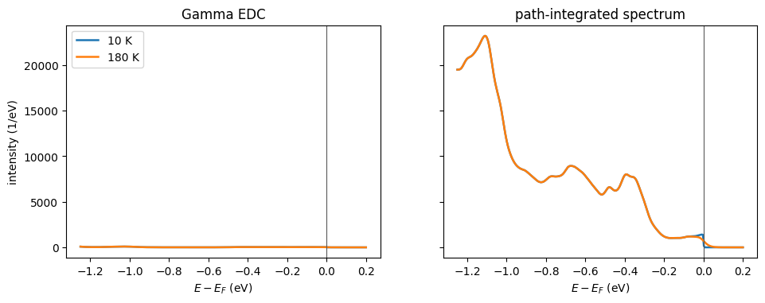
    

