# Orbital-Resolved ARPES From PROCAR

Tutorial 3 treated every VASP band as equally visible. This one relaxes that
assumption: PROCAR orbital populations supply scalar weights, revealing which
features are Pd d-like or Te p-like in a PdTe2 slab. Replace the paths with
one consistent VASP line-mode calculation of your own.

These are still orbital-weighted spectral proxies. Projection populations do
not carry phase interference or photon-energy-dependent final-state scattering,
so they are useful for feature selection rather than absolute ARPES brightness.
Tutorial 5 introduces a coherent matrix element and the instrument response.


## 1. Add Orbital Information to the VASP Band Path

EIGENVAL, KPOINTS, and PROCAR must describe the same path. The dimensional
consistency check catches the common mistake of mixing outputs from different
VASP runs. The bundled example paths are relative to this notebook's directory.


```python
import os

os.environ["JAX_PLATFORMS"] = "cpu"

import jax.numpy as jnp
import matplotlib.pyplot as plt
import numpy as np
from pathlib import Path

from diffpes.inout import (
    check_consistency,
    dedupe_band_path,
    read_eigenval,
    read_kpoints,
    read_outcar,
    read_poscar,
    read_procar,
)
from diffpes.plots import (
    plot_band_dispersion,
    plot_band_scatter_weights,
    plot_curve_family,
    plot_difference_map,
    plot_spectral_cut,
)
from diffpes.simul import assemble_spectral_intensity_bands_chunk
from diffpes.tightb import kpath_arc_length
from diffpes.types import make_kpath, make_self_energy_model

CALCULATION_DIR = (
    Path("..") / ".." / "data" / "DFT" / "PdTe2" / "4ML" / "Output"
)
BAND_DIR = CALCULATION_DIR / "MGM"
POSCAR_PATH = (
    Path("..") / ".." / "data" / "DFT" / "PdTe2" / "4ML" / "PdTe2_4ML_0x_0y_0z.vasp"
)
OUTCAR_PATH = BAND_DIR / "OAM DATA" / "OUTCAR"
EIGENVAL_PATH = BAND_DIR / "EIGENVAL"
KPOINTS_PATH = BAND_DIR / "KPOINTS"
PROCAR_PATH = BAND_DIR / "PROCAR"
PATH_LABEL = "M-Gamma-M"

for required_path in (
    POSCAR_PATH,
    OUTCAR_PATH,
    EIGENVAL_PATH,
    KPOINTS_PATH,
    PROCAR_PATH,
):
    assert required_path.is_file(), required_path

fermi_energy_ev = float(read_outcar(str(OUTCAR_PATH)).fermi_energy)
geometry = read_poscar(str(POSCAR_PATH))
bands = read_eigenval(str(EIGENVAL_PATH), fermi_energy=fermi_energy_ev)
kpath_info = read_kpoints(str(KPOINTS_PATH))
projection = read_procar(str(PROCAR_PATH), return_mode="full")
check_consistency(bands, projection, kpath_info)
bands, kpath_info, projection = dedupe_band_path(
    bands, kpath_info, projection
)
k_distance = np.asarray(
    kpath_arc_length(make_kpath(bands.kpoints), geometry)
)
relative_energies = np.asarray(bands.eigenvalues) - fermi_energy_ev
gamma_index = int(
    np.argmin(np.linalg.norm(np.asarray(bands.kpoints), axis=1))
)
centered_k_distance = k_distance - k_distance[gamma_index]
species = np.asarray(geometry.species)
pd_indices = np.nonzero(species == "Pd")[0]
te_indices = np.nonzero(species == "Te")[0]
energy_axis = jnp.linspace(-2.7, 0.20, 301)
visible_bands = np.any(
    (relative_energies >= float(energy_axis[0]) - 0.12)
    & (relative_energies <= float(energy_axis[-1]) + 0.12),
    axis=0,
)
spectral_eigenvalues = jnp.asarray(
    np.asarray(bands.eigenvalues)[:, visible_bands]
)
intrinsic_weights = jnp.ones(
    (
        spectral_eigenvalues.shape[0],
        energy_axis.shape[0],
        spectral_eigenvalues.shape[1],
    )
)
self_energy = make_self_energy_model(gamma=0.035)
intrinsic_intensity = assemble_spectral_intensity_bands_chunk(
    spectral_eigenvalues,
    intrinsic_weights,
    energy_axis,
    self_energy,
    jnp.asarray(fermi_energy_ev),
    45.0,
    allow_degenerate_value_only=True,
)
print("bands:", bands.eigenvalues.shape)
print("projection table:", projection.projections.shape)
print("bands included in the intrinsic map:", spectral_eigenvalues.shape[1])
```

    bands: (399, 144)
    projection table: (399, 144, 12, 9)
    bands included in the intrinsic map: 38


## 2. Start With the Intrinsic ARPES-Style Spectrum

Before assigning orbital weights, look at the equal-weight occupied
spectrum. `plot_spectral_cut` renders the intensity on physical axes
with a Fermi line and a Gamma momentum guide. This baseline anchors
every bright and dark orbital feature below.


```python
fig, ax = plt.subplots(figsize=(6.9, 4.9))
plot_spectral_cut(
    intrinsic_intensity,
    centered_k_distance,
    energy_axis,
    ax=ax,
    momentum_guides=(0.0,),
    xlabel=fr"{PATH_LABEL} distance ($\AA^{{-1}}$)",
    title="equal-weight intrinsic ARPES-style spectrum",
)
plt.show()
```


    
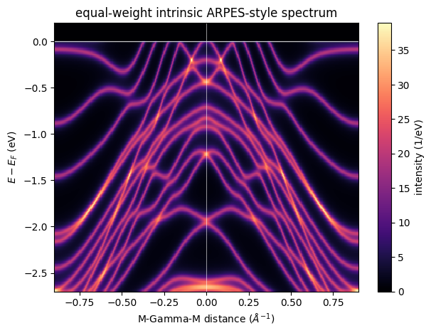
    


## 3. Turn Orbital Population Into Band Contrast

VASP stores the orbital order as s, py, pz, px, then five d channels.
`plot_band_scatter_weights` scales each marker by the palladium d or
tellurium p fraction of the state. The grey backdrop keeps the full
band set visible behind the weighted points.


```python
raw_weights = np.asarray(projection.projections)
total_weight = raw_weights.sum(axis=(2, 3))
safe_total_weight = np.where(total_weight > 1.0e-12, total_weight, 1.0)
pd_d_fraction = raw_weights[:, :, pd_indices, 4:9].sum(axis=(2, 3)) / safe_total_weight
te_p_fraction = raw_weights[:, :, te_indices, 1:4].sum(axis=(2, 3)) / safe_total_weight
te_pz_fraction = raw_weights[:, :, te_indices, 2].sum(axis=2) / safe_total_weight
te_pxy_fraction = te_p_fraction - te_pz_fraction

fig, axes = plt.subplots(1, 2, figsize=(12.0, 4.7), sharey=True)
for ax, fraction, color, title in (
    (axes[0], pd_d_fraction, "tab:green", "palladium d character"),
    (axes[1], te_p_fraction, "tab:orange", "tellurium p character"),
):
    plot_band_scatter_weights(
        relative_energies,
        fraction,
        momentum_axis=centered_k_distance,
        mode="size",
        size_scale=34.0,
        color=color,
        alpha=0.70,
        backdrop_color="0.78",
        ax=ax,
        xlabel=fr"{PATH_LABEL} distance ($\AA^{{-1}}$)",
        title=title,
    )
    ax.axhline(0.0, color="0.25", linewidth=0.8)
    ax.set_ylim(-3.0, 0.7)
axes[1].set_ylabel("")
plt.show()
```


    
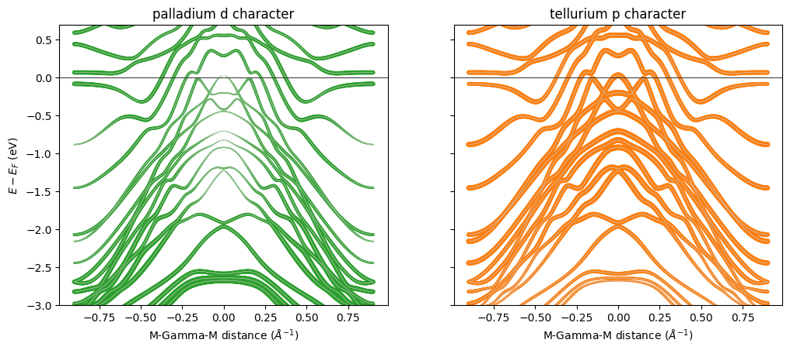
    


## 4. Use Orbital Fractions as Spectral Weights

These maps retain only bands in the displayed energy window. PROCAR
weights carry orbital character, while a phase-complete Hamiltonian is
required for a coherent matrix-element simulation. Two
`plot_spectral_cut` panels then share one spanning colorbar, with one
colormap per orbital channel.


```python
pd_d_weights = jnp.broadcast_to(
    jnp.asarray(pd_d_fraction[:, visible_bands])[:, None, :],
    (
        spectral_eigenvalues.shape[0],
        energy_axis.shape[0],
        spectral_eigenvalues.shape[1],
    ),
)
te_p_weights = jnp.broadcast_to(
    jnp.asarray(te_p_fraction[:, visible_bands])[:, None, :],
    (
        spectral_eigenvalues.shape[0],
        energy_axis.shape[0],
        spectral_eigenvalues.shape[1],
    ),
)
te_pz_weights = jnp.broadcast_to(
    jnp.asarray(te_pz_fraction[:, visible_bands])[:, None, :],
    (
        spectral_eigenvalues.shape[0],
        energy_axis.shape[0],
        spectral_eigenvalues.shape[1],
    )
)
te_pxy_weights = jnp.broadcast_to(
    jnp.asarray(te_pxy_fraction[:, visible_bands])[:, None, :],
    (
        spectral_eigenvalues.shape[0],
        energy_axis.shape[0],
        spectral_eigenvalues.shape[1],
    )
)
pd_d_intensity = assemble_spectral_intensity_bands_chunk(
    spectral_eigenvalues,
    pd_d_weights,
    energy_axis,
    self_energy,
    jnp.asarray(fermi_energy_ev),
    45.0,
    allow_degenerate_value_only=True,
)
te_p_intensity = assemble_spectral_intensity_bands_chunk(
    spectral_eigenvalues,
    te_p_weights,
    energy_axis,
    self_energy,
    jnp.asarray(fermi_energy_ev),
    45.0,
    allow_degenerate_value_only=True,
)
te_pz_intensity = assemble_spectral_intensity_bands_chunk(
    spectral_eigenvalues,
    te_pz_weights,
    energy_axis,
    self_energy,
    jnp.asarray(fermi_energy_ev),
    45.0,
    allow_degenerate_value_only=True,
)
te_pxy_intensity = assemble_spectral_intensity_bands_chunk(
    spectral_eigenvalues,
    te_pxy_weights,
    energy_axis,
    self_energy,
    jnp.asarray(fermi_energy_ev),
    45.0,
    allow_degenerate_value_only=True,
)
```


```python
fig, axes = plt.subplots(1, 2, figsize=(12.0, 4.8), sharey=True)
images = []
for ax, intensity_map, cmap, title in (
    (axes[0], pd_d_intensity, "viridis", "Pd d weighted ARPES-style map"),
    (axes[1], te_p_intensity, "plasma", "Te p weighted ARPES-style map"),
):
    _, _, image = plot_spectral_cut(
        intensity_map,
        centered_k_distance,
        energy_axis,
        ax=ax,
        cmap=cmap,
        colorbar=False,
        xlabel=fr"{PATH_LABEL} distance ($\AA^{{-1}}$)",
        title=title,
    )
    images.append(image)
axes[1].set_ylabel("")
fig.colorbar(images[-1], ax=axes, label=r"intensity (1/eV)")
plt.show()
```


    
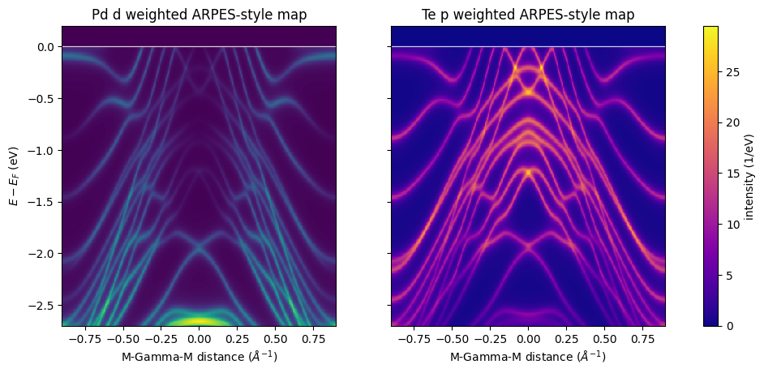
    


## 5. Locate Orbital Contrast

Positive values below mark states that are d-heavy; negative values
mark p-heavy states. `plot_difference_map` centers the diverging color
scale on zero and marks the coordinate origin. It is a compact way to
choose spectral features worth testing with polarization or
photon-energy dependence.


```python
fig, ax = plt.subplots(figsize=(6.8, 4.9))
plot_difference_map(
    pd_d_intensity - te_p_intensity,
    centered_k_distance,
    energy_axis,
    ax=ax,
    zero_lines=True,
    colorbar_label=r"intensity difference (1/eV)",
    xlabel=fr"{PATH_LABEL} distance ($\AA^{{-1}}$)",
    ylabel=r"$E - E_F$ (eV)",
    title="Pd d minus Te p spectral contrast",
)
plt.show()
```


    
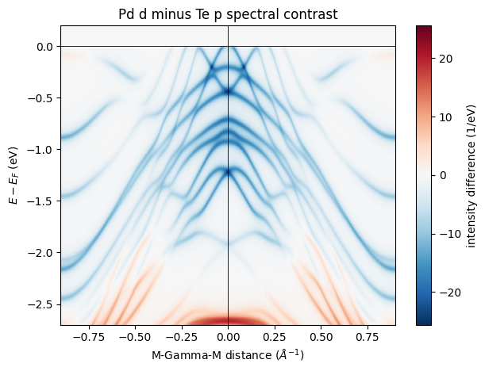
    


## 6. Read the Orbital Contrast in Several Experimental Views

The following figures retain the same equal-linewidth spectral proxy.
`plot_band_dispersion` draws the full and near-Fermi band windows.
`plot_band_scatter_weights` splits the tellurium p character into pz
and px plus py. `plot_spectral_cut` panels show the weighted maps, and
`plot_curve_family` compares normalized EDC, MDC, and window profiles.


```python
fig, ax = plt.subplots(figsize=(6.7, 4.8))
plot_band_dispersion(
    relative_energies,
    momentum_axis=centered_k_distance,
    ax=ax,
    color="0.50",
    linewidth=0.35,
    xlabel=fr"{PATH_LABEL} distance ($\AA^{{-1}}$)",
    title="PdTe2 slab bands behind the spectral proxy",
)
ax.set_ylim(-3.0, 0.7)
plt.show()
```


    
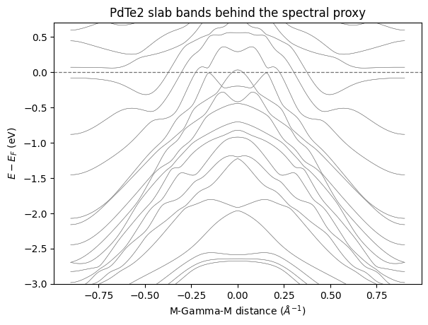
    


```python
fig, ax = plt.subplots(figsize=(6.7, 4.8))
plot_band_dispersion(
    relative_energies,
    momentum_axis=centered_k_distance,
    ax=ax,
    color="0.50",
    linewidth=0.45,
    xlabel=fr"{PATH_LABEL} distance ($\AA^{{-1}}$)",
    title="near-Fermi PdTe2 band window",
)
ax.set_xlim(-0.48, 0.48)
ax.set_ylim(-0.90, 0.25)
plt.show()
```


    
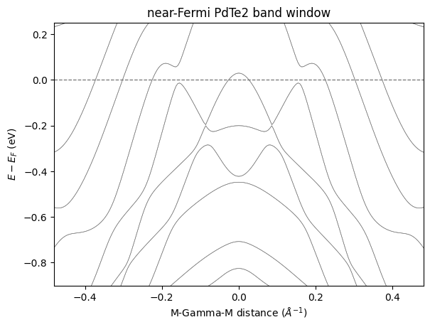
    


```python
fig, axes = plt.subplots(1, 2, figsize=(12.0, 4.7), sharey=True)
for ax, fraction, color, title in (
    (axes[0], te_pz_fraction, "tab:blue", "Te out-of-plane pz character"),
    (axes[1], te_pxy_fraction, "tab:red", "Te in-plane px plus py character"),
):
    plot_band_scatter_weights(
        relative_energies,
        fraction,
        momentum_axis=centered_k_distance,
        mode="size",
        size_scale=36.0,
        color=color,
        alpha=0.70,
        backdrop_color="0.80",
        ax=ax,
        xlabel=fr"{PATH_LABEL} distance ($\AA^{{-1}}$)",
        title=title,
    )
    ax.axhline(0.0, color="0.25", linewidth=0.8)
    ax.set_ylim(-3.0, 0.7)
axes[1].set_ylabel("")
plt.show()
```


    
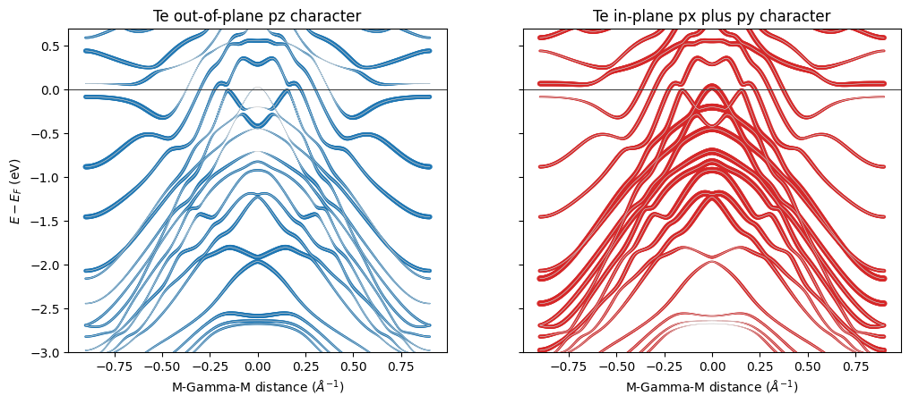
    


```python
fig, axes = plt.subplots(1, 2, figsize=(12.0, 4.8), sharey=True)
images = []
for ax, intensity_map, cmap, title in (
    (axes[0], te_pz_intensity, "Blues", "Te pz weighted ARPES-style map"),
    (axes[1], te_pxy_intensity, "Reds", "Te px plus py weighted ARPES-style map"),
):
    _, _, image = plot_spectral_cut(
        intensity_map,
        centered_k_distance,
        energy_axis,
        ax=ax,
        cmap=cmap,
        colorbar=False,
        guide_color="black",
        xlabel=fr"{PATH_LABEL} distance ($\AA^{{-1}}$)",
        title=title,
    )
    images.append(image)
axes[1].set_ylabel("")
fig.colorbar(images[-1], ax=axes, label=r"intensity (1/eV)")
plt.show()
```


    
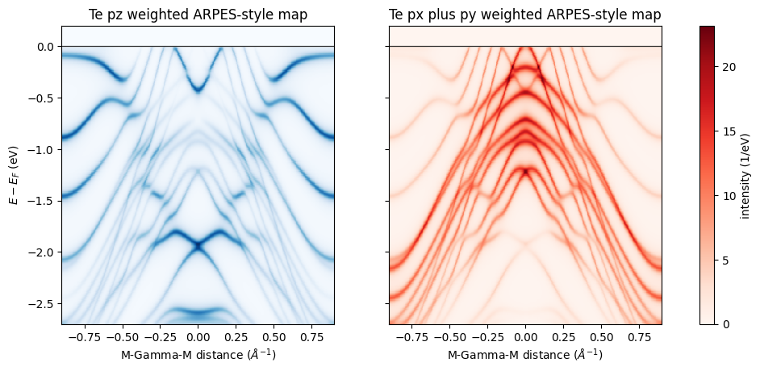
    


```python
fig, axes = plt.subplots(1, 2, figsize=(12.0, 4.8), sharey=True)
images = []
for ax, intensity_map, cmap, title in (
    (axes[0], pd_d_intensity, "viridis", "Pd d near the Fermi level"),
    (axes[1], te_p_intensity, "plasma", "Te p near the Fermi level"),
):
    _, _, image = plot_spectral_cut(
        intensity_map,
        centered_k_distance,
        energy_axis,
        ax=ax,
        cmap=cmap,
        colorbar=False,
        xlabel=fr"{PATH_LABEL} distance ($\AA^{{-1}}$)",
        title=title,
    )
    images.append(image)
    ax.set_xlim(-0.48, 0.48)
    ax.set_ylim(-0.90, 0.20)
axes[1].set_ylabel("")
fig.colorbar(images[-1], ax=axes, label=r"intensity (1/eV)")
plt.show()
```


    
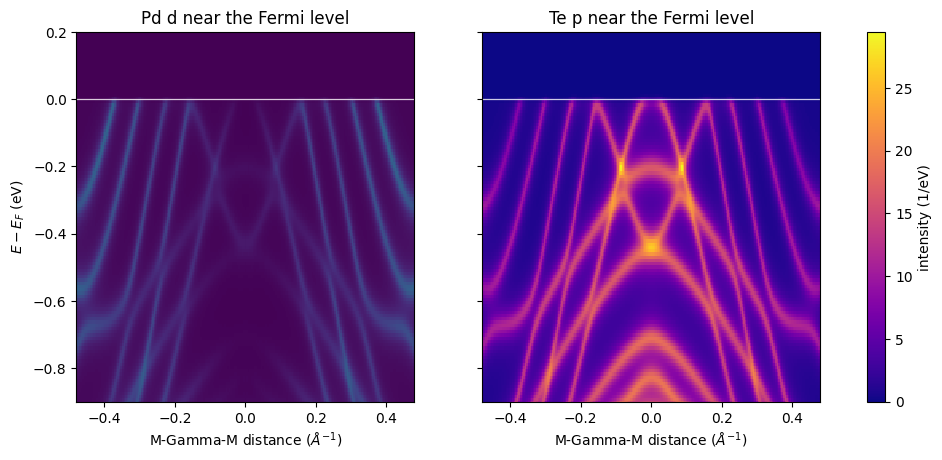
    


```python
energy_values = np.asarray(energy_axis)
gamma_edcs = np.asarray(
    (
        intrinsic_intensity[gamma_index],
        pd_d_intensity[gamma_index],
        te_p_intensity[gamma_index],
    )
)
gamma_edcs = gamma_edcs / gamma_edcs.max(axis=1, keepdims=True)
fig, ax = plt.subplots(figsize=(6.8, 4.0))
plot_curve_family(
    energy_values,
    tuple(gamma_edcs),
    labels=("equal weight", "Pd d weight", "Te p weight"),
    ax=ax,
    xlabel=r"$E - E_F$ (eV)",
    ylabel="normalized intensity",
    title="Gamma EDC before and after orbital weighting",
)
ax.axvline(0.0, color="0.35", linewidth=0.8)
plt.show()
```


    
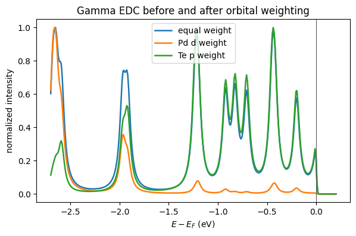
    


```python
mdc_energy_ev = -0.55
mdc_energy_index = int(np.argmin(np.abs(energy_values - mdc_energy_ev)))
mdc_profiles = np.asarray(
    (
        intrinsic_intensity[:, mdc_energy_index],
        pd_d_intensity[:, mdc_energy_index],
        te_p_intensity[:, mdc_energy_index],
    )
)
mdc_profiles = mdc_profiles / mdc_profiles.max(axis=1, keepdims=True)
fig, ax = plt.subplots(figsize=(6.8, 4.0))
plot_curve_family(
    centered_k_distance,
    tuple(mdc_profiles),
    labels=("equal weight", "Pd d weight", "Te p weight"),
    ax=ax,
    xlabel=fr"{PATH_LABEL} distance ($\AA^{{-1}}$)",
    ylabel="normalized intensity",
    title=f"MDC at {energy_values[mdc_energy_index]:.2f} eV",
)
ax.axvline(0.0, color="0.35", linewidth=0.8)
plt.show()
```


    
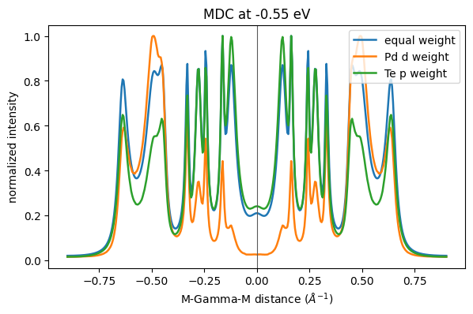
    


```python
energy_windows_ev = ((-0.25, -0.05), (-0.80, -0.55), (-1.60, -1.30))
fig, axes = plt.subplots(1, 3, figsize=(12.6, 3.8), sharey=True)
for ax, (lower_ev, upper_ev) in zip(axes, energy_windows_ev):
    window_mask = (energy_values >= lower_ev) & (energy_values <= upper_ev)
    pd_profile = np.asarray(pd_d_intensity)[:, window_mask].sum(axis=1)
    te_profile = np.asarray(te_p_intensity)[:, window_mask].sum(axis=1)
    plot_curve_family(
        centered_k_distance,
        (pd_profile / pd_profile.max(), te_profile / te_profile.max()),
        labels=("Pd d", "Te p"),
        ax=ax,
        legend=bool(ax is axes[0]),
        xlabel=fr"{PATH_LABEL} distance ($\AA^{{-1}}$)",
        title=f"{lower_ev:.2f} to {upper_ev:.2f} eV",
    )
    ax.axvline(0.0, color="0.45", linewidth=0.7)
axes[0].set_ylabel("normalized window intensity")
fig.suptitle("orbital contrast across finite binding-energy windows")
plt.show()
```


    
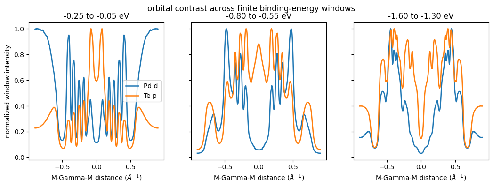
    

