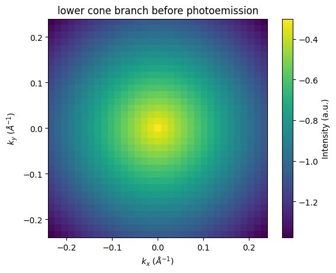
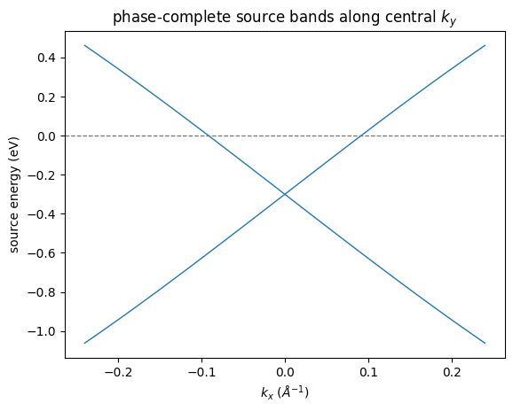
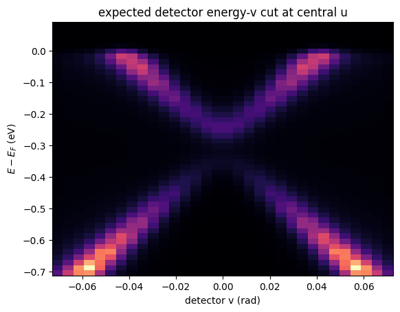
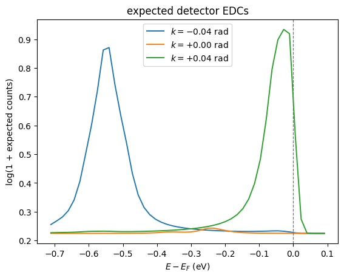
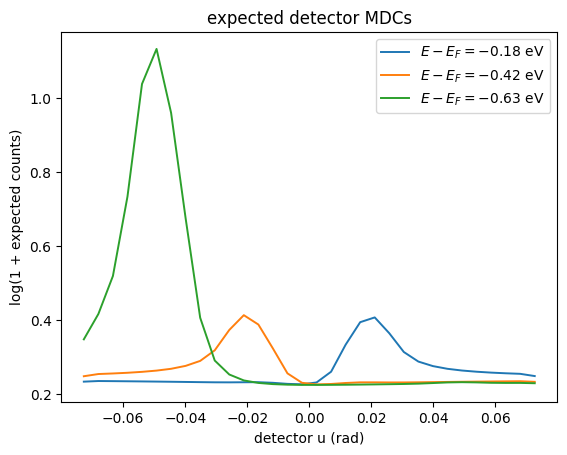
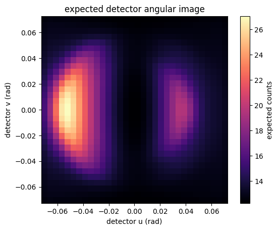
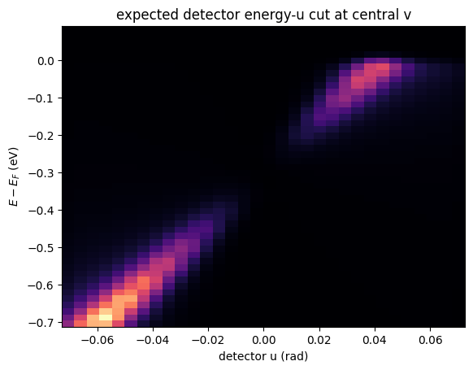
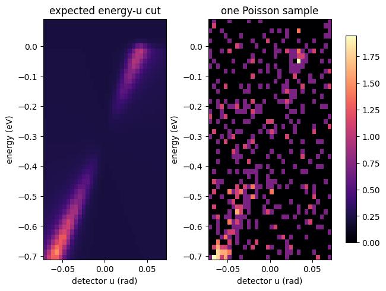
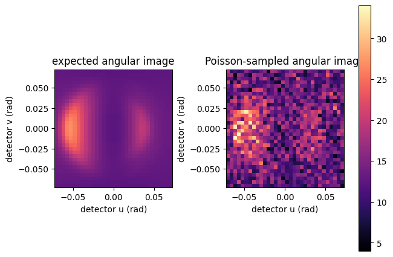
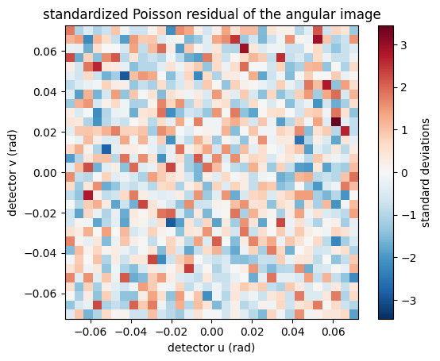

# Coherent Detector ARPES Acquisition

Tutorial 4 uses scalar orbital populations as spectral weights. This final workflow starts from a phase-complete tight-binding Hamiltonian.
It applies coherent matrix elements and stated beamline inputs before detector mapping and Poisson sampling.

It is a full forward-pipeline route to expected detector counts, not an
automatically calibrated prediction for a particular material or instrument.
EIGENVAL and PROCAR alone cannot provide this input: use a phase-complete
Wannier or tight-binding Hamiltonian with an orbital basis. The compact 2D source and radial and final-state choices remain explicit model inputs.
Self-energy, background, sensitivity, and detector calibration also need replacement or calibration for data comparison.


## 1. Supply a Phase-Complete Source on an ARPES Raster

At 21.2 eV photon energy and a 4.5 eV work function, the photoelectron leaves with about 16.7 eV of kinetic energy. The ±0.075 rad analyser window therefore collects ±0.16 Å⁻¹ of parallel momentum around normal emission.
The source is therefore a two-orbital Dirac cone at the zone centre, the geometry of a topological-insulator surface state. The cone has a 3.3 eV Å velocity, and its node sits 0.30 eV below the Fermi level. The source model and
`build_arpes_kmesh` are the two pieces to replace when moving to a
material-specific Hamiltonian and momentum window. `plot_momentum_map`
draws the lower cone branch on the source window.


```python
import os

os.environ["JAX_PLATFORMS"] = "cpu"

import jax
import jax.numpy as jnp
import matplotlib.pyplot as plt
import numpy as np

import diffpes as dp

lattice_constant_ang = 2.0
cone_velocity_ev_ang = 3.3
hopping_ev = cone_velocity_ev_ang / lattice_constant_ang
dirac_energy_ev = -0.30
crystal = dp.types.make_crystal_geometry(
    lattice=jnp.asarray(
        [
            [lattice_constant_ang, 0.0, 0.0],
            [0.0, lattice_constant_ang, 0.0],
            [0.0, 0.0, 20.0],
        ]
    ),
    positions=jnp.zeros((1, 3)),
    species=("X",),
)
basis = dp.types.make_orbital_basis(
    atom_indices=(0, 0),
    n=(1, 2),
    l=(0, 0),
    m=(0, 0),
    labels=("s+", "s-"),
)
model = dp.types.make_tb_model(
    hopping_amplitudes=0.5
    * hopping_ev
    * jnp.asarray([-1.0j, 1.0j, 1.0, -1.0, 1.0j, -1.0j, 1.0, -1.0]),
    onsite_energies=jnp.full(2, dirac_energy_ev),
    soc_lambdas=jnp.zeros(0),
    geometry=crystal,
    basis=basis,
    hopping_pairs=(
        (0, 1),
        (0, 1),
        (0, 1),
        (0, 1),
        (1, 0),
        (1, 0),
        (1, 0),
        (1, 0),
    ),
    hopping_cells=(
        (1, 0, 0),
        (-1, 0, 0),
        (0, 1, 0),
        (0, -1, 0),
        (-1, 0, 0),
        (1, 0, 0),
        (0, -1, 0),
        (0, 1, 0),
    ),
    shell_index=(-1, -1),
    depths=jnp.zeros(2),
)
source_axis = jnp.linspace(-0.24, 0.24, 33)
kgrid = dp.tightb.build_arpes_kmesh(source_axis, source_axis, 0.0, 0.0, crystal)
hamiltonians = dp.tightb.bloch_hamiltonian_batch(model, kgrid.kpoints)
bands = dp.tightb.diagonalize_tb(model, kgrid.kpoints)
energy_axis = jnp.linspace(-0.80, 0.15, 81)
print("source k grid:", kgrid.mesh_shape)
```

    source k grid: (33, 33)


```python
lower_branch = (
    np.asarray(bands.eigenvalues[:, 0]).reshape(kgrid.mesh_shape).T
)
dp.plots.plot_momentum_map(
    lower_branch,
    source_axis,
    source_axis,
    cmap="viridis",
    xlabel=r"$k_x$ ($\AA^{-1}$)",
    ylabel=r"$k_y$ ($\AA^{-1}$)",
    title="lower cone branch before photoemission",
)
plt.show()
```


    

    


## 1.1 Inspect the Source Dispersion Before Photoemission

The coherent calculation below starts from a phase-complete Hamiltonian, not
from a list of eigenvalue weights. `plot_band_dispersion` draws the central
source cut before geometry and detector effects apply.


```python
source_eigenvalues = np.asarray(bands.eigenvalues).reshape(
    (*kgrid.mesh_shape, bands.eigenvalues.shape[-1])
)
center_source_v_index = kgrid.mesh_shape[1] // 2
dp.plots.plot_band_dispersion(
    source_eigenvalues[:, center_source_v_index, :],
    momentum_axis=np.asarray(source_axis),
    color="tab:blue",
    xlabel=r"$k_x$ ($\AA^{-1}$)",
    ylabel="source energy (eV)",
    title="phase-complete source bands along central $k_y$",
)
plt.show()
```


    

    


## 2. Set the Beamline and Detector

The experiment, radial channels, and detector state are explicit inputs. The
default values make one ultraviolet measurement; tune these objects to describe
your instrument rather than fitting around undocumented defaults.


```python
experiment = dp.types.make_experiment_geometry(
    photon_energy_ev=21.2,
    polarization=jnp.asarray([1.0 + 0.0j, 0.25j, 0.0j]),
    work_function_ev=4.5,
    temperature_k=45.0,
    mean_free_path_ang=9.0,
)
radial_spec = dp.types.make_radial_spec(
    basis,
    (0, 1),
    mode="fixed",
    fixed_integrals_shell=jnp.asarray([[0.0, 1.0], [0.0, 1.0]]),
)
matrix_element_params = dp.types.make_matrix_element_params(
    basis,
    (0, 1),
    sigma_shell=jnp.asarray([1.0, 1.0]),
    phase_shift_angles_shell=jnp.asarray([0.15, 0.15]),
)
calibration = dp.types.make_detector_calibration(
    u_bin_edges=jnp.linspace(-0.075, 0.075, 33),
    v_bin_edges=jnp.linspace(-0.075, 0.075, 33),
    energy_bin_edges_ev=jnp.linspace(-0.72, 0.10, 49),
    psf_fwhm_u=0.005,
    psf_fwhm_v=0.005,
    psf_fwhm_energy_ev=0.012,
    transmission_reference_domain_ev=jnp.asarray([14.0, 18.0]),
)
detector_effects = dp.types.make_detector_effects(
    domain_logits=jnp.asarray([0.0]),
    domain_euler_angles_rad=jnp.zeros((1, 3)),
    transmission_raw_slopes=jnp.asarray([-0.35, 0.15]),
    background_coefficients=jnp.asarray([-8.0]),
    sensitivity_coefficients=jnp.asarray([]),
    exposure=2.0e9,
    background_mode="flat",
    sensitivity_mode="constant",
    domain_frame_ids=("org.diffpes.frame.sample_cartesian",),
)
```

## 3. Simulate Expected Counts

`simulate_arpes` applies coherent source assembly, detector mapping,
transmission, resolution, background, sensitivity, and exposure. The result is
expected counts on native detector bins, ready for a likelihood or a synthetic
acquisition.


```python
detector = dp.simul.simulate_arpes(
    (hamiltonians,),
    (bands,),
    radial_spec,
    matrix_element_params,
    dp.types.make_radial_quadrature_spec(),
    dp.types.make_final_state_spec(),
    experiment,
    dp.types.make_self_energy_model(gamma=0.025),
    kgrid,
    energy_axis,
    calibration,
    detector_effects,
    k_chunk=64,
    energy_chunk=16,
    checkpoint=True,
)
expected_counts = np.asarray(detector.expected_counts[0])
print("detector raster [u, v, energy]:", expected_counts.shape)
print("expected events:", float(expected_counts.sum()))
```

    detector raster [u, v, energy]: (32, 32, 48)
    expected events: 15156.239906795327


## 3.1 Inspect the Orthogonal Detector Cut

The analyser records a two-dimensional angular image. `plot_detector_energy_cut`
with `cut_axis="v"` holds detector u at its center. The result is the
complementary energy-v cut to the energy-u cut below.


```python
dp.plots.plot_detector_energy_cut(
    detector,
    cut_axis="v",
    colorbar=False,
    ylabel=r"$E - E_F$ (eV)",
    title="expected detector energy-v cut at central u",
)
plt.show()
```


    

    


## 3.2 Read Detector EDCs and MDCs

These cuts use native detector coordinates. They expose the predicted line
shape before one particular Poisson realization is drawn.
`plot_distribution_curves` stacks EDCs at three u positions and MDCs at
three energies from the central-v map. `plot_detector_image` sums the
raster over energy into the angular image. `plot_detector_energy_cut`
renders the energy-u cut at central v.


```python
detector_u_axis = np.asarray(detector.detector_u_axis)
center_v_index = expected_counts.shape[1] // 2
central_v_map = expected_counts[:, center_v_index, :]
edc_positions = tuple(
    float(detector_u_axis[u_index])
    for u_index in (
        expected_counts.shape[0] // 4,
        expected_counts.shape[0] // 2,
        3 * expected_counts.shape[0] // 4,
    )
)
dp.plots.plot_distribution_curves(
    central_v_map,
    detector_u_axis,
    np.asarray(detector.energy_axis),
    kind="edc",
    positions=edc_positions,
    log_counts=True,
    momentum_unit="rad",
    ylabel="log(1 + expected counts)",
    title="expected detector EDCs",
)
plt.show()
```


    

    


```python
dp.plots.plot_distribution_curves(
    central_v_map,
    detector_u_axis,
    np.asarray(detector.energy_axis),
    kind="mdc",
    positions=(-0.18, -0.42, -0.62),
    log_counts=True,
    xlabel="detector u (rad)",
    ylabel="log(1 + expected counts)",
    title="expected detector MDCs",
)
plt.show()
```


    

    


```python
dp.plots.plot_detector_image(
    detector,
    title="expected detector angular image",
)
plt.show()
```


    

    


```python
dp.plots.plot_detector_energy_cut(
    detector,
    cut_axis="u",
    colorbar=False,
    ylabel=r"$E - E_F$ (eV)",
    title="expected detector energy-u cut at central v",
)
plt.show()
```


    

    


## 4. Draw One Acquisition

Use expected counts for fitting and uncertainty propagation.
`sample_poisson_counts` makes the counting noise part of the synthetic
acquisition. `plot_detector_comparison` with `view="energy"` places the
expected energy-u cut beside the sampled cut on one shared scale. Both
panels hold detector v at its central bin; a sum over v is a different
projected observable.


```python
observed_counts = np.asarray(
    dp.simul.sample_poisson_counts(jax.random.key(20260814), detector.expected_counts)[0],
    dtype=np.float64,
)
dp.plots.plot_detector_comparison(
    detector,
    observed_counts,
    view="energy",
    log_counts=True,
    titles=("expected energy-u cut", "one Poisson sample"),
)
plt.show()
```


    

    


## 4.1 Compare the Angular Acquisition and Counting Residual

The angular `plot_detector_comparison` view places the expected and sampled
angular images side by side. `plot_detector_residual` standardizes the
energy-summed difference with the Poisson standard deviation of the
expected image. The residual map makes the counting statistics visible
without relabeling detector coordinates as sample momentum.


```python
dp.plots.plot_detector_comparison(
    detector,
    observed_counts,
    view="angular",
    titles=("expected angular image", "Poisson-sampled angular image"),
)
plt.show()
```


    

    


```python
dp.plots.plot_detector_residual(
    detector,
    observed_counts,
    title="standardized Poisson residual of the angular image",
)
plt.show()
```


    

    

