# Laser Window Audit

The photoemission horizon for laser photon energies, drawn over the
internal DFT band structures of Bi2Se3 and PdTe2. A calibrated
tight-binding Dirac cone then turns the accessible window into a
simulated spectrum. The notebook reads the local `data/DFT` tree.

## Load the Public API

The readers supply band structures and reciprocal lattices. The
tight-binding and spectral calls build the simulated cone at the end.


```python
import jax.numpy as jnp
import matplotlib.pyplot as plt
import numpy as np
from pathlib import Path

from diffpes.inout import read_eigenval, read_poscar
from diffpes.simul import assemble_spectral_intensity_chunk
from diffpes.tightb import bloch_hamiltonian_batch, diagonalize_tb
from diffpes.types import (
    make_crystal_geometry,
    make_orbital_basis,
    make_self_energy_model,
    make_tb_model,
)
```

## Draw the Photoemission Horizon

The parallel-momentum bound is $k_{\parallel} = 0.5123\,\sqrt{h\nu -
W - E_b}$ in inverse Angstrom. Here $h\nu$ is the photon energy, $W$ the
work function, and $E_b$ the binding energy. The audit covers laser lines
at 6.05, 6.4, 7.0, and 10.8 eV. The work function enters as 4.5 eV.


```python
KINETIC_FACTOR = 0.5123
LASER_LINES_EV = np.asarray([6.05, 6.4, 7.0, 10.8])
WORK_FUNCTION_EV = 4.5
photon_grid_ev = np.linspace(5.0, 12.0, 281)
fig, ax = plt.subplots(figsize=(6.4, 4.4))
for trial_work_function in (4.0, 4.5, 5.0, 5.5):
    horizon = KINETIC_FACTOR * np.sqrt(
        np.clip(photon_grid_ev - trial_work_function, 0.0, None)
    )
    ax.plot(photon_grid_ev, horizon, label=f"W = {trial_work_function} eV")
for laser_line in LASER_LINES_EV:
    ax.axvline(laser_line, color="0.75", linewidth=0.8)
ax.set_xlabel("photon energy (eV)")
ax.set_ylabel(r"$k_{\parallel}$ horizon ($\AA^{-1}$)")
ax.set_title("horizon at zero binding energy")
ax.legend()
plt.show()
```


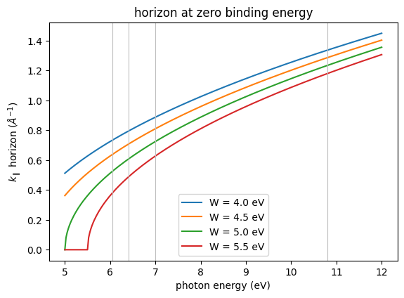


```python
fig, ax = plt.subplots(figsize=(6.4, 4.4))
for acceptance_deg in (15.0, 30.0, 90.0):
    reach = (
        KINETIC_FACTOR
        * np.sqrt(np.clip(photon_grid_ev - WORK_FUNCTION_EV, 0.0, None))
        * np.sin(np.deg2rad(acceptance_deg))
    )
    ax.plot(
        photon_grid_ev,
        reach,
        label=rf"$\pm{acceptance_deg:.0f}^\circ$ acceptance",
    )
for laser_line in LASER_LINES_EV:
    ax.axvline(laser_line, color="0.75", linewidth=0.8)
ax.set_xlabel("photon energy (eV)")
ax.set_ylabel(r"reachable $k_{\parallel}$ ($\AA^{-1}$)")
ax.set_title("analyser acceptance at W = 4.5 eV")
ax.legend()
plt.show()
```


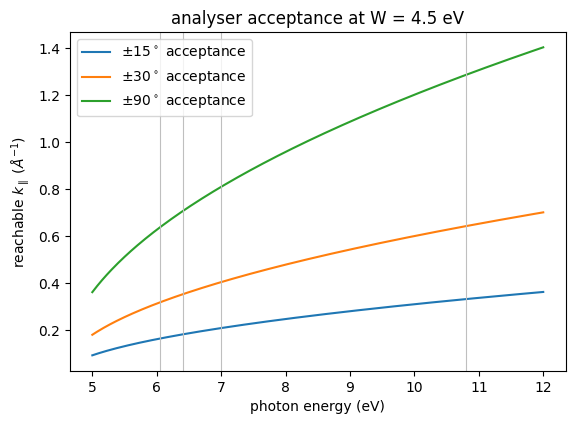


```python
binding_window_ev = np.clip(photon_grid_ev - WORK_FUNCTION_EV, 0.0, None)
fig, ax = plt.subplots(figsize=(6.4, 4.0))
ax.plot(photon_grid_ev, binding_window_ev, color="tab:blue")
for laser_line in LASER_LINES_EV:
    ax.axvline(laser_line, color="0.75", linewidth=0.8)
    ax.plot(
        laser_line,
        laser_line - WORK_FUNCTION_EV,
        marker="o",
        color="tab:red",
    )
ax.set_xlabel("photon energy (eV)")
ax.set_ylabel("accessible binding window (eV)")
ax.set_title("binding-energy depth per photon energy")
plt.show()
```


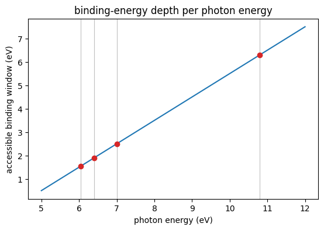


## Load the Anchor Band Paths

The Fermi levels come from the retained OUTCAR files. The structure
files convert the fractional paths to inverse Angstrom, centered at
Gamma.


```python
DATA_ROOT = Path("..") / "data" / "DFT"
BI2SE3_DIR = DATA_ROOT / "Bi2Se3" / "6QL" / "Output few bands"
PDTE2_DIR = DATA_ROOT / "PdTe2" / "4ML" / "Output"
bi2se3_fermi_ev = float(
    next(
        line
        for line in open(BI2SE3_DIR / "OUTCAR_SCF", encoding="utf-8")
        if "E-fermi" in line
    ).split()[2]
)
pdte2_fermi_ev = float(
    next(
        line
        for line in open(
            PDTE2_DIR / "MGM" / "OAM DATA" / "OUTCAR", encoding="utf-8"
        )
        if "E-fermi" in line
    ).split()[2]
)
bi2se3_geo = read_poscar(str(BI2SE3_DIR / "POSCAR"))
pdte2_geo = read_poscar(
    str(DATA_ROOT / "PdTe2" / "4ML" / "PdTe2_4ML_0x_0y_0z.vasp")
)
bi2se3_bands = read_eigenval(
    str(BI2SE3_DIR / "MGM" / "EIGENVAL"), fermi_energy=bi2se3_fermi_ev
)
pdte2_mgm = read_eigenval(
    str(PDTE2_DIR / "MGM" / "EIGENVAL"), fermi_energy=pdte2_fermi_ev
)
pdte2_kgk = read_eigenval(
    str(PDTE2_DIR / "KGK" / "EIGENVAL"), fermi_energy=pdte2_fermi_ev
)
bi2se3_kcart = np.asarray(bi2se3_bands.kpoints) @ np.asarray(
    bi2se3_geo.reciprocal
)
bi2se3_dist = np.concatenate(
    (
        [0.0],
        np.cumsum(np.linalg.norm(np.diff(bi2se3_kcart, axis=0), axis=1)),
    )
)
bi2se3_gamma = int(
    np.argmin(np.linalg.norm(np.asarray(bi2se3_bands.kpoints), axis=1))
)
bi2se3_axis = bi2se3_dist - bi2se3_dist[bi2se3_gamma]
bi2se3_shift = np.asarray(bi2se3_bands.eigenvalues) - bi2se3_fermi_ev
pdte2_reciprocal = np.asarray(pdte2_geo.reciprocal)
pdte2_mgm_kcart = np.asarray(pdte2_mgm.kpoints) @ pdte2_reciprocal
pdte2_mgm_dist = np.concatenate(
    (
        [0.0],
        np.cumsum(
            np.linalg.norm(np.diff(pdte2_mgm_kcart, axis=0), axis=1)
        ),
    )
)
pdte2_mgm_gamma = int(
    np.argmin(np.linalg.norm(np.asarray(pdte2_mgm.kpoints), axis=1))
)
pdte2_mgm_axis = pdte2_mgm_dist - pdte2_mgm_dist[pdte2_mgm_gamma]
pdte2_mgm_shift = np.asarray(pdte2_mgm.eigenvalues) - pdte2_fermi_ev
pdte2_kgk_kcart = np.asarray(pdte2_kgk.kpoints) @ pdte2_reciprocal
pdte2_kgk_dist = np.concatenate(
    (
        [0.0],
        np.cumsum(
            np.linalg.norm(np.diff(pdte2_kgk_kcart, axis=0), axis=1)
        ),
    )
)
pdte2_kgk_gamma = int(
    np.argmin(np.linalg.norm(np.asarray(pdte2_kgk.kpoints), axis=1))
)
pdte2_kgk_axis = pdte2_kgk_dist - pdte2_kgk_dist[pdte2_kgk_gamma]
pdte2_kgk_shift = np.asarray(pdte2_kgk.eigenvalues) - pdte2_fermi_ev
print("Bi2Se3 Fermi energy (eV):", bi2se3_fermi_ev)
print("PdTe2 Fermi energy (eV):", pdte2_fermi_ev)
```

    Bi2Se3 Fermi energy (eV): 0.0178
    PdTe2 Fermi energy (eV): 2.1733


## Overlay the Horizon on the Bands

Each curve bounds the states one laser line reaches. The bound follows
$k_{\parallel}(E) = 0.5123\,\sqrt{h\nu - W + (E - E_F)}$ for occupied
states. States outside the curves stay dark at that photon energy.


```python
overlay_energy_ev = np.linspace(-1.5, 0.0, 301)
fig, ax = plt.subplots(figsize=(6.4, 4.8))
ax.plot(bi2se3_axis, bi2se3_shift, color="0.6", linewidth=0.5)
for laser_line in LASER_LINES_EV:
    boundary = KINETIC_FACTOR * np.sqrt(
        np.clip(
            laser_line - WORK_FUNCTION_EV + overlay_energy_ev, 0.0, None
        )
    )
    ax.plot(boundary, overlay_energy_ev, label=f"{laser_line} eV")
    ax.plot(-boundary, overlay_energy_ev, color=ax.lines[-1].get_color())
ax.axhline(0.0, color="0.4", linewidth=0.8)
ax.set_xlim(-0.5, 0.5)
ax.set_ylim(-1.5, 0.4)
ax.set_xlabel(r"$k - k_\Gamma$ ($\AA^{-1}$)")
ax.set_ylabel(r"$E - E_F$ (eV)")
ax.set_title("Bi2Se3 surface state inside the laser horizons")
ax.legend(loc="lower right")
plt.show()
```


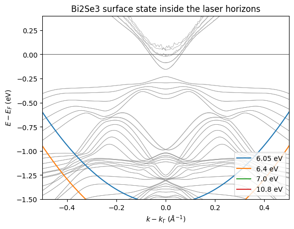


```python
fig, ax = plt.subplots(figsize=(6.4, 4.8))
ax.plot(pdte2_mgm_axis, pdte2_mgm_shift, color="0.6", linewidth=0.5)
for laser_line in LASER_LINES_EV:
    boundary = KINETIC_FACTOR * np.sqrt(
        np.clip(
            laser_line - WORK_FUNCTION_EV + overlay_energy_ev, 0.0, None
        )
    )
    ax.plot(boundary, overlay_energy_ev, label=f"{laser_line} eV")
    ax.plot(-boundary, overlay_energy_ev, color=ax.lines[-1].get_color())
ax.axhline(0.0, color="0.4", linewidth=0.8)
ax.set_xlim(-0.6, 0.6)
ax.set_ylim(-1.5, 0.4)
ax.set_xlabel(r"$k - k_\Gamma$ ($\AA^{-1}$)")
ax.set_ylabel(r"$E - E_F$ (eV)")
ax.set_title("PdTe2 near-Gamma states inside the laser horizons")
ax.legend(loc="lower right")
plt.show()
```


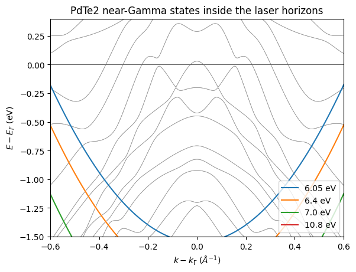


```python
fig, ax = plt.subplots(figsize=(7.0, 4.8))
ax.plot(pdte2_kgk_axis, pdte2_kgk_shift, color="0.6", linewidth=0.4)
for laser_line in LASER_LINES_EV:
    boundary = KINETIC_FACTOR * np.sqrt(
        np.clip(
            laser_line - WORK_FUNCTION_EV + overlay_energy_ev, 0.0, None
        )
    )
    ax.plot(boundary, overlay_energy_ev, label=f"{laser_line} eV")
    ax.plot(-boundary, overlay_energy_ev, color=ax.lines[-1].get_color())
ax.axhline(0.0, color="0.4", linewidth=0.8)
ax.set_ylim(-2.2, 0.4)
ax.set_xlabel(r"$k - k_\Gamma$ along K--$\Gamma$--K ($\AA^{-1}$)")
ax.set_ylabel(r"$E - E_F$ (eV)")
ax.set_title("PdTe2 full retained path against the laser horizons")
ax.legend(loc="lower right")
plt.show()
```


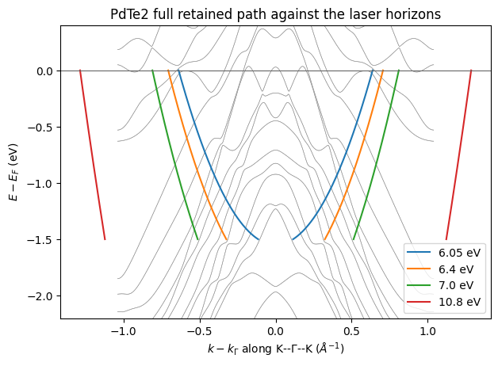


## Summarize the Reachable Path Fraction

The bars count the path points inside the horizon at 0.3 eV binding
energy. The 10.8 eV line covers most of both retained paths. The
6.05 eV line keeps a narrow cone around Gamma.


```python
probe_binding_ev = 0.3
bar_offsets = np.arange(LASER_LINES_EV.shape[0], dtype=np.float64)
bi2se3_fractions = [
    float(
        np.mean(
            np.abs(bi2se3_axis)
            <= KINETIC_FACTOR
            * np.sqrt(
                max(laser_line - WORK_FUNCTION_EV - probe_binding_ev, 0.0)
            )
        )
    )
    for laser_line in LASER_LINES_EV
]
pdte2_fractions = [
    float(
        np.mean(
            np.abs(pdte2_kgk_axis)
            <= KINETIC_FACTOR
            * np.sqrt(
                max(laser_line - WORK_FUNCTION_EV - probe_binding_ev, 0.0)
            )
        )
    )
    for laser_line in LASER_LINES_EV
]
fig, ax = plt.subplots(figsize=(6.4, 4.0))
ax.bar(
    bar_offsets - 0.18,
    bi2se3_fractions,
    width=0.36,
    label="Bi2Se3 M--Gamma--M",
)
ax.bar(
    bar_offsets + 0.18,
    pdte2_fractions,
    width=0.36,
    label="PdTe2 K--Gamma--K",
)
ax.set_xticks(bar_offsets)
ax.set_xticklabels([f"{value} eV" for value in LASER_LINES_EV])
ax.set_ylabel("reachable fraction of the path")
ax.set_title("path coverage at 0.3 eV binding energy")
ax.legend()
plt.show()
```


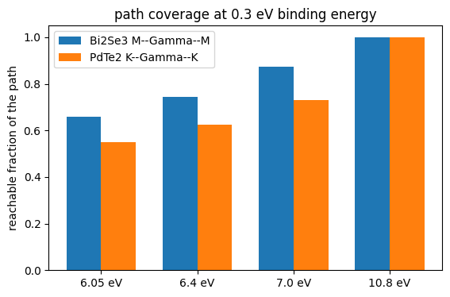


## Calibrate a Dirac Cone to the Surface State

A linear fit through the surface-state branch gives the Dirac velocity.
A two-site honeycomb model reproduces that velocity through one hopping
amplitude. Its Dirac point sits at the corner of the model zone.


```python
gamma_column = bi2se3_shift[bi2se3_gamma]
surface_band = int(np.argmin(np.abs(gamma_column + 0.05)))
fit_mask = (np.abs(bi2se3_axis) > 0.02) & (np.abs(bi2se3_axis) < 0.12)
fit_slope, fit_intercept = np.polyfit(
    np.abs(bi2se3_axis[fit_mask]),
    bi2se3_shift[fit_mask, surface_band],
    1,
)
dirac_velocity_ev_ang = float(abs(fit_slope))
dirac_energy_ev = float(gamma_column[surface_band])
lattice_constant_ang = 2.0
hopping_ev = (
    2.0 * dirac_velocity_ev_ang / (np.sqrt(3.0) * lattice_constant_ang)
)
print("surface band index:", surface_band)
print("Dirac velocity (eV Ang):", round(dirac_velocity_ev_ang, 3))
print("Dirac point (eV):", round(dirac_energy_ev, 3))
print("honeycomb hopping (eV):", round(hopping_ev, 3))
```

    surface band index: 172
    Dirac velocity (eV Ang): 2.682
    Dirac point (eV): -0.023
    honeycomb hopping (eV): 1.549


```python
lattice = jnp.asarray(
    [
        [lattice_constant_ang, 0.0, 0.0],
        [
            lattice_constant_ang / 2.0,
            lattice_constant_ang * jnp.sqrt(3.0) / 2.0,
            0.0,
        ],
        [0.0, 0.0, 20.0],
    ]
)
crystal = make_crystal_geometry(
    lattice=lattice,
    positions=jnp.asarray(
        [[0.0, 0.0, 0.0], [1.0 / 3.0, 1.0 / 3.0, 0.0]]
    ),
    species=("X", "X"),
)
basis = make_orbital_basis(
    atom_indices=(0, 1),
    n=(1, 1),
    l=(0, 0),
    m=(0, 0),
    labels=("1s", "2s"),
)
model = make_tb_model(
    hopping_amplitudes=hopping_ev * jnp.ones(6, dtype=jnp.complex128),
    onsite_energies=jnp.zeros(2),
    soc_lambdas=jnp.zeros(0),
    geometry=crystal,
    basis=basis,
    hopping_pairs=((0, 1), (0, 1), (0, 1), (1, 0), (1, 0), (1, 0)),
    hopping_cells=(
        (0, 0, 0),
        (-1, 0, 0),
        (0, -1, 0),
        (0, 0, 0),
        (1, 0, 0),
        (0, 1, 0),
    ),
    shell_index=(-1, -1),
    depths=jnp.zeros(2),
)
dirac_frac = np.asarray([1.0 / 3.0, 2.0 / 3.0, 0.0])
reciprocal = np.asarray(crystal.reciprocal)
dirac_cart = dirac_frac @ reciprocal
path_direction = dirac_cart / np.linalg.norm(dirac_cart)
cone_axis = np.linspace(-0.30, 0.30, 181)
cone_cart = dirac_cart[None, :] + cone_axis[:, None] * path_direction
cone_frac = jnp.asarray(cone_cart @ np.linalg.inv(reciprocal))
cone_hamiltonians = bloch_hamiltonian_batch(model, cone_frac)
cone_bands = diagonalize_tb(model, cone_frac)
print("cone Hamiltonians:", cone_hamiltonians.shape)
```

    cone Hamiltonians: (181, 2, 2)


```python
cone_energies = np.asarray(cone_bands.eigenvalues) + dirac_energy_ev
fig, ax = plt.subplots(figsize=(6.2, 4.8))
ax.plot(bi2se3_axis, bi2se3_shift, color="0.75", linewidth=0.5)
ax.plot(cone_axis, cone_energies[:, 0], color="tab:orange", linewidth=1.6)
ax.plot(
    cone_axis,
    cone_energies[:, 1],
    color="tab:orange",
    linewidth=1.6,
    label="calibrated cone",
)
ax.axhline(0.0, color="0.4", linewidth=0.8)
ax.set_xlim(-0.3, 0.3)
ax.set_ylim(-1.0, 0.6)
ax.set_xlabel(r"$k - k_\Gamma$ ($\AA^{-1}$)")
ax.set_ylabel(r"$E - E_F$ (eV)")
ax.set_title("calibrated cone over the DFT surface state")
ax.legend(loc="lower right")
plt.show()
```


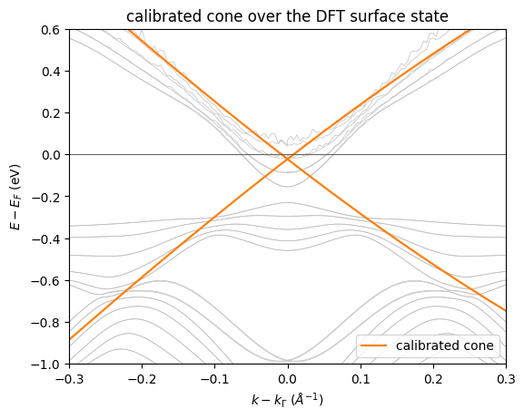


## Simulate the Cone Spectrum

Unit transition sources enter the resolvent assembly. A 20 meV constant
self-energy sets the linewidth. The Fermi level sits above the Dirac
point by the fitted offset, and the temperature is 100 K.


```python
spectrum_energy_ev = jnp.linspace(-0.8, 0.25, 211)
cone_self_energy = make_self_energy_model(gamma=0.02)
cone_sources = jnp.ones(
    (cone_axis.shape[0], spectrum_energy_ev.shape[0], 1, 2),
    dtype=jnp.complex128,
)
cone_intensity = assemble_spectral_intensity_chunk(
    cone_hamiltonians,
    cone_sources,
    spectrum_energy_ev,
    cone_self_energy,
    jnp.asarray(-dirac_energy_ev),
    100.0,
)
cone_image = np.asarray(cone_intensity).T
fig, ax = plt.subplots(figsize=(6.2, 4.8))
image = ax.imshow(
    cone_image,
    origin="lower",
    aspect="auto",
    extent=(
        float(cone_axis[0]),
        float(cone_axis[-1]),
        float(spectrum_energy_ev[0]),
        float(spectrum_energy_ev[-1]),
    ),
    cmap="magma",
)
ax.set_xlabel(r"$k - k_D$ ($\AA^{-1}$)")
ax.set_ylabel(r"$E - E_F$ (eV)")
ax.set_title("simulated cone spectral intensity")
fig.colorbar(image, ax=ax, label="spectral intensity")
plt.show()
```


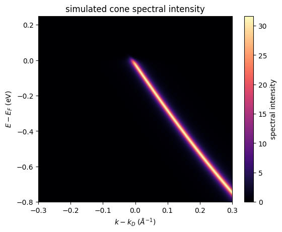


## Mask the Spectrum with the Laser Horizon

The 6.05 eV panel keeps the narrow cone that a fixed-wavelength laser
sees. The 10.8 eV panel restores most of the momentum range. The dashed
curves trace the horizon.


```python
energy_grid = np.asarray(spectrum_energy_ev)
momentum_grid = cone_axis
low_boundary = KINETIC_FACTOR * np.sqrt(
    np.clip(6.05 - WORK_FUNCTION_EV + energy_grid, 0.0, None)
)
low_mask = (
    np.abs(momentum_grid[None, :]) <= low_boundary[:, None]
).astype(np.float64)
fig, ax = plt.subplots(figsize=(6.2, 4.8))
image = ax.imshow(
    cone_image * low_mask,
    origin="lower",
    aspect="auto",
    extent=(
        float(momentum_grid[0]),
        float(momentum_grid[-1]),
        float(energy_grid[0]),
        float(energy_grid[-1]),
    ),
    cmap="magma",
)
ax.plot(low_boundary, energy_grid, color="w", linestyle="--", linewidth=1.0)
ax.plot(
    -low_boundary, energy_grid, color="w", linestyle="--", linewidth=1.0
)
ax.set_xlabel(r"$k - k_D$ ($\AA^{-1}$)")
ax.set_ylabel(r"$E - E_F$ (eV)")
ax.set_title("simulated spectrum inside the 6.05 eV horizon")
fig.colorbar(image, ax=ax, label="spectral intensity")
plt.show()
```


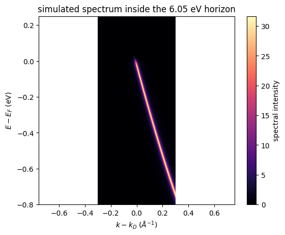


```python
high_boundary = KINETIC_FACTOR * np.sqrt(
    np.clip(10.8 - WORK_FUNCTION_EV + energy_grid, 0.0, None)
)
high_mask = (
    np.abs(momentum_grid[None, :]) <= high_boundary[:, None]
).astype(np.float64)
fig, ax = plt.subplots(figsize=(6.2, 4.8))
image = ax.imshow(
    cone_image * high_mask,
    origin="lower",
    aspect="auto",
    extent=(
        float(momentum_grid[0]),
        float(momentum_grid[-1]),
        float(energy_grid[0]),
        float(energy_grid[-1]),
    ),
    cmap="magma",
)
ax.plot(
    high_boundary, energy_grid, color="w", linestyle="--", linewidth=1.0
)
ax.plot(
    -high_boundary, energy_grid, color="w", linestyle="--", linewidth=1.0
)
ax.set_xlabel(r"$k - k_D$ ($\AA^{-1}$)")
ax.set_ylabel(r"$E - E_F$ (eV)")
ax.set_title("simulated spectrum inside the 10.8 eV horizon")
fig.colorbar(image, ax=ax, label="spectral intensity")
plt.show()
```


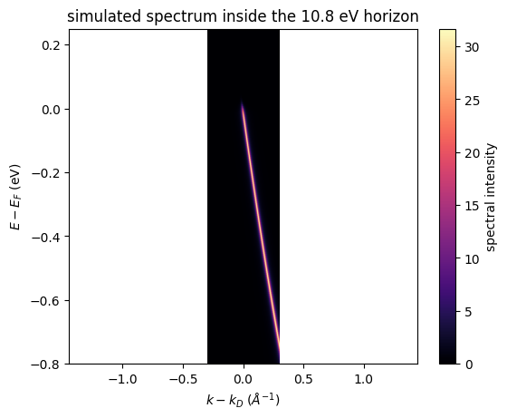


## Cut the Simulated Spectrum

The momentum cut sits at 0.15 eV binding energy. The energy cut sits on
the cone branch at 0.10 inverse Angstrom. The masked curve drops to zero
where the 6.05 eV horizon ends.


```python
cut_row = int(np.argmin(np.abs(energy_grid + 0.15)))
fig, ax = plt.subplots(figsize=(6.2, 3.8))
ax.plot(momentum_grid, cone_image[cut_row], label="full cone")
ax.plot(
    momentum_grid,
    (cone_image * low_mask)[cut_row],
    label="6.05 eV horizon",
)
ax.set_xlabel(r"$k - k_D$ ($\AA^{-1}$)")
ax.set_ylabel("spectral intensity")
ax.set_title("momentum cut at 0.15 eV binding energy")
ax.legend()
plt.show()
```


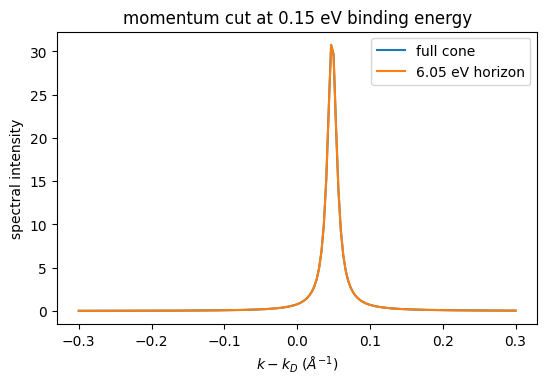


```python
cut_column = int(np.argmin(np.abs(momentum_grid - 0.10)))
fig, ax = plt.subplots(figsize=(6.2, 3.8))
ax.plot(energy_grid, cone_image[:, cut_column], label="full cone")
ax.plot(
    energy_grid,
    (cone_image * low_mask)[:, cut_column],
    label="6.05 eV horizon",
)
ax.axvline(0.0, color="0.4", linewidth=0.8)
ax.set_xlabel(r"$E - E_F$ (eV)")
ax.set_ylabel("spectral intensity")
ax.set_title("energy cut at 0.10 inverse Angstrom")
ax.legend()
plt.show()
```


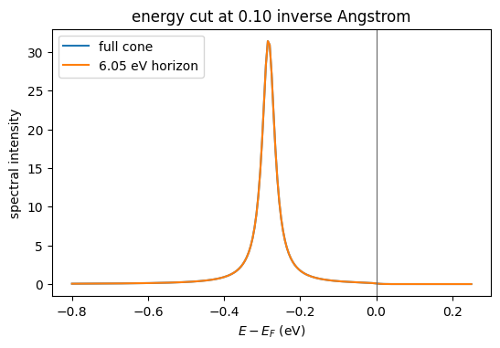
