# Anchor Material Band Structures

Band structures from the internal DFT calculations of Bi2Se3, PdTe2, and
the bismuth telluride family. The final panels turn the same eigenvalues
into ARPES-style intensity maps. The notebook reads the local `data/DFT`
tree.

## Load the Public API

The eigenvalue reader returns a validated band-structure carrier. The
structure reader supplies the reciprocal lattice for momentum conversion.


```python
import jax.numpy as jnp
import matplotlib.pyplot as plt
import numpy as np
from pathlib import Path

from diffpes.inout import read_doscar, read_eigenval, read_poscar
```

## Locate the Local Data Tree

Every path is relative to the tutorials directory. The data tree sits one
level up, under `data/DFT`.


```python
DATA_ROOT = Path("..") / "data" / "DFT"
BI2SE3_DIR = DATA_ROOT / "Bi2Se3" / "6QL" / "Output few bands"
PDTE2_DIR = DATA_ROOT / "PdTe2" / "4ML" / "Output"
BIXTEY_DIR = DATA_ROOT / "BixTey"
print("data tree present:", DATA_ROOT.is_dir())
```

    data tree present: True


## Read the Fermi Levels

The Bi2Se3 value comes from the self-consistent OUTCAR. The PdTe2 value
comes from the retained band-run OUTCAR. A band run reuses a fixed charge
density, so its Fermi value is approximate.


```python
bi2se3_fermi_line = next(
    line
    for line in open(BI2SE3_DIR / "OUTCAR_SCF", encoding="utf-8")
    if "E-fermi" in line
)
bi2se3_fermi_ev = float(bi2se3_fermi_line.split()[2])
pdte2_fermi_line = next(
    line
    for line in open(
        PDTE2_DIR / "MGM" / "OAM DATA" / "OUTCAR", encoding="utf-8"
    )
    if "E-fermi" in line
)
pdte2_fermi_ev = float(pdte2_fermi_line.split()[2])
print("Bi2Se3 6QL Fermi energy (eV):", bi2se3_fermi_ev)
print("PdTe2 4ML Fermi energy (eV):", pdte2_fermi_ev)
```

    Bi2Se3 6QL Fermi energy (eV): 0.0178
    PdTe2 4ML Fermi energy (eV): 2.1733


## Load the Anchor Band Paths

Each path is a line-mode calculation. The reader returns absolute
eigenvalues. Every plot subtracts the Fermi energy.


```python
bi2se3_geo = read_poscar(str(BI2SE3_DIR / "POSCAR"))
pdte2_geo = read_poscar(
    str(DATA_ROOT / "PdTe2" / "4ML" / "PdTe2_4ML_0x_0y_0z.vasp")
)
bi2se3_bands = read_eigenval(
    str(BI2SE3_DIR / "MGM" / "EIGENVAL"), fermi_energy=bi2se3_fermi_ev
)
pdte2_mgm = read_eigenval(
    str(PDTE2_DIR / "MGM" / "EIGENVAL"), fermi_energy=pdte2_fermi_ev
)
pdte2_kgk = read_eigenval(
    str(PDTE2_DIR / "KGK" / "EIGENVAL"), fermi_energy=pdte2_fermi_ev
)
print("Bi2Se3 eigenvalue block:", bi2se3_bands.eigenvalues.shape)
print("PdTe2 MGM eigenvalue block:", pdte2_mgm.eigenvalues.shape)
print("PdTe2 KGK eigenvalue block:", pdte2_kgk.eigenvalues.shape)
```

    Bi2Se3 eigenvalue block: (400, 176)
    PdTe2 MGM eigenvalue block: (400, 144)
    PdTe2 KGK eigenvalue block: (400, 144)


## Convert the Paths to Inverse Angstrom

The reciprocal lattice carries the two-pi convention. The signed path
coordinate is zero at the Gamma point.


```python
bi2se3_kcart = np.asarray(bi2se3_bands.kpoints) @ np.asarray(
    bi2se3_geo.reciprocal
)
bi2se3_step = np.linalg.norm(np.diff(bi2se3_kcart, axis=0), axis=1)
bi2se3_dist = np.concatenate(([0.0], np.cumsum(bi2se3_step)))
bi2se3_gamma = int(
    np.argmin(np.linalg.norm(np.asarray(bi2se3_bands.kpoints), axis=1))
)
bi2se3_axis = bi2se3_dist - bi2se3_dist[bi2se3_gamma]
pdte2_reciprocal = np.asarray(pdte2_geo.reciprocal)
pdte2_mgm_kcart = np.asarray(pdte2_mgm.kpoints) @ pdte2_reciprocal
pdte2_mgm_step = np.linalg.norm(np.diff(pdte2_mgm_kcart, axis=0), axis=1)
pdte2_mgm_dist = np.concatenate(([0.0], np.cumsum(pdte2_mgm_step)))
pdte2_mgm_gamma = int(
    np.argmin(np.linalg.norm(np.asarray(pdte2_mgm.kpoints), axis=1))
)
pdte2_mgm_axis = pdte2_mgm_dist - pdte2_mgm_dist[pdte2_mgm_gamma]
pdte2_kgk_kcart = np.asarray(pdte2_kgk.kpoints) @ pdte2_reciprocal
pdte2_kgk_step = np.linalg.norm(np.diff(pdte2_kgk_kcart, axis=0), axis=1)
pdte2_kgk_dist = np.concatenate(([0.0], np.cumsum(pdte2_kgk_step)))
pdte2_kgk_gamma = int(
    np.argmin(np.linalg.norm(np.asarray(pdte2_kgk.kpoints), axis=1))
)
pdte2_kgk_axis = pdte2_kgk_dist - pdte2_kgk_dist[pdte2_kgk_gamma]
print("Bi2Se3 path half width (1/Ang):", float(bi2se3_axis.max()))
print("PdTe2 MGM path half width (1/Ang):", float(pdte2_mgm_axis.max()))
```

    Bi2Se3 path half width (1/Ang): 0.8654930508183062
    PdTe2 MGM path half width (1/Ang): 0.9005955408277526


## Plot the Bi2Se3 Slab Bands

The full window shows the slab valence manifold. The zoom shows the
topological surface state. The Dirac crossing sits close to the Fermi
level.


```python
bi2se3_shift = np.asarray(bi2se3_bands.eigenvalues) - bi2se3_fermi_ev
fig, ax = plt.subplots(figsize=(6.4, 4.6))
ax.plot(bi2se3_axis, bi2se3_shift, color="tab:blue", linewidth=0.4)
ax.axhline(0.0, color="0.4", linewidth=0.8)
ax.set_xlabel(r"$k - k_\Gamma$ along M--$\Gamma$--M ($\AA^{-1}$)")
ax.set_ylabel(r"$E - E_F$ (eV)")
ax.set_ylim(-6.0, 2.0)
ax.set_title("Bi2Se3 six-layer slab bands")
plt.show()
```


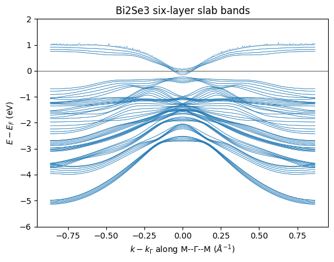


```python
fig, ax = plt.subplots(figsize=(6.0, 4.6))
ax.plot(bi2se3_axis, bi2se3_shift, color="tab:blue", linewidth=0.7)
ax.axhline(0.0, color="0.4", linewidth=0.8)
ax.set_xlim(-0.35, 0.35)
ax.set_ylim(-1.2, 0.7)
ax.set_xlabel(r"$k - k_\Gamma$ ($\AA^{-1}$)")
ax.set_ylabel(r"$E - E_F$ (eV)")
ax.set_title("Bi2Se3 surface-state window")
plt.show()
```


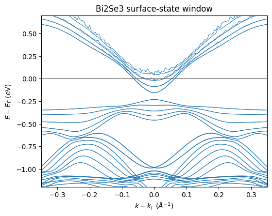


## Plot the PdTe2 Slab Bands

Dense slab subbands fill the four-layer window. The zoom panels cover the
states near Gamma on both retained paths.


```python
pdte2_mgm_shift = np.asarray(pdte2_mgm.eigenvalues) - pdte2_fermi_ev
fig, ax = plt.subplots(figsize=(6.4, 4.6))
ax.plot(pdte2_mgm_axis, pdte2_mgm_shift, color="tab:red", linewidth=0.4)
ax.axhline(0.0, color="0.4", linewidth=0.8)
ax.set_xlabel(r"$k - k_\Gamma$ along M--$\Gamma$--M ($\AA^{-1}$)")
ax.set_ylabel(r"$E - E_F$ (eV)")
ax.set_ylim(-6.0, 2.0)
ax.set_title("PdTe2 four-layer slab bands")
plt.show()
```


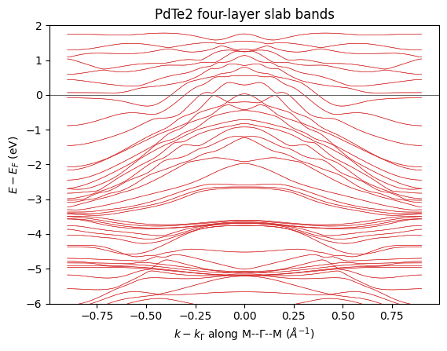


```python
fig, ax = plt.subplots(figsize=(6.0, 4.6))
ax.plot(pdte2_mgm_axis, pdte2_mgm_shift, color="tab:red", linewidth=0.7)
ax.axhline(0.0, color="0.4", linewidth=0.8)
ax.set_xlim(-0.45, 0.45)
ax.set_ylim(-1.6, 0.7)
ax.set_xlabel(r"$k - k_\Gamma$ ($\AA^{-1}$)")
ax.set_ylabel(r"$E - E_F$ (eV)")
ax.set_title("PdTe2 near-Gamma window")
plt.show()
```


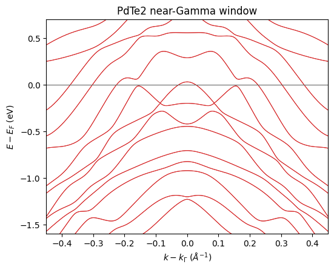


```python
pdte2_kgk_shift = np.asarray(pdte2_kgk.eigenvalues) - pdte2_fermi_ev
fig, ax = plt.subplots(figsize=(6.0, 4.6))
ax.plot(pdte2_kgk_axis, pdte2_kgk_shift, color="tab:red", linewidth=0.5)
ax.axhline(0.0, color="0.4", linewidth=0.8)
ax.set_xlim(-0.6, 0.6)
ax.set_ylim(-2.0, 0.7)
ax.set_xlabel(r"$k - k_\Gamma$ along K--$\Gamma$--K ($\AA^{-1}$)")
ax.set_ylabel(r"$E - E_F$ (eV)")
ax.set_title("PdTe2 K--Gamma--K window")
plt.show()
```


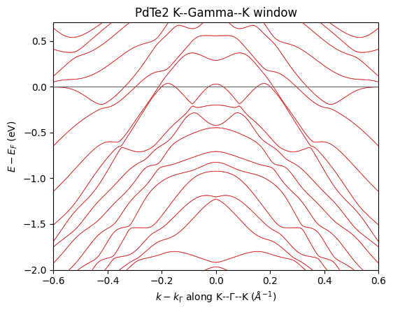


## Survey the Bismuth Telluride Family

Supplementary calculations cover BiTe, Bi2Te3, and Bi4Te3. The panels use
a normalized path coordinate. Each Fermi value comes from the matching
band-run OUTCAR.


```python
bite_dir = BIXTEY_DIR / "BiTe" / "Bulk" / "Output" / "MGM"
bite_fermi_ev = float(
    next(
        line
        for line in open(bite_dir / "OUTCAR_BAND", encoding="utf-8")
        if "E-fermi" in line
    ).split()[2]
)
bite_bands = read_eigenval(
    str(bite_dir / "EIGENVAL"), fermi_energy=bite_fermi_ev
)
bi2te3_dir = BIXTEY_DIR / "Bi2Te3" / "Bulk" / "Output" / "KGK"
bi2te3_fermi_ev = float(
    next(
        line
        for line in open(bi2te3_dir / "OUTCAR_BAND", encoding="utf-8")
        if "E-fermi" in line
    ).split()[2]
)
bi2te3_bands = read_eigenval(
    str(bi2te3_dir / "EIGENVAL"), fermi_energy=bi2te3_fermi_ev
)
bi4te3_dir = BIXTEY_DIR / "Bi4Te3" / "Bulk" / "Output" / "MGM"
bi4te3_fermi_ev = float(
    next(
        line
        for line in open(bi4te3_dir / "OUTCAR_BAND", encoding="utf-8")
        if "E-fermi" in line
    ).split()[2]
)
bi4te3_bands = read_eigenval(
    str(bi4te3_dir / "EIGENVAL"), fermi_energy=bi4te3_fermi_ev
)
bi4te3_slab_dir = BIXTEY_DIR / "Bi4Te3" / "5BL 5QL" / "Output" / "MGM"
bi4te3_slab_fermi_ev = float(
    next(
        line
        for line in open(bi4te3_slab_dir / "OUTCAR_BAND", encoding="utf-8")
        if "E-fermi" in line
    ).split()[2]
)
bi4te3_slab_bands = read_eigenval(
    str(bi4te3_slab_dir / "EIGENVAL"), fermi_energy=bi4te3_slab_fermi_ev
)
print("BiTe bands:", bite_bands.eigenvalues.shape)
print("Bi2Te3 bands:", bi2te3_bands.eigenvalues.shape)
print("Bi4Te3 bulk bands:", bi4te3_bands.eigenvalues.shape)
print("Bi4Te3 slab bands:", bi4te3_slab_bands.eigenvalues.shape)
```

    BiTe bands: (400, 140)
    Bi2Te3 bands: (400, 140)
    Bi4Te3 bulk bands: (400, 140)
    Bi4Te3 slab bands: (400, 200)


```python
bite_axis = np.linspace(0.0, 1.0, bite_bands.eigenvalues.shape[0])
bite_shift = np.asarray(bite_bands.eigenvalues) - bite_fermi_ev
fig, ax = plt.subplots(figsize=(6.0, 4.4))
ax.plot(bite_axis, bite_shift, color="tab:purple", linewidth=0.4)
ax.axhline(0.0, color="0.4", linewidth=0.8)
ax.set_ylim(-4.0, 2.0)
ax.set_xlabel("normalized M--Gamma--M coordinate")
ax.set_ylabel(r"$E - E_F$ (eV)")
ax.set_title("BiTe bulk bands")
plt.show()
```


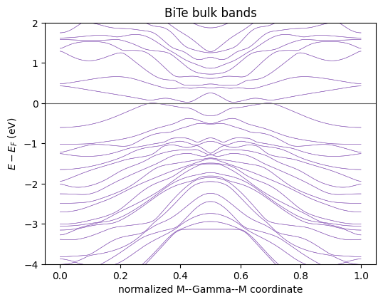


```python
bi2te3_axis = np.linspace(0.0, 1.0, bi2te3_bands.eigenvalues.shape[0])
bi2te3_shift = np.asarray(bi2te3_bands.eigenvalues) - bi2te3_fermi_ev
fig, ax = plt.subplots(figsize=(6.0, 4.4))
ax.plot(bi2te3_axis, bi2te3_shift, color="tab:green", linewidth=0.4)
ax.axhline(0.0, color="0.4", linewidth=0.8)
ax.set_ylim(-4.0, 2.0)
ax.set_xlabel("normalized K--Gamma--K coordinate")
ax.set_ylabel(r"$E - E_F$ (eV)")
ax.set_title("Bi2Te3 bulk bands")
plt.show()
```


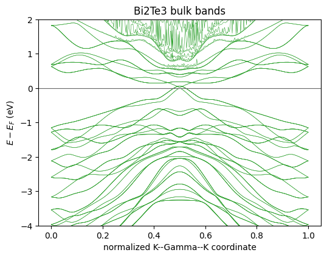


```python
bi4te3_axis = np.linspace(0.0, 1.0, bi4te3_bands.eigenvalues.shape[0])
bi4te3_shift = np.asarray(bi4te3_bands.eigenvalues) - bi4te3_fermi_ev
fig, ax = plt.subplots(figsize=(6.0, 4.4))
ax.plot(bi4te3_axis, bi4te3_shift, color="tab:brown", linewidth=0.4)
ax.axhline(0.0, color="0.4", linewidth=0.8)
ax.set_ylim(-4.0, 2.0)
ax.set_xlabel("normalized M--Gamma--M coordinate")
ax.set_ylabel(r"$E - E_F$ (eV)")
ax.set_title("Bi4Te3 bulk bands")
plt.show()
```


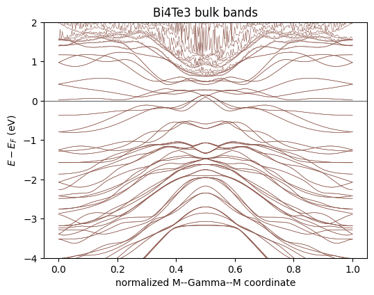


```python
bi4te3_slab_axis = np.linspace(
    0.0, 1.0, bi4te3_slab_bands.eigenvalues.shape[0]
)
bi4te3_slab_shift = (
    np.asarray(bi4te3_slab_bands.eigenvalues) - bi4te3_slab_fermi_ev
)
fig, ax = plt.subplots(figsize=(6.0, 4.4))
ax.plot(
    bi4te3_slab_axis, bi4te3_slab_shift, color="tab:olive", linewidth=0.4
)
ax.axhline(0.0, color="0.4", linewidth=0.8)
ax.set_ylim(-4.0, 2.0)
ax.set_xlabel("normalized M--Gamma--M coordinate")
ax.set_ylabel(r"$E - E_F$ (eV)")
ax.set_title("Bi4Te3 five-layer slab bands")
plt.show()
```


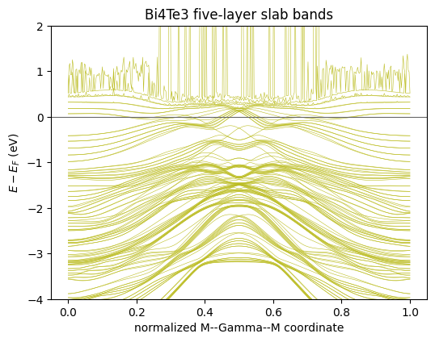


## Compare the Densities of States

Total density of states for the Bi2Se3 bulk and slab calculations. The
slab curve adds the vacuum region.


```python
bi2se3_bulk_dos = read_doscar(
    str(DATA_ROOT / "Bi2Se3" / "Bulk" / "Output" / "DOSCAR")
)
fig, ax = plt.subplots(figsize=(6.0, 4.0))
ax.plot(
    np.asarray(bi2se3_bulk_dos.energy)
    - float(bi2se3_bulk_dos.fermi_energy),
    np.asarray(bi2se3_bulk_dos.total_dos),
    color="tab:blue",
)
ax.axvline(0.0, color="0.4", linewidth=0.8)
ax.set_xlim(-6.0, 4.0)
ax.set_xlabel(r"$E - E_F$ (eV)")
ax.set_ylabel("total DOS (states/eV)")
ax.set_title("Bi2Se3 bulk density of states")
plt.show()
```


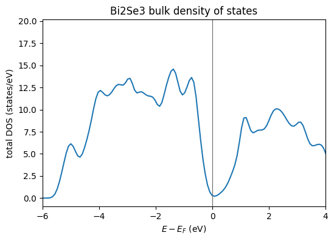


```python
bi2se3_slab_dos = read_doscar(str(BI2SE3_DIR / "DOSCAR"))
fig, ax = plt.subplots(figsize=(6.0, 4.0))
ax.plot(
    np.asarray(bi2se3_slab_dos.energy)
    - float(bi2se3_slab_dos.fermi_energy),
    np.asarray(bi2se3_slab_dos.total_dos),
    color="tab:cyan",
)
ax.axvline(0.0, color="0.4", linewidth=0.8)
ax.set_xlim(-6.0, 4.0)
ax.set_xlabel(r"$E - E_F$ (eV)")
ax.set_ylabel("total DOS (states/eV)")
ax.set_title("Bi2Se3 slab density of states")
plt.show()
```


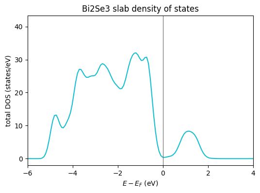


## Render ARPES-Style Intensity Maps

Each eigenvalue receives one Lorentzian line shape with a 30 meV width. A
Fermi factor at 100 K removes the unoccupied side. The thermal energy is
0.0086 eV.


```python
omega_ev = jnp.linspace(-1.4, 0.5, 261)
gamma_ev = 0.03
bi2se3_levels = jnp.asarray(bi2se3_shift)
bi2se3_lorentzians = (gamma_ev / jnp.pi) / (
    (omega_ev[None, None, :] - bi2se3_levels[:, :, None]) ** 2
    + gamma_ev**2
)
occupation = 1.0 / (1.0 + jnp.exp(omega_ev / 0.0086))
bi2se3_map = (bi2se3_lorentzians.sum(axis=1) * occupation[None, :]).T
fig, ax = plt.subplots(figsize=(6.2, 4.8))
image = ax.imshow(
    bi2se3_map,
    origin="lower",
    aspect="auto",
    extent=(
        float(bi2se3_axis[0]),
        float(bi2se3_axis[-1]),
        float(omega_ev[0]),
        float(omega_ev[-1]),
    ),
    cmap="magma",
)
ax.set_xlim(-0.35, 0.35)
ax.set_xlabel(r"$k - k_\Gamma$ ($\AA^{-1}$)")
ax.set_ylabel(r"$E - E_F$ (eV)")
ax.set_title("Bi2Se3 slab ARPES-style map")
fig.colorbar(image, ax=ax, label="broadened intensity")
plt.show()
```


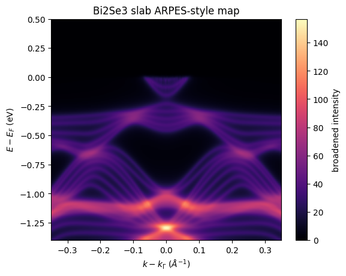


```python
pdte2_levels = jnp.asarray(pdte2_mgm_shift)
pdte2_lorentzians = (gamma_ev / jnp.pi) / (
    (omega_ev[None, None, :] - pdte2_levels[:, :, None]) ** 2
    + gamma_ev**2
)
pdte2_map = (pdte2_lorentzians.sum(axis=1) * occupation[None, :]).T
fig, ax = plt.subplots(figsize=(6.2, 4.8))
image = ax.imshow(
    pdte2_map,
    origin="lower",
    aspect="auto",
    extent=(
        float(pdte2_mgm_axis[0]),
        float(pdte2_mgm_axis[-1]),
        float(omega_ev[0]),
        float(omega_ev[-1]),
    ),
    cmap="magma",
)
ax.set_xlim(-0.45, 0.45)
ax.set_xlabel(r"$k - k_\Gamma$ ($\AA^{-1}$)")
ax.set_ylabel(r"$E - E_F$ (eV)")
ax.set_title("PdTe2 slab ARPES-style map")
fig.colorbar(image, ax=ax, label="broadened intensity")
plt.show()
```


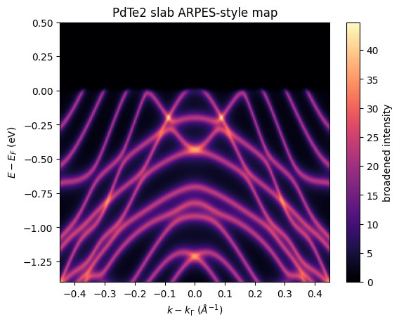
