# Orbital Character Maps

Orbital-resolved band weights from the PdTe2 four-layer PROCAR. The
panels color the band structure by orbital family, atomic species, and
layer. The final images fold the weights into ARPES-style fat-band maps.
The notebook reads the local `data/DFT` tree.

## Load the Public API

The readers return the geometry, the path metadata, the Fermi reference,
and the spin-orbit projection carrier. The helper calls select atoms,
reduce orbitals, and check the parsed dimensions against each other.


```python
import jax.numpy as jnp
import matplotlib.pyplot as plt
import numpy as np
from pathlib import Path

from diffpes.inout import (
    check_consistency,
    dedupe_band_path,
    plot_arpes_with_kpath,
    plot_band_scatter_with_kpath,
    read_eigenval,
    read_kpoints,
    read_outcar,
    read_poscar,
    read_procar,
    reduce_orbitals,
    select_atoms,
)
from diffpes.simul import assemble_spectral_intensity_bands_chunk
from diffpes.tightb import kpath_arc_length, kpoints_frac_to_cart
from diffpes.types import (
    make_arpes_spectrum,
    make_kpath,
    make_self_energy_model,
)
```

## Load the Path and the Geometry

The species list orders the projection ions. The fractional atom heights
separate the top and bottom halves of the slab.


```python
DATA_ROOT = Path("..") / "data" / "DFT"
PDTE2_MGM_DIR = DATA_ROOT / "PdTe2" / "4ML" / "Output" / "MGM"
pdte2_fermi_ev = float(
    read_outcar(str(PDTE2_MGM_DIR / "OAM DATA" / "OUTCAR")).fermi_energy
)
pdte2_geo = read_poscar(
    str(DATA_ROOT / "PdTe2" / "4ML" / "PdTe2_4ML_0x_0y_0z.vasp")
)
pdte2_bands = read_eigenval(
    str(PDTE2_MGM_DIR / "EIGENVAL"), fermi_energy=pdte2_fermi_ev
)
pdte2_kinfo = read_kpoints(str(PDTE2_MGM_DIR / "KPOINTS"))
band_shift = np.asarray(pdte2_bands.eigenvalues) - pdte2_fermi_ev
path_dist = kpath_arc_length(
    make_kpath(pdte2_bands.kpoints), pdte2_geo
)
gamma_index = int(
    np.argmin(np.linalg.norm(np.asarray(pdte2_bands.kpoints), axis=1))
)
path_axis = np.asarray(path_dist - path_dist[gamma_index])
species = np.asarray(pdte2_geo.species)
heights = np.asarray(pdte2_geo.positions)[:, 2]
print("Fermi energy (eV):", pdte2_fermi_ev)
print("species counts:", {s: int((species == s).sum()) for s in set(species)})
print("path labels:", pdte2_kinfo.labels)
```

    Fermi energy (eV): 2.1733
    species counts: {np.str_('Te'): 8, np.str_('Pd'): 4}
    path labels: ('M', 'G', 'M')


## Read the Projection Tables

The reader returns the spin-orbit projection carrier: one charge table
and six nonnegative spin channels. The consistency check confirms the
k-point and band counts against the eigenvalue file and the path.


```python
projection = read_procar(
    str(PDTE2_MGM_DIR / "PROCAR"), return_mode="full"
)
weights = np.asarray(projection.projections)
spin_channels = np.asarray(projection.spin)
check_consistency(pdte2_bands, projection, pdte2_kinfo)
print("weight block:", weights.shape)
print("spin block:", spin_channels.shape)
print(
    "mean state weight:",
    round(float(weights.sum(axis=(2, 3)).mean()), 3),
)
```

    weight block: (400, 144, 12, 9)
    spin block: (400, 144, 12, 6)
    mean state weight: 0.611


## Group the Atoms

The species masks split palladium from tellurium. The height masks split
the top half of the slab from the bottom half. `select_atoms` restricts
the carrier to the top-half ions for the layer panels.


```python
pd_indices = [int(i) for i in np.nonzero(species == "Pd")[0]]
te_indices = [int(i) for i in np.nonzero(species == "Te")[0]]
top_indices = [
    int(i) for i in np.nonzero(heights > np.median(heights))[0]
]
top_projection = select_atoms(projection, top_indices)
total_weight = weights.sum(axis=(2, 3))
fig, ax = plt.subplots(figsize=(6.2, 4.0))
ax.hist(total_weight.ravel(), bins=60, color="tab:gray")
ax.set_xlabel("summed projection weight per state")
ax.set_ylabel("state count")
ax.set_title("projection completeness across the path")
plt.show()
```


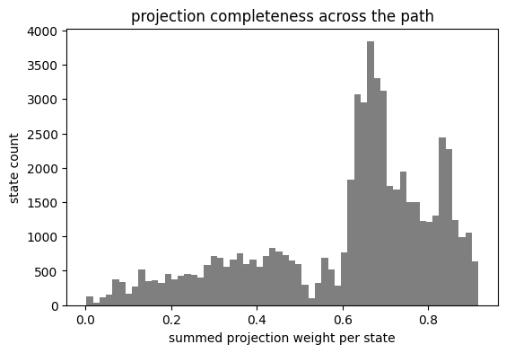


## Draw the Preset Band Scatters

`plot_band_scatter_with_kpath` sizes each marker with the selected
preset weight and labels the momentum axis with the KPOINTS symmetry
points. The palladium d weight dominates the deeper valence manifold.
The tellurium p weight carries the states near the Fermi level.


```python
fig, ax = plt.subplots(figsize=(6.8, 4.8))
plot_band_scatter_with_kpath(
    pdte2_bands,
    projection,
    pdte2_kinfo,
    preset="d",
    atom_indices=pd_indices,
    ax=ax,
    color="tab:green",
    size_scale=40.0,
    title="palladium d weight along M--Gamma--M",
)
ax.set_ylim(-3.0, 1.0)
plt.show()
```


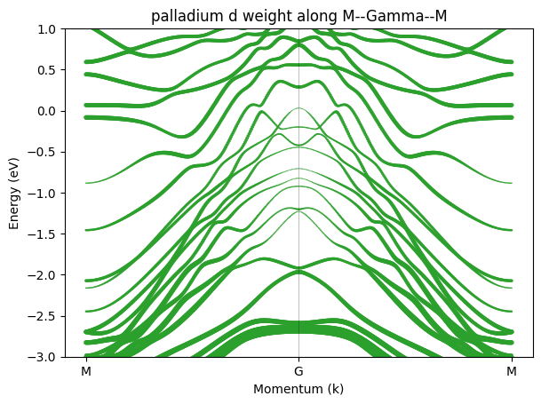


```python
fig, ax = plt.subplots(figsize=(6.8, 4.8))
plot_band_scatter_with_kpath(
    pdte2_bands,
    projection,
    pdte2_kinfo,
    preset="p",
    atom_indices=te_indices,
    ax=ax,
    color="tab:orange",
    size_scale=40.0,
    title="tellurium p weight along M--Gamma--M",
)
ax.set_ylim(-3.0, 1.0)
plt.show()
```


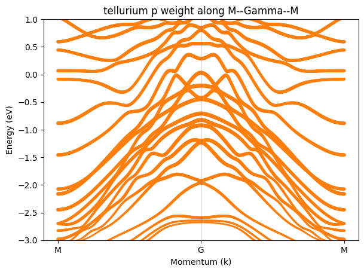


```python
fig, ax = plt.subplots(figsize=(6.8, 4.8))
plot_band_scatter_with_kpath(
    pdte2_bands,
    projection,
    pdte2_kinfo,
    preset="pz",
    ax=ax,
    color="tab:blue",
    size_scale=40.0,
    title="out-of-plane p weight along M--Gamma--M",
)
ax.set_ylim(-3.0, 1.0)
plt.show()
```


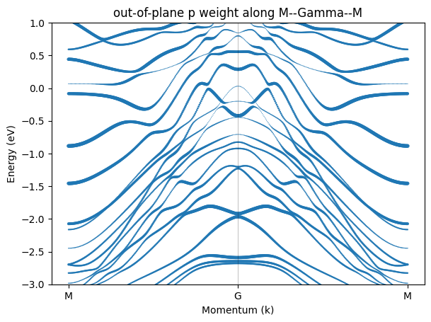


```python
fig, ax = plt.subplots(figsize=(6.8, 4.8))
plot_band_scatter_with_kpath(
    pdte2_bands,
    top_projection,
    pdte2_kinfo,
    preset="total",
    ax=ax,
    color="tab:purple",
    size_scale=25.0,
    title="top-half weight along M--Gamma--M",
)
ax.set_ylim(-3.0, 1.0)
plt.show()
```


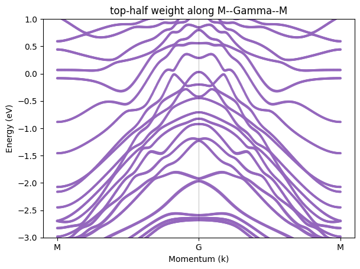


## Decompose the Gamma-Point States

`reduce_orbitals` collapses the nine orbital channels into s, p, and d
shell totals. The stacked bars split every Gamma state in the window.
The valence top mixes tellurium p with palladium d.


```python
shell_totals = np.asarray(
    reduce_orbitals(projection.projections)
).sum(axis=2)
gamma_window = (band_shift[gamma_index] > -2.0) & (
    band_shift[gamma_index] < 0.5
)
gamma_band_indices = np.nonzero(gamma_window)[0]
gamma_energies = band_shift[gamma_index, gamma_band_indices]
gamma_shells = shell_totals[gamma_index, gamma_band_indices]
gamma_norm = np.where(
    gamma_shells.sum(axis=1) > 1.0e-12, gamma_shells.sum(axis=1), 1.0
)
bar_positions = np.arange(gamma_band_indices.shape[0], dtype=np.float64)
fig, ax = plt.subplots(figsize=(7.2, 4.2))
ax.bar(bar_positions, gamma_shells[:, 0] / gamma_norm, label="s")
ax.bar(
    bar_positions,
    gamma_shells[:, 1] / gamma_norm,
    bottom=gamma_shells[:, 0] / gamma_norm,
    label="p",
)
ax.bar(
    bar_positions,
    gamma_shells[:, 2] / gamma_norm,
    bottom=(gamma_shells[:, 0] + gamma_shells[:, 1]) / gamma_norm,
    label="d",
)
ax.set_xticks(bar_positions[:: max(1, bar_positions.shape[0] // 12)])
ax.set_xticklabels(
    [
        f"{energy:.2f}"
        for energy in gamma_energies[
            :: max(1, bar_positions.shape[0] // 12)
        ]
    ],
    rotation=45,
)
ax.set_xlabel(r"Gamma-state energy $E - E_F$ (eV)")
ax.set_ylabel("orbital share")
ax.set_title("orbital composition of the Gamma states")
ax.legend()
plt.show()
```


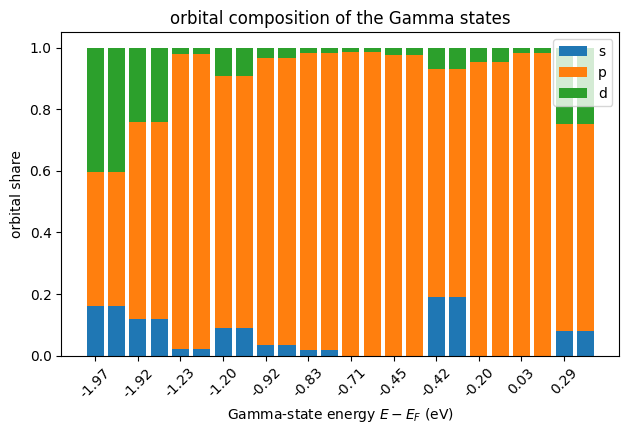


## Fold the Weights into Fat-Band Maps

`dedupe_band_path` removes the repeated Gamma anchor and carries the
projections through the same selection. The spectral assembly scales
each Lorentzian line with its channel weight at 100 K.
`plot_arpes_with_kpath` draws each map with the symmetry labels.


```python
map_bands, map_kinfo, map_projection = dedupe_band_path(
    pdte2_bands, pdte2_kinfo, projection
)
map_dist = kpath_arc_length(make_kpath(map_bands.kpoints), pdte2_geo)
map_kcart = kpoints_frac_to_cart(map_bands.kpoints, pdte2_geo)
map_weights = np.asarray(map_projection.projections)
map_total = map_weights.sum(axis=(2, 3))
map_safe = np.where(map_total > 1.0e-12, map_total, 1.0)
pd_d_fraction = jnp.asarray(
    map_weights[:, :, pd_indices, 4:9].sum(axis=(2, 3)) / map_safe
)
te_p_fraction = jnp.asarray(
    map_weights[:, :, te_indices, 1:4].sum(axis=(2, 3)) / map_safe
)
top_fraction = jnp.asarray(
    map_weights[:, :, top_indices, :].sum(axis=(2, 3)) / map_safe
)
omega_ev = jnp.linspace(-3.0, 0.5, 241)
map_self_energy = make_self_energy_model(gamma=0.035)
n_k, n_bands = map_bands.eigenvalues.shape
pd_d_intensity = assemble_spectral_intensity_bands_chunk(
    map_bands.eigenvalues,
    jnp.broadcast_to(
        pd_d_fraction[:, None, :], (n_k, omega_ev.shape[0], n_bands)
    ),
    omega_ev,
    map_self_energy,
    jnp.asarray(pdte2_fermi_ev),
    100.0,
    allow_degenerate_value_only=True,
)
pd_d_spectrum = make_arpes_spectrum(
    pd_d_intensity, omega_ev, map_dist, map_kcart
)
fig, ax = plt.subplots(figsize=(6.6, 4.8))
plot_arpes_with_kpath(
    pd_d_spectrum,
    map_kinfo,
    ax=ax,
    cmap="viridis",
    title="palladium d fat-band map",
)
plt.show()
```


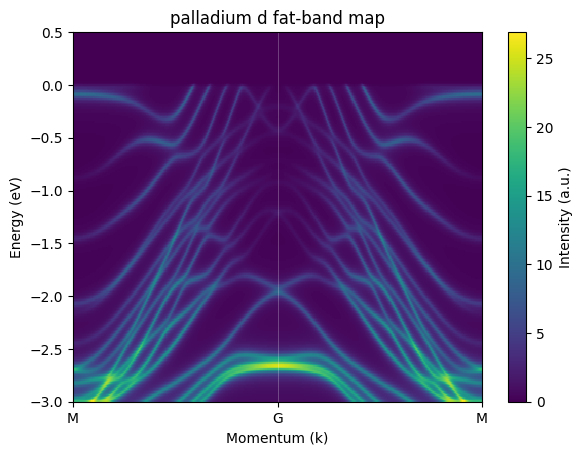


```python
te_p_intensity = assemble_spectral_intensity_bands_chunk(
    map_bands.eigenvalues,
    jnp.broadcast_to(
        te_p_fraction[:, None, :], (n_k, omega_ev.shape[0], n_bands)
    ),
    omega_ev,
    map_self_energy,
    jnp.asarray(pdte2_fermi_ev),
    100.0,
    allow_degenerate_value_only=True,
)
te_p_spectrum = make_arpes_spectrum(
    te_p_intensity, omega_ev, map_dist, map_kcart
)
fig, ax = plt.subplots(figsize=(6.6, 4.8))
plot_arpes_with_kpath(
    te_p_spectrum,
    map_kinfo,
    ax=ax,
    cmap="plasma",
    title="tellurium p fat-band map",
)
plt.show()
```


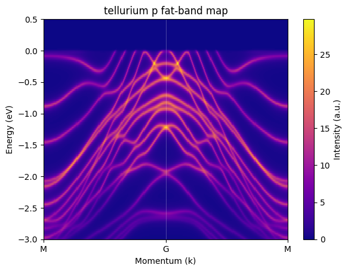


```python
difference_map = np.asarray(pd_d_intensity).T - np.asarray(
    te_p_intensity
).T
difference_scale = float(np.abs(difference_map).max())
fig, ax = plt.subplots(figsize=(6.6, 4.8))
image = ax.imshow(
    difference_map,
    origin="lower",
    aspect="auto",
    extent=(
        float(map_dist[0]),
        float(map_dist[-1]),
        float(omega_ev[0]),
        float(omega_ev[-1]),
    ),
    cmap="RdBu_r",
    vmin=-difference_scale,
    vmax=difference_scale,
)
ax.set_xlabel(r"M--$\Gamma$--M path distance ($\AA^{-1}$)")
ax.set_ylabel(r"$E - E_F$ (eV)")
ax.set_title("d minus p channel contrast")
fig.colorbar(image, ax=ax, label="intensity difference")
plt.show()
```


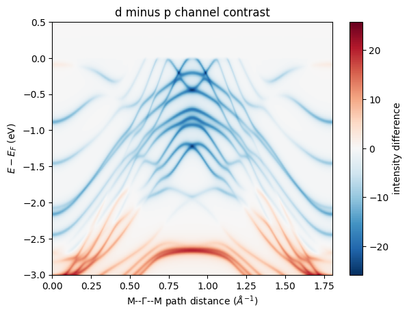


```python
top_intensity = assemble_spectral_intensity_bands_chunk(
    map_bands.eigenvalues,
    jnp.broadcast_to(
        top_fraction[:, None, :], (n_k, omega_ev.shape[0], n_bands)
    ),
    omega_ev,
    map_self_energy,
    jnp.asarray(pdte2_fermi_ev),
    100.0,
    allow_degenerate_value_only=True,
)
top_spectrum = make_arpes_spectrum(
    top_intensity, omega_ev, map_dist, map_kcart
)
fig, ax = plt.subplots(figsize=(6.6, 4.8))
plot_arpes_with_kpath(
    top_spectrum,
    map_kinfo,
    ax=ax,
    cmap="magma",
    title="top-half weighted fat-band map",
)
plt.show()
```


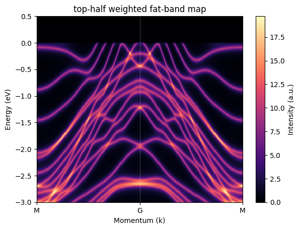


## Map the Spin Texture

The signed z spin is the fifth channel minus the sixth channel, summed
over ions. Red and blue mark opposite spin signs. Opposite momenta carry
opposite signs across Gamma.


```python
sz_signed = (
    spin_channels[:, :, :, 4] - spin_channels[:, :, :, 5]
).sum(axis=2)
sz_scale = float(np.abs(sz_signed).max())
path_mesh = np.repeat(path_axis[:, None], band_shift.shape[1], axis=1)
window = (band_shift > -3.0) & (band_shift < 1.0)
fig, ax = plt.subplots(figsize=(6.8, 4.8))
points = ax.scatter(
    path_mesh[window],
    band_shift[window],
    c=sz_signed[window],
    s=2.0,
    cmap="RdBu_r",
    vmin=-sz_scale,
    vmax=sz_scale,
)
ax.axhline(0.0, color="0.4", linewidth=0.8)
ax.set_xlabel(r"$k - k_\Gamma$ ($\AA^{-1}$)")
ax.set_ylabel(r"$E - E_F$ (eV)")
ax.set_title("signed z spin along M--Gamma--M")
fig.colorbar(points, ax=ax, label="signed z spin weight")
plt.show()
```


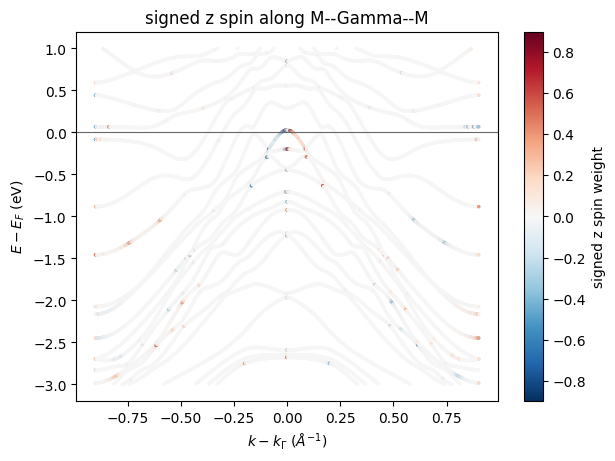
