# Charge Density Floor Checks

Volumetric charge densities from the internal DFT tree: the Bi2Se3 bulk
and slab totals, and the PdTe2 selected-band states. The final panels
weight the surface states with photoemission escape depths. The notebook
reads the local `data/DFT` tree.

## Load the Public API

The volumetric reader returns the charge in electrons per cubic
Angstrom, the lattice, the grid shape, and the species list.


```python
import matplotlib.pyplot as plt
import numpy as np
from pathlib import Path

from diffpes.inout import read_chgcar
```

## Read the Bi2Se3 Bulk Density

The grid shape and the species list come straight from the file header.
The planar average runs over the in-plane axes.


```python
DATA_ROOT = Path("..") / "data" / "DFT"
bulk_volume_data = read_chgcar(
    str(DATA_ROOT / "Bi2Se3" / "Bulk" / "Output" / "CHGCAR")
)
bulk_charge = np.asarray(bulk_volume_data.charge)
bulk_lattice = np.asarray(bulk_volume_data.lattice)
print("grid shape:", bulk_volume_data.grid_shape)
print("species:", bulk_volume_data.symbols)
print("atom counts:", bulk_volume_data.atom_counts)
```

    grid shape: (36, 36, 252)
    species: ('Bi', 'Te')
    atom counts: [6 9]


```python
bulk_c_length = float(np.linalg.norm(bulk_lattice[2]))
bulk_z_axis = (
    np.arange(bulk_charge.shape[2]) / bulk_charge.shape[2] * bulk_c_length
)
bulk_profile = bulk_charge.mean(axis=(0, 1))
fig, ax = plt.subplots(figsize=(6.4, 4.0))
ax.plot(bulk_z_axis, bulk_profile, color="tab:blue")
ax.set_xlabel(r"$z$ ($\AA$)")
ax.set_ylabel(r"planar-averaged density (e/$\AA^3$)")
ax.set_title("Bi2Se3 bulk charge along the stacking axis")
plt.show()
```


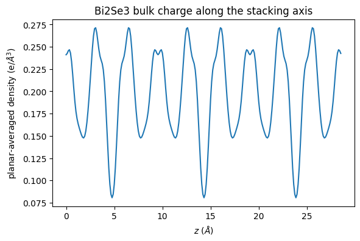


```python
bulk_plane_index = int(np.argmax(bulk_profile))
fig, ax = plt.subplots(figsize=(5.4, 4.6))
image = ax.imshow(
    bulk_charge[:, :, bulk_plane_index].T,
    origin="lower",
    cmap="viridis",
)
ax.set_xlabel("grid index a")
ax.set_ylabel("grid index b")
ax.set_title("bulk in-plane slice at the density maximum")
fig.colorbar(image, ax=ax, label=r"density (e/$\AA^3$)")
plt.show()
```


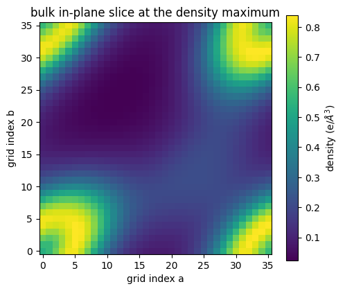


## Check the Electron Counts

The grid integral is the mean density times the cell volume. The
reference count is the NELECT value in the matching OUTCAR.


```python
bulk_volume = float(abs(np.linalg.det(bulk_lattice)))
bulk_integral = float(bulk_charge.mean() * bulk_volume)
bulk_nelect = float(
    next(
        line
        for line in open(
            DATA_ROOT / "Bi2Se3" / "Bulk" / "Output" / "OUTCAR_SCF",
            encoding="utf-8",
        )
        if "NELECT" in line
    ).split()[2]
)
SLAB_DIR = DATA_ROOT / "Bi2Se3" / "6QL" / "Output few bands"
slab_volume_data = read_chgcar(str(SLAB_DIR / "CHGCAR"))
slab_charge = np.asarray(slab_volume_data.charge)
slab_lattice = np.asarray(slab_volume_data.lattice)
slab_volume = float(abs(np.linalg.det(slab_lattice)))
slab_integral = float(slab_charge.mean() * slab_volume)
slab_nelect = float(
    next(
        line
        for line in open(SLAB_DIR / "OUTCAR_SCF", encoding="utf-8")
        if "NELECT" in line
    ).split()[2]
)
print("bulk integral (e):", round(bulk_integral, 2))
print("bulk NELECT (e):", bulk_nelect)
print("slab integral (e):", round(slab_integral, 2))
print("slab NELECT (e):", slab_nelect)
```

    bulk integral (e): 84.0
    bulk NELECT (e): 84.0
    slab integral (e): 168.0
    slab NELECT (e): 168.0


```python
bar_positions = np.asarray([0.0, 1.0])
fig, ax = plt.subplots(figsize=(6.0, 4.0))
ax.bar(
    bar_positions - 0.17,
    [bulk_integral, slab_integral],
    width=0.34,
    label="grid integral",
)
ax.bar(
    bar_positions + 0.17,
    [bulk_nelect, slab_nelect],
    width=0.34,
    label="OUTCAR NELECT",
)
ax.set_xticks(bar_positions)
ax.set_xticklabels(["Bi2Se3 bulk", "Bi2Se3 slab"])
ax.set_ylabel("electrons per cell")
ax.set_title("grid integral against the electron count")
ax.legend()
plt.show()
```


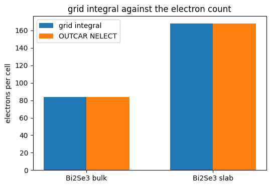


## Profile the Slab Density

The linear panel shows six quintuple layers. The logarithmic panel shows
the exponential decay into the vacuum region.


```python
slab_c_length = float(np.linalg.norm(slab_lattice[2]))
slab_z_axis = (
    np.arange(slab_charge.shape[2]) / slab_charge.shape[2] * slab_c_length
)
slab_profile = slab_charge.mean(axis=(0, 1))
fig, ax = plt.subplots(figsize=(6.8, 4.0))
ax.plot(slab_z_axis, slab_profile, color="tab:cyan")
ax.set_xlabel(r"$z$ ($\AA$)")
ax.set_ylabel(r"planar-averaged density (e/$\AA^3$)")
ax.set_title("Bi2Se3 slab charge along the stacking axis")
plt.show()
```


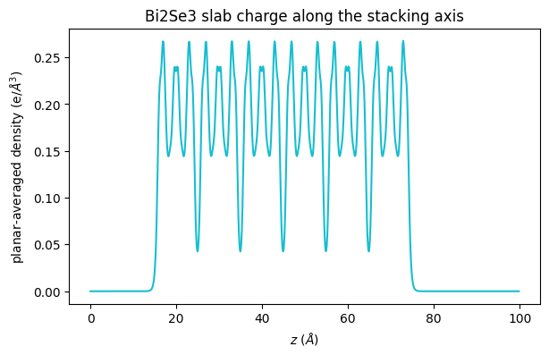


```python
fig, ax = plt.subplots(figsize=(6.8, 4.0))
ax.semilogy(
    slab_z_axis, np.clip(slab_profile, 1.0e-9, None), color="tab:cyan"
)
ax.set_xlabel(r"$z$ ($\AA$)")
ax.set_ylabel(r"planar-averaged density (e/$\AA^3$)")
ax.set_title("slab charge on a logarithmic scale")
plt.show()
```


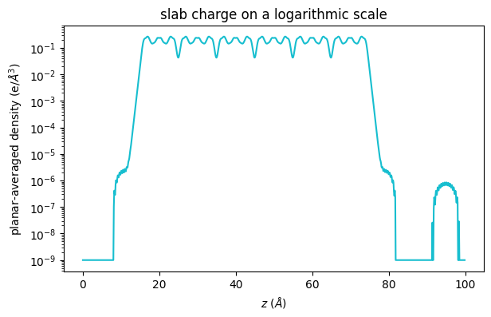


```python
slab_plane_index = int(np.argmax(slab_profile))
fig, ax = plt.subplots(figsize=(5.4, 4.6))
image = ax.imshow(
    slab_charge[:, :, slab_plane_index].T,
    origin="lower",
    cmap="viridis",
)
ax.set_xlabel("grid index a")
ax.set_ylabel("grid index b")
ax.set_title("slab in-plane slice at the density maximum")
fig.colorbar(image, ax=ax, label=r"density (e/$\AA^3$)")
plt.show()
```


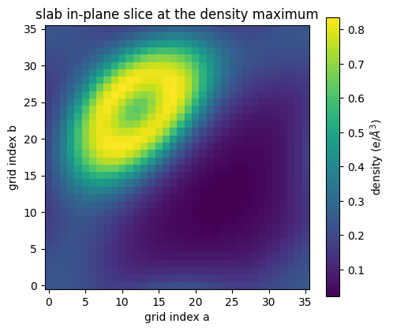


## Read the PdTe2 Selected-Band States

The PARCHG files hold band-decomposed densities from the ten-layer
PdTe2 slab. The labeled pairs bracket the Dirac and resonance states.
The numbered pairs sit deeper in the valence manifold.


```python
PDTE2_10ML_DIR = DATA_ROOT / "PdTe2" / "10ML"
dirac_state = read_chgcar(str(PDTE2_10ML_DIR / "PARCHG Dirac"))
resonance_state = read_chgcar(str(PDTE2_10ML_DIR / "PARCHG Resonance"))
deep_state = read_chgcar(str(PDTE2_10ML_DIR / "PARCHG 157 158"))
shallow_state = read_chgcar(str(PDTE2_10ML_DIR / "PARCHG 197 198"))
dirac_charge = np.asarray(dirac_state.charge)
resonance_charge = np.asarray(resonance_state.charge)
deep_charge = np.asarray(deep_state.charge)
shallow_charge = np.asarray(shallow_state.charge)
state_lattice = np.asarray(dirac_state.lattice)
state_c_length = float(np.linalg.norm(state_lattice[2]))
state_z_axis = (
    np.arange(dirac_charge.shape[2])
    / dirac_charge.shape[2]
    * state_c_length
)
print("PARCHG grid shape:", dirac_state.grid_shape)
print("slab thickness axis (Ang):", round(state_c_length, 2))
```

    PARCHG grid shape: (36, 36, 640)
    slab thickness axis (Ang): 71.18


```python
dirac_profile = dirac_charge.mean(axis=(0, 1))
resonance_profile = resonance_charge.mean(axis=(0, 1))
fig, ax = plt.subplots(figsize=(6.8, 4.2))
ax.plot(state_z_axis, dirac_profile, label="Dirac pair")
ax.plot(state_z_axis, resonance_profile, label="resonance pair")
ax.set_xlabel(r"$z$ ($\AA$)")
ax.set_ylabel(r"planar-averaged density (e/$\AA^3$)")
ax.set_title("surface localization of the labeled states")
ax.legend()
plt.show()
```


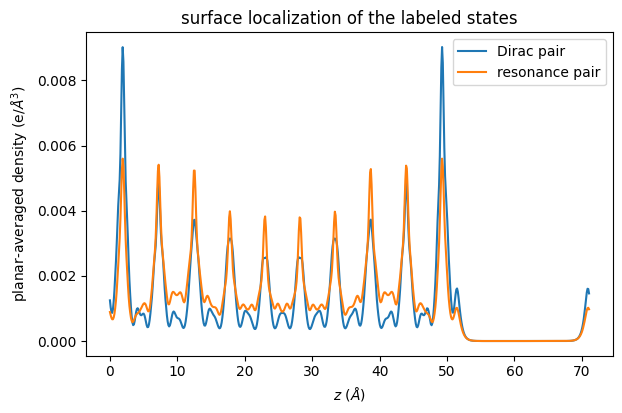


```python
deep_profile = deep_charge.mean(axis=(0, 1))
shallow_profile = shallow_charge.mean(axis=(0, 1))
fig, ax = plt.subplots(figsize=(6.8, 4.2))
ax.plot(state_z_axis, deep_profile, label="bands 157 and 158")
ax.plot(state_z_axis, shallow_profile, label="bands 197 and 198")
ax.set_xlabel(r"$z$ ($\AA$)")
ax.set_ylabel(r"planar-averaged density (e/$\AA^3$)")
ax.set_title("layer character of the numbered pairs")
ax.legend()
plt.show()
```


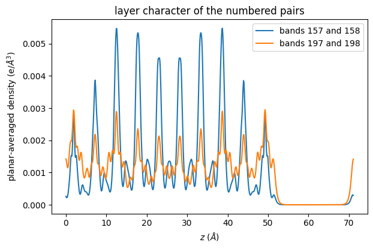


```python
dirac_plane_index = int(np.argmax(dirac_profile))
fig, ax = plt.subplots(figsize=(5.4, 4.6))
image = ax.imshow(
    dirac_charge[:, :, dirac_plane_index].T,
    origin="lower",
    cmap="inferno",
)
ax.set_xlabel("grid index a")
ax.set_ylabel("grid index b")
ax.set_title("Dirac-pair slice at its density maximum")
fig.colorbar(image, ax=ax, label=r"density (e/$\AA^3$)")
plt.show()
```


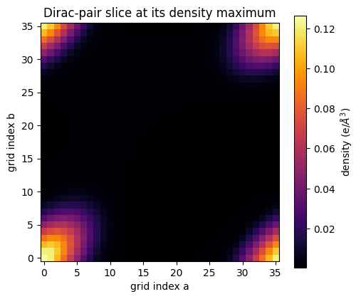


## Weight the States with Escape Depths

The weight is $\exp(-(z_{top} - z)/\lambda)$ below the top surface.
Three inelastic mean free paths bracket the laser regime. The bars give
the escape-weighted share of each state.


```python
occupied_indices = np.nonzero(
    dirac_profile > dirac_profile.max() * 1.0e-4
)[0]
surface_z = float(state_z_axis[int(occupied_indices.max())])
fig, ax = plt.subplots(figsize=(6.8, 4.2))
ax.plot(
    state_z_axis,
    dirac_profile / dirac_profile.max(),
    color="0.4",
    label="Dirac pair (normalized)",
)
for mean_free_path in (5.0, 10.0, 20.0):
    escape_weight = np.exp(
        -np.clip(surface_z - state_z_axis, 0.0, None) / mean_free_path
    )
    ax.plot(
        state_z_axis,
        escape_weight,
        linestyle="--",
        label=rf"$\lambda$ = {mean_free_path:.0f} $\AA$",
    )
ax.set_xlabel(r"$z$ ($\AA$)")
ax.set_ylabel("normalized weight")
ax.set_title("escape-depth weights over the Dirac state")
ax.legend()
plt.show()
```


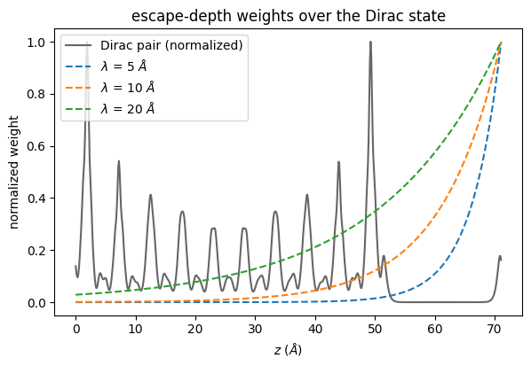


```python
state_profiles = [
    dirac_profile,
    resonance_profile,
    deep_profile,
    shallow_profile,
]
state_labels = [
    "Dirac",
    "resonance",
    "157 158",
    "197 198",
]
weighted_shares = []
for state_profile in state_profiles:
    row = []
    for mean_free_path in (5.0, 10.0, 20.0):
        escape_weight = np.exp(
            -np.clip(surface_z - state_z_axis, 0.0, None) / mean_free_path
        )
        row.append(
            float(
                (state_profile * escape_weight).sum() / state_profile.sum()
            )
        )
    weighted_shares.append(row)
share_array = np.asarray(weighted_shares)
bar_positions = np.arange(len(state_labels), dtype=np.float64)
fig, ax = plt.subplots(figsize=(6.8, 4.2))
for column, mean_free_path in enumerate((5.0, 10.0, 20.0)):
    ax.bar(
        bar_positions + 0.26 * (column - 1),
        share_array[:, column],
        width=0.26,
        label=rf"$\lambda$ = {mean_free_path:.0f} $\AA$",
    )
ax.set_xticks(bar_positions)
ax.set_xticklabels(state_labels)
ax.set_ylabel("escape-weighted share")
ax.set_title("photoemission weight of each selected state")
ax.legend()
plt.show()
```


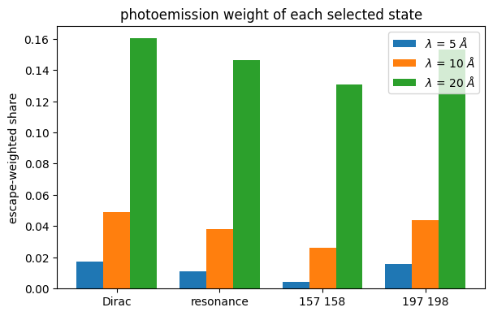
