# Calibrated Dirac Cone Spectrum

A laser-energy ARPES simulation through the full production chain. The
cone velocity comes from the Bi2Se3 surface state in the local DFT data.
The chain runs from the tight-binding source through matrix elements,
the spectral function, detector response, and one Poisson acquisition.
The notebook reads the local `data/DFT` tree.

## Load the Public API

The chain uses the tight-binding builders, the spectral assembly, the
detector simulation, and the Poisson sampler.


```python
import jax
import jax.numpy as jnp
import matplotlib.pyplot as plt
import numpy as np
from pathlib import Path

from diffpes.inout import read_eigenval, read_poscar
from diffpes.simul import (
    assemble_spectral_intensity_chunk,
    sample_poisson_counts,
    simulate_arpes,
)
from diffpes.tightb import bloch_hamiltonian_batch, diagonalize_tb
from diffpes.types import (
    fermi_surface_map,
    make_arpes_cube,
    make_crystal_geometry,
    make_detector_calibration,
    make_detector_effects,
    make_experiment_geometry,
    make_final_state_spec,
    make_kgrid,
    make_matrix_element_params,
    make_orbital_basis,
    make_radial_quadrature_spec,
    make_radial_spec,
    make_self_energy_model,
    make_tb_model,
)
```

## Calibrate the Cone from the Data

A linear fit through the Bi2Se3 surface-state branch gives the Dirac
velocity and the Dirac-point energy. One honeycomb hopping amplitude
reproduces that velocity.


```python
DATA_ROOT = Path("..") / "data" / "DFT"
BI2SE3_DIR = DATA_ROOT / "Bi2Se3" / "6QL" / "Output few bands"
bi2se3_fermi_ev = float(
    next(
        line
        for line in open(BI2SE3_DIR / "OUTCAR_SCF", encoding="utf-8")
        if "E-fermi" in line
    ).split()[2]
)
bi2se3_geo = read_poscar(str(BI2SE3_DIR / "POSCAR"))
bi2se3_bands = read_eigenval(
    str(BI2SE3_DIR / "MGM" / "EIGENVAL"), fermi_energy=bi2se3_fermi_ev
)
bi2se3_shift = np.asarray(bi2se3_bands.eigenvalues) - bi2se3_fermi_ev
bi2se3_kcart = np.asarray(bi2se3_bands.kpoints) @ np.asarray(
    bi2se3_geo.reciprocal
)
bi2se3_dist = np.concatenate(
    (
        [0.0],
        np.cumsum(np.linalg.norm(np.diff(bi2se3_kcart, axis=0), axis=1)),
    )
)
bi2se3_gamma = int(
    np.argmin(np.linalg.norm(np.asarray(bi2se3_bands.kpoints), axis=1))
)
bi2se3_axis = bi2se3_dist - bi2se3_dist[bi2se3_gamma]
gamma_column = bi2se3_shift[bi2se3_gamma]
surface_band = int(np.argmin(np.abs(gamma_column + 0.05)))
fit_mask = (np.abs(bi2se3_axis) > 0.02) & (np.abs(bi2se3_axis) < 0.12)
fit_slope, fit_intercept = np.polyfit(
    np.abs(bi2se3_axis[fit_mask]),
    bi2se3_shift[fit_mask, surface_band],
    1,
)
dirac_velocity_ev_ang = float(abs(fit_slope))
dirac_energy_ev = float(gamma_column[surface_band])
lattice_constant_ang = 2.0
hopping_ev = (
    2.0 * dirac_velocity_ev_ang / (np.sqrt(3.0) * lattice_constant_ang)
)
print("Dirac velocity (eV Ang):", round(dirac_velocity_ev_ang, 3))
print("Dirac point (eV):", round(dirac_energy_ev, 3))
print("honeycomb hopping (eV):", round(hopping_ev, 3))
```

    Dirac velocity (eV Ang): 2.682
    Dirac point (eV): -0.023
    honeycomb hopping (eV): 1.549


## Build the Source Model

Two s orbitals on a honeycomb lattice carry the cone. The uniform onsite
shift places the Dirac point at the fitted energy below the Fermi level.


```python
lattice = jnp.asarray(
    [
        [lattice_constant_ang, 0.0, 0.0],
        [
            lattice_constant_ang / 2.0,
            lattice_constant_ang * jnp.sqrt(3.0) / 2.0,
            0.0,
        ],
        [0.0, 0.0, 20.0],
    ]
)
crystal = make_crystal_geometry(
    lattice=lattice,
    positions=jnp.asarray(
        [[0.0, 0.0, 0.0], [1.0 / 3.0, 1.0 / 3.0, 0.0]]
    ),
    species=("X", "X"),
)
basis = make_orbital_basis(
    atom_indices=(0, 1),
    n=(1, 1),
    l=(0, 0),
    m=(0, 0),
    labels=("1s", "2s"),
)
model = make_tb_model(
    hopping_amplitudes=hopping_ev * jnp.ones(6, dtype=jnp.complex128),
    onsite_energies=jnp.full(2, dirac_energy_ev),
    soc_lambdas=jnp.zeros(0),
    geometry=crystal,
    basis=basis,
    hopping_pairs=((0, 1), (0, 1), (0, 1), (1, 0), (1, 0), (1, 0)),
    hopping_cells=(
        (0, 0, 0),
        (-1, 0, 0),
        (0, -1, 0),
        (0, 0, 0),
        (1, 0, 0),
        (0, 1, 0),
    ),
    shell_index=(-1, -1),
    depths=jnp.zeros(2),
)
dirac_frac = np.asarray([1.0 / 3.0, 2.0 / 3.0, 0.0])
reciprocal = np.asarray(crystal.reciprocal)
dirac_cart = dirac_frac @ reciprocal
print("Dirac point (1/Ang):", np.round(dirac_cart, 3))
```

    Dirac point (1/Ang): [1.047 1.814 0.   ]


## Raster the Zone Corner

A square momentum raster surrounds the Dirac point. The mesh feeds the
Bloch Hamiltonians, the band energies, and every later stage.


```python
mesh_half_width = 0.22
mesh_points = 21
mesh_axis = np.linspace(-mesh_half_width, mesh_half_width, mesh_points)
mesh_u, mesh_v = np.meshgrid(mesh_axis, mesh_axis, indexing="xy")
mesh_cart = np.stack(
    (
        dirac_cart[0] + mesh_u.ravel(),
        dirac_cart[1] + mesh_v.ravel(),
        np.zeros(mesh_points * mesh_points),
    ),
    axis=-1,
)
mesh_frac = jnp.asarray(mesh_cart @ np.linalg.inv(reciprocal))
kgrid = make_kgrid(
    mesh_frac, mesh_shape=(mesh_points, mesh_points), kz=0.0
)
hamiltonians = bloch_hamiltonian_batch(model, mesh_frac)
bands = diagonalize_tb(model, mesh_frac)
lower_band = np.asarray(bands.eigenvalues[:, 0]).reshape(
    (mesh_points, mesh_points)
)
print("mesh Hamiltonians:", hamiltonians.shape)
print("model Fermi energy (eV):", float(bands.fermi_energy))
```

    mesh Hamiltonians: (441, 2, 2)
    model Fermi energy (eV): 0.0


```python
fig, ax = plt.subplots(figsize=(5.4, 4.6))
image = ax.imshow(
    lower_band,
    origin="lower",
    extent=(
        -mesh_half_width,
        mesh_half_width,
        -mesh_half_width,
        mesh_half_width,
    ),
    cmap="viridis",
)
ax.set_xlabel(r"$k_x - k_D$ ($\AA^{-1}$)")
ax.set_ylabel(r"$k_y - k_D$ ($\AA^{-1}$)")
ax.set_title("lower cone branch over the raster")
fig.colorbar(image, ax=ax, label="band energy (eV)")
plt.show()
```


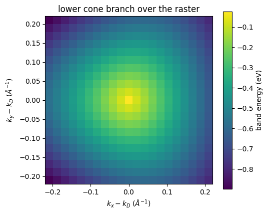


## Assemble the Source Spectral Cube

Unit transition sources enter the resolvent assembly on the raster. A
20 meV self-energy sets the linewidth at 100 K.


```python
energy_axis = jnp.linspace(-0.7, 0.25, 49)
self_energy = make_self_energy_model(gamma=0.02)
transition_sources = jnp.ones(
    (mesh_frac.shape[0], energy_axis.shape[0], 1, 2),
    dtype=jnp.complex128,
)
source_flat = assemble_spectral_intensity_chunk(
    hamiltonians,
    transition_sources,
    energy_axis,
    self_energy,
    jnp.asarray(0.0),
    100.0,
)
source_intensity = np.asarray(source_flat).reshape(
    (mesh_points, mesh_points, energy_axis.shape[0])
).transpose((1, 0, 2))
source_cube = make_arpes_cube(
    jnp.asarray(source_intensity),
    jnp.asarray(mesh_axis),
    jnp.asarray(mesh_axis),
    energy_axis,
    provenance="calibrated Dirac cone raster",
)
print("source cube:", source_cube.intensity.shape)
```

    source cube: (21, 21, 49)


```python
central_row = mesh_points // 2
source_cut = source_intensity[central_row, :, :].T
fig, ax = plt.subplots(figsize=(6.2, 4.8))
image = ax.imshow(
    source_cut,
    origin="lower",
    aspect="auto",
    extent=(
        -mesh_half_width,
        mesh_half_width,
        float(energy_axis[0]),
        float(energy_axis[-1]),
    ),
    cmap="magma",
)
ax.set_xlabel(r"$k_x - k_D$ ($\AA^{-1}$)")
ax.set_ylabel(r"$E - E_F$ (eV)")
ax.set_title("source cone through the Dirac point")
fig.colorbar(image, ax=ax, label="spectral intensity")
plt.show()
```


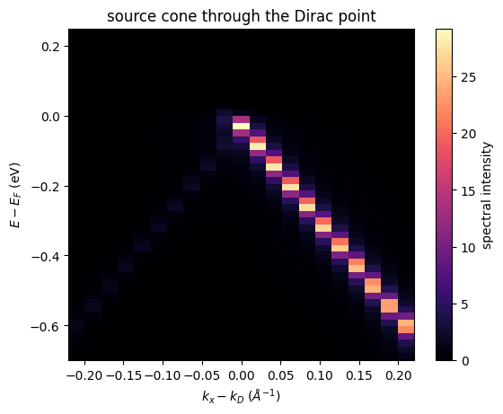


```python
fermi_map = fermi_surface_map(source_cube, tol_ev=0.03)
fig, ax = plt.subplots(figsize=(5.4, 4.6))
image = ax.imshow(
    np.asarray(fermi_map).T,
    origin="lower",
    extent=(
        -mesh_half_width,
        mesh_half_width,
        -mesh_half_width,
        mesh_half_width,
    ),
    cmap="inferno",
)
ax.set_xlabel(r"$k_x - k_D$ ($\AA^{-1}$)")
ax.set_ylabel(r"$k_y - k_D$ ($\AA^{-1}$)")
ax.set_title(r"Fermi ring at $E_F \pm 30$ meV")
fig.colorbar(image, ax=ax, label="mean spectral intensity")
plt.show()
```


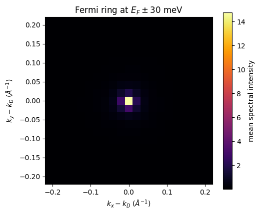


## Slice the Cone at Constant Energy

Each panel is one momentum-momentum slice of the source cube. The
occupied ring grows with binding energy below the Dirac point. The panel
above the Fermi level stays dark at 100 K.


```python
slice_energies_ev = (-0.40, -0.20, dirac_energy_ev, 0.10)
fig, axes = plt.subplots(
    1, 4, figsize=(13.6, 3.6), constrained_layout=True
)
for axis, slice_energy in zip(axes, slice_energies_ev):
    slice_index = int(
        np.argmin(np.abs(np.asarray(energy_axis) - slice_energy))
    )
    image = axis.imshow(
        source_intensity[:, :, slice_index].T,
        origin="lower",
        extent=(
            -mesh_half_width,
            mesh_half_width,
            -mesh_half_width,
            mesh_half_width,
        ),
        cmap="inferno",
    )
    axis.set_title(f"E = {slice_energy:.2f} eV")
    axis.set_xlabel(r"$k_x - k_D$ ($\AA^{-1}$)")
axes[0].set_ylabel(r"$k_y - k_D$ ($\AA^{-1}$)")
fig.colorbar(image, ax=axes, label="spectral intensity", shrink=0.85)
plt.show()
```


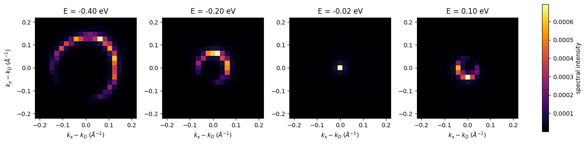


## Sum the Energy Windows

Each panel integrates the cube over one energy range. The deep window
collects the wide lower-cone ring. The window around the Dirac point
collapses onto the apex. The window above the Fermi level collects only
the thermal tail.


```python
window_bounds_ev = ((-0.45, -0.25), (-0.10, 0.05), (0.05, 0.20))
energy_values = np.asarray(energy_axis)
fig, axes = plt.subplots(
    1, 3, figsize=(11.4, 3.8), constrained_layout=True
)
for axis, bounds in zip(axes, window_bounds_ev):
    window_mask = (energy_values >= bounds[0]) & (
        energy_values <= bounds[1]
    )
    window_map = source_intensity[:, :, window_mask].sum(axis=2)
    image = axis.imshow(
        window_map.T,
        origin="lower",
        extent=(
            -mesh_half_width,
            mesh_half_width,
            -mesh_half_width,
            mesh_half_width,
        ),
        cmap="inferno",
    )
    axis.set_title(f"{bounds[0]:.2f} to {bounds[1]:.2f} eV")
    axis.set_xlabel(r"$k_x - k_D$ ($\AA^{-1}$)")
axes[0].set_ylabel(r"$k_y - k_D$ ($\AA^{-1}$)")
fig.colorbar(image, ax=axes, label="integrated intensity", shrink=0.85)
plt.show()
```


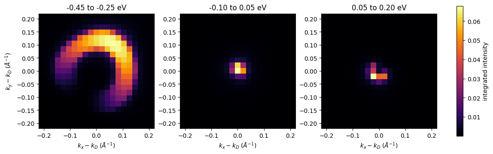


```python
edc_column = int(np.argmin(np.abs(mesh_axis - 0.10)))
fig, ax = plt.subplots(figsize=(6.2, 3.8))
ax.plot(
    np.asarray(energy_axis),
    source_intensity[central_row, edc_column, :],
    label=r"$k = 0.10$ $\AA^{-1}$",
)
ax.plot(
    np.asarray(energy_axis),
    source_intensity[central_row, central_row, :],
    label=r"$k = 0$",
)
ax.axvline(0.0, color="0.4", linewidth=0.8)
ax.set_xlabel(r"$E - E_F$ (eV)")
ax.set_ylabel("spectral intensity")
ax.set_title("energy cuts through the cone")
ax.legend()
plt.show()
```


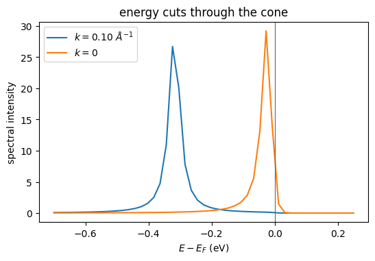


```python
offsets = (0.0, 6.0, 12.0)
cut_energies_ev = (-0.1, -0.25, -0.4)
fig, ax = plt.subplots(figsize=(6.2, 4.2))
for offset, cut_energy in zip(offsets, cut_energies_ev):
    row_index = int(
        np.argmin(np.abs(np.asarray(energy_axis) - cut_energy))
    )
    ax.plot(
        mesh_axis,
        source_intensity[central_row, :, row_index] + offset,
        label=f"{cut_energy} eV",
    )
ax.set_xlabel(r"$k_x - k_D$ ($\AA^{-1}$)")
ax.set_ylabel("offset spectral intensity")
ax.set_title("momentum cuts down the cone")
ax.legend()
plt.show()
```


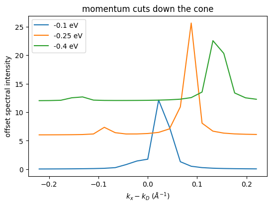


## Observe the Cone at 6.05 eV

The experiment carries the 6.05 eV laser line, a 4.5 eV work function,
and elliptic polarization. The detector applies the point-spread
functions, the transmission, a flat background, and the exposure.


```python
experiment = make_experiment_geometry(
    photon_energy_ev=6.05,
    polarization=jnp.asarray([1.0 + 0.0j, 0.25j, 0.0j]),
    work_function_ev=4.5,
    temperature_k=100.0,
    mean_free_path_ang=10.0,
)
radial_spec = make_radial_spec(
    basis,
    (0, 1),
    mode="fixed",
    fixed_integrals_shell=jnp.asarray([[0.0, 1.0], [0.0, 1.0]]),
)
matrix_element_params = make_matrix_element_params(
    basis,
    (0, 1),
    sigma_shell=jnp.asarray([1.0, 1.0]),
    phase_shift_angles_shell=jnp.asarray([0.15, 0.15]),
)
calibration = make_detector_calibration(
    u_bin_edges=jnp.linspace(-0.060, 0.060, 17),
    v_bin_edges=jnp.linspace(-0.060, 0.060, 17),
    energy_bin_edges_ev=jnp.linspace(-0.65, 0.20, 25),
    psf_fwhm_u=0.006,
    psf_fwhm_v=0.006,
    psf_fwhm_energy_ev=0.012,
    transmission_reference_domain_ev=jnp.asarray([0.6, 2.0]),
)
detector_effects = make_detector_effects(
    domain_logits=jnp.asarray([0.0]),
    domain_euler_angles_rad=jnp.zeros((1, 3)),
    transmission_raw_slopes=jnp.asarray([-0.4, 0.2]),
    background_coefficients=jnp.asarray([-8.0]),
    sensitivity_coefficients=jnp.asarray([]),
    exposure=3.0e8,
    background_mode="flat",
    sensitivity_mode="constant",
    domain_frame_ids=("org.diffpes.frame.sample_cartesian",),
)
detector = simulate_arpes(
    (hamiltonians,),
    (bands,),
    radial_spec,
    matrix_element_params,
    make_radial_quadrature_spec(),
    make_final_state_spec(),
    experiment,
    self_energy,
    kgrid,
    energy_axis,
    calibration,
    detector_effects,
    k_chunk=64,
    energy_chunk=16,
    checkpoint=True,
)
print("detector raster:", detector.expected_counts.shape)
print("expected total events:", float(detector.expected_counts.sum()))
```

    detector raster: (1, 16, 16, 24)
    expected total events: 1231.6122012733365


```python
expected_map = np.asarray(detector.expected_counts[0].sum(axis=-1))
fig, ax = plt.subplots(figsize=(5.4, 4.6))
image = ax.imshow(expected_map.T, origin="lower", cmap="magma")
ax.set_xlabel("detector u bin")
ax.set_ylabel("detector v bin")
ax.set_title("expected counts over the detector plane")
fig.colorbar(image, ax=ax, label="expected events")
plt.show()
```


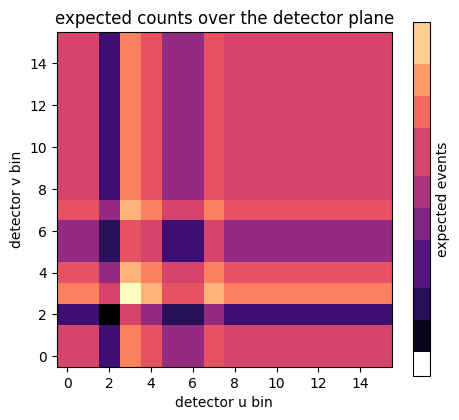


```python
expected_spectrum = np.asarray(detector.expected_counts[0].sum(axis=1))
fig, ax = plt.subplots(figsize=(6.2, 4.8))
image = ax.imshow(
    expected_spectrum.T,
    origin="lower",
    aspect="auto",
    cmap="magma",
)
ax.set_xlabel("detector u bin")
ax.set_ylabel("detector energy bin")
ax.set_title("expected energy-momentum image")
fig.colorbar(image, ax=ax, label="expected events")
plt.show()
```


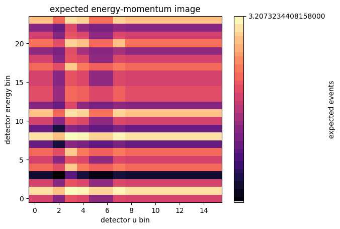


```python
observed_counts = sample_poisson_counts(
    jax.random.key(20260813), detector.expected_counts
)
observed_spectrum = np.asarray(observed_counts[0].sum(axis=1))
fig, ax = plt.subplots(figsize=(6.2, 4.8))
image = ax.imshow(
    observed_spectrum.T,
    origin="lower",
    aspect="auto",
    cmap="magma",
)
ax.set_xlabel("detector u bin")
ax.set_ylabel("detector energy bin")
ax.set_title("one Poisson acquisition of the same image")
fig.colorbar(image, ax=ax, label="observed events")
plt.show()
```


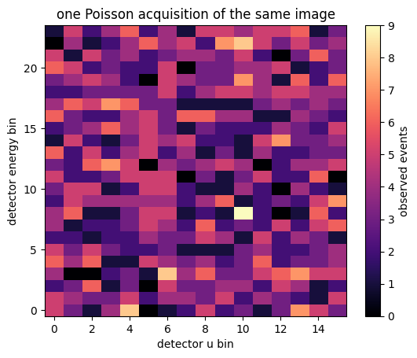


```python
expected_energy_profile = np.asarray(
    detector.expected_counts[0].sum(axis=(0, 1))
)
observed_energy_profile = np.asarray(observed_counts[0].sum(axis=(0, 1)))
energy_bins = np.arange(expected_energy_profile.shape[0])
fig, ax = plt.subplots(figsize=(6.2, 3.8))
ax.plot(energy_bins, expected_energy_profile, marker="o", label="expected")
ax.step(
    energy_bins, observed_energy_profile, where="mid", label="observed"
)
ax.set_xlabel("detector energy bin")
ax.set_ylabel("events after the momentum sum")
ax.set_title("count spectrum of the acquisition")
ax.legend()
plt.show()
```


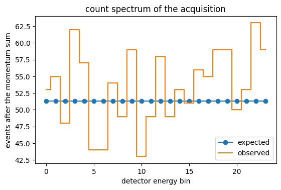


## Rotate the Polarization

A second run swaps the polarization to the orthogonal linear state. The
difference map shows the matrix-element contrast between the two
acquisitions of the same cone.


```python
rotated_experiment = make_experiment_geometry(
    photon_energy_ev=6.05,
    polarization=jnp.asarray([0.0j, 1.0 + 0.0j, 0.0j]),
    work_function_ev=4.5,
    temperature_k=100.0,
    mean_free_path_ang=10.0,
)
rotated_detector = simulate_arpes(
    (hamiltonians,),
    (bands,),
    radial_spec,
    matrix_element_params,
    make_radial_quadrature_spec(),
    make_final_state_spec(),
    rotated_experiment,
    self_energy,
    kgrid,
    energy_axis,
    calibration,
    detector_effects,
    k_chunk=64,
    energy_chunk=16,
    checkpoint=True,
)
rotated_map = np.asarray(rotated_detector.expected_counts[0].sum(axis=-1))
polarization_difference = expected_map - rotated_map
difference_scale = float(np.abs(polarization_difference).max())
fig, ax = plt.subplots(figsize=(5.4, 4.6))
image = ax.imshow(
    polarization_difference.T,
    origin="lower",
    cmap="RdBu_r",
    vmin=-difference_scale,
    vmax=difference_scale,
)
ax.set_xlabel("detector u bin")
ax.set_ylabel("detector v bin")
ax.set_title("polarization contrast of the expected counts")
fig.colorbar(image, ax=ax, label="count difference")
plt.show()
```


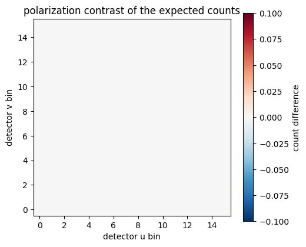


## Warm the Cone

Two more source assemblies change only the temperature. The Fermi edge
softens between 25 K and 300 K while the cone body stays fixed.


```python
cold_flat = assemble_spectral_intensity_chunk(
    hamiltonians,
    transition_sources,
    energy_axis,
    self_energy,
    jnp.asarray(0.0),
    25.0,
)
warm_flat = assemble_spectral_intensity_chunk(
    hamiltonians,
    transition_sources,
    energy_axis,
    self_energy,
    jnp.asarray(0.0),
    300.0,
)
cold_cube = np.asarray(cold_flat).reshape(
    (mesh_points, mesh_points, energy_axis.shape[0])
)
warm_cube = np.asarray(warm_flat).reshape(
    (mesh_points, mesh_points, energy_axis.shape[0])
)
cold_profile = cold_cube.sum(axis=(0, 1))
warm_profile = warm_cube.sum(axis=(0, 1))
fig, ax = plt.subplots(figsize=(6.2, 3.8))
ax.plot(np.asarray(energy_axis), cold_profile, label="25 K")
ax.plot(np.asarray(energy_axis), warm_profile, label="300 K")
ax.axvline(0.0, color="0.4", linewidth=0.8)
ax.set_xlabel(r"$E - E_F$ (eV)")
ax.set_ylabel("summed spectral intensity")
ax.set_title("Fermi edge at two temperatures")
ax.legend()
plt.show()
```


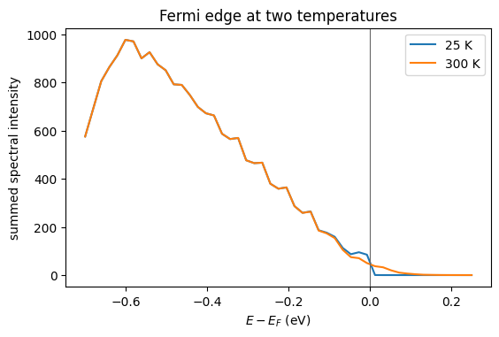
