# Bulk $k_z$ Integration and Photon-Energy Scans

Build a small bulk model and follow its wrapped $k_z$ integral through a photon-energy scan. This lesson separates quadrature evidence from demonstration settings.


```python
import jax
import jax.numpy as jnp
import matplotlib.pyplot as plt

from diffpes.simul import (
    hv_map_at_energy,
    kz_fractional_nodes,
    kz_wrapped_lorentzian_bin_weights,
    simulate_hv_scan,
)
from diffpes.tightb import diagonalize_tb
from diffpes.types import (
    make_crystal_geometry,
    make_experiment_geometry,
    make_final_state_spec,
    make_kpath,
    make_matrix_element_params,
    make_orbital_basis,
    make_radial_quadrature_spec,
    make_radial_spec,
    make_self_energy_model,
    make_surface_cell,
    make_tb_model,
)
```

## 1. Select One Physical Mode

The canonical drivers expose four mutually exclusive routes. Each route declares a different electronic input and a different treatment of out-of-plane momentum.

| Mode | Electronic input | Surface or node input | Physical meaning |
|---|---|---|---|
| native_direct | Explicit Hamiltonian and native bands | Neither | Keep one caller-supplied native $k_z$ |
| bulk_direct | Bulk model | Surface cell, without nodes | Use the zero-width limit with finite-energy kinematics |
| bulk_kz | Bulk model | Surface cell and registered nodes | Integrate over one wrapped reciprocal period |
| coherent_slab | Depth-bearing Hamiltonian and bands | Surface cell, without bulk nodes | Sum coherent depth-resolved slab emission |

This lesson uses bulk_kz. The driver rejects carriers from two rows because those inputs describe different physical models.


```python
modes = ("native_direct", "bulk_direct", "bulk_kz", "coherent_slab")
selected_mode = "bulk_kz"
print("registered mode choices:", ", ".join(modes))
print("selected mode:", selected_mode)
```

    registered mode choices: native_direct, bulk_direct, bulk_kz, coherent_slab
    selected mode: bulk_kz


## 2. Inspect the Registered $k_z$ Quadrature

The frozen convergence profile recommends 2048 uniform bin centres on one surface-fractional period. This number applies only to its registered domain.

The public weight operation integrates a wrapped Lorentzian over each bin. Its total mass stays one when the centre approaches a period boundary.


```python
recommended_n_kz = 2048
recommended_nodes = kz_fractional_nodes(recommended_n_kz)
recommended_edges = jnp.linspace(-0.5, 0.5, recommended_n_kz + 1)
reciprocal_period = 2.0 * jnp.pi / 3.2
recommended_weights = kz_wrapped_lorentzian_bin_weights(
    recommended_edges,
    jnp.asarray(0.46),
    mean_free_path_ang=7.5,
    period_inv_ang=reciprocal_period,
)
print("recommended node count:", recommended_nodes.shape[0])
print("wrapped mass:", float(recommended_weights.sum()))
```

    recommended node count: 2048
    wrapped mass: 0.9999999999999997


### Confirm the Node Placement

The helper returns uniform bin centres on the half-open interval. This sparse display shows every sixty-fourth node without changing the actual quadrature.


```python
display_nodes = recommended_nodes[::64]
fig, ax = plt.subplots(figsize=(6.2, 2.2))
ax.scatter(display_nodes, jnp.zeros_like(display_nodes), marker="|")
ax.set_xlim(-0.5, 0.5)
ax.set_yticks([])
ax.set_xlabel("surface-fractional $k_z$")
ax.set_title("uniform centres across one wrapped period")
plt.show()
```


    
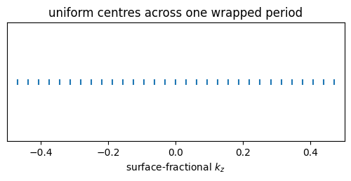
    


### View the Boundary-Centred Weights

A centre near positive one half places visible mass at both plotted ends. The continuous wrapped distribution crosses the artificial plot boundary.


```python
fig, ax = plt.subplots(figsize=(6.2, 3.5))
ax.plot(recommended_nodes, recommended_weights)
ax.set_xlabel("surface-fractional $k_z$")
ax.set_ylabel("analytic bin mass")
ax.set_title("wrapped Lorentzian centred at 0.46")
plt.show()
```


    
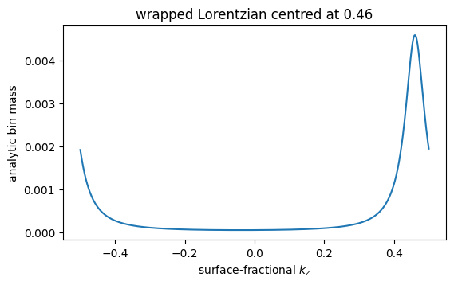
    


### Audit the Cumulative Mass

The cumulative view confirms that every analytic bin contributes once. Its final value equals the printed unit mass.


```python
cumulative_mass = jnp.cumsum(recommended_weights)
fig, ax = plt.subplots(figsize=(6.2, 3.5))
ax.plot(recommended_nodes, cumulative_mass, color="tab:green")
ax.axhline(1.0, color="0.5", linewidth=0.8)
ax.set_xlabel("surface-fractional $k_z$")
ax.set_ylabel("cumulative analytic mass")
ax.set_title("unit-mass audit across the wrapped period")
plt.show()
```


    
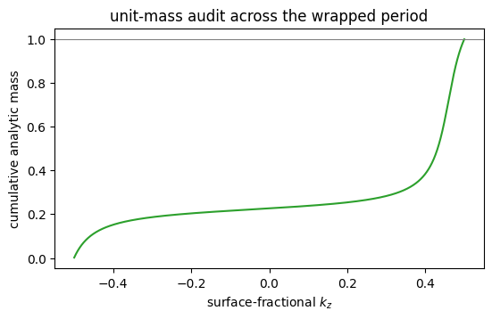
    


### Move the Final-State Centre

Compare three centres with the same mean free path. The public operation translates the peak and preserves the wrapped normalization.


```python
quadrature_centres = jnp.asarray([-0.46, 0.0, 0.46])
centre_weights = jax.vmap(
    kz_wrapped_lorentzian_bin_weights,
    in_axes=(None, 0, None, None),
)(recommended_edges, quadrature_centres, 7.5, reciprocal_period)
```

The central curve stays inside the plotted interval. The two edge curves exchange mass across the two ends of the same reciprocal period.


```python
fig, ax = plt.subplots(figsize=(6.2, 3.6))
for centre, values in zip(quadrature_centres, centre_weights, strict=True):
    ax.plot(recommended_nodes, values, label=f"centre {float(centre):.2f}")
ax.set_xlabel("surface-fractional $k_z$")
ax.set_ylabel("analytic bin mass")
ax.set_title("wrapped translation of the final-state centre")
ax.legend()
plt.show()
```


    
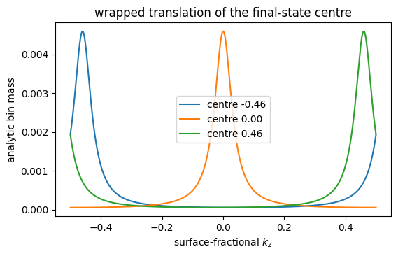
    


### Change the Mean Free Path

Compare three declared escape depths at the same centre. The width changes because the mean free path controls out-of-plane momentum broadening.


```python
mean_free_paths = jnp.asarray([4.0, 7.5, 15.0])
escape_depth_weights = jax.vmap(
    kz_wrapped_lorentzian_bin_weights,
    in_axes=(None, None, 0, None),
)(recommended_edges, jnp.asarray(0.0), mean_free_paths, reciprocal_period)
```

A longer mean free path produces a narrower momentum distribution. Each curve still integrates to one across the wrapped period.


```python
fig, ax = plt.subplots(figsize=(6.2, 3.6))
for mean_free_path, values in zip(mean_free_paths, escape_depth_weights, strict=True):
    ax.plot(recommended_nodes, values, label=f"{float(mean_free_path):.1f} Angstrom")
ax.set_xlabel("surface-fractional $k_z$")
ax.set_ylabel("analytic bin mass")
ax.set_title("escape-depth control of the wrapped width")
ax.legend()
plt.show()
```


    
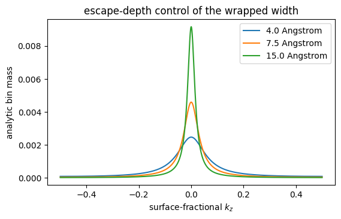
    


## 3. Build a Compact Bulk Model

Use one orbital and paired hoppings along $x$ and $z$. The two directions make path dispersion and photon-energy-dependent $k_z$ visible.

The identity surface keeps the coordinate roles transparent. The fixed radial input avoids a separate atomic-wavefunction lesson here.


```python
lattice_scale = 3.2
crystal = make_crystal_geometry(
    lattice_scale * jnp.eye(3),
    jnp.zeros((1, 3)),
    ("X",),
)
basis = make_orbital_basis(
    atom_indices=(0,),
    n=(1,),
    l=(0,),
    m=(0,),
    labels=("1s",),
)
bulk_model = make_tb_model(
    hopping_amplitudes=jnp.asarray((-0.12, -0.12, -0.38, -0.38), dtype=jnp.complex128),
    onsite_energies=jnp.asarray((-0.05,)),
    soc_lambdas=jnp.zeros((0,)),
    geometry=crystal,
    basis=basis,
    hopping_pairs=((0, 0), (0, 0), (0, 0), (0, 0)),
    hopping_cells=((1, 0, 0), (-1, 0, 0), (0, 0, 1), (0, 0, -1)),
    shell_index=(-1,),
)
surface_cell = make_surface_cell(
    in_plane_vectors=lattice_scale * jnp.asarray(((1.0, 0.0, 0.0), (0.0, 1.0, 0.0))),
    stacking_vector=lattice_scale * jnp.asarray((0.0, 0.0, 1.0)),
    rotation=jnp.eye(3),
    interlayer_spacing_ang=lattice_scale,
    miller=(0, 0, 1),
    in_plane_coeffs=((1, 0, 0), (0, 1, 0)),
    stacking_coeffs=(0, 0, 1),
)
print("bulk hopping records:", bulk_model.hopping_amplitudes.shape[0])
```

    bulk hopping records: 4


### Confirm the Electronic $k_z$ Dispersion

Diagonalize the public bulk model on three fixed fractional $k_z$ slices. This check precedes all matrix-element and final-state operations.


```python
band_path_coordinate = jnp.linspace(-0.5, 0.5, 101)
band_zeros = jnp.zeros_like(band_path_coordinate)
band_kz_values = jnp.asarray([-0.25, 0.0, 0.25])
bands_kz_minus = diagonalize_tb(
    bulk_model,
    jnp.stack((band_path_coordinate, band_zeros, -0.25 * jnp.ones_like(band_path_coordinate)), axis=-1),
)
bands_kz_zero = diagonalize_tb(
    bulk_model,
    jnp.stack((band_path_coordinate, band_zeros, band_zeros), axis=-1),
)
bands_kz_plus = diagonalize_tb(
    bulk_model,
    jnp.stack((band_path_coordinate, band_zeros, 0.25 * jnp.ones_like(band_path_coordinate)), axis=-1),
)
band_slices = jnp.stack(
    (bands_kz_minus.eigenvalues[:, 0], bands_kz_zero.eigenvalues[:, 0], bands_kz_plus.eigenvalues[:, 0])
)
```

The zero slice separates from the two coincident edge slices. Their overlap displays inversion symmetry for this paired-hopping model.


```python
fig, ax = plt.subplots(figsize=(6.2, 3.8))
for kz_value, values in zip(band_kz_values, band_slices, strict=True):
    ax.plot(band_path_coordinate, values, label=f"fractional kz {float(kz_value):.2f}")
ax.set_xlabel("fractional path coordinate")
ax.set_ylabel("band energy (eV)")
ax.set_title("bulk dispersion on three out-of-plane slices")
ax.legend()
plt.show()
```


    
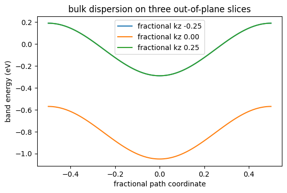
    


### Configure the Forward Inputs

Use five path points, seven energy samples, and three photon energies. These compact axes keep the executed documentation suitable for a CPU build.

Use the original geometry, self-energy, and fixed radial parameters. The lesson changes no physical formula or tolerance.


```python
path_coordinate = jnp.linspace(-0.055, 0.055, 5)
path_points = jnp.stack(
    (path_coordinate, jnp.zeros_like(path_coordinate), jnp.zeros_like(path_coordinate)),
    axis=-1,
)
kpath = make_kpath(path_points, n_per_segment=1, kz=0.0)
radial_spec = make_radial_spec(
    basis,
    (0,),
    mode="fixed",
    fixed_integrals_shell=jnp.asarray(((0.0, 1.0),)),
)
matrix_element_params = make_matrix_element_params(
    basis,
    (0,),
    sigma_shell=jnp.asarray((1.13,)),
    phase_shift_angles_shell=jnp.asarray((0.21,)),
)
geometry = make_experiment_geometry(
    photon_energy_ev=28.0,
    polarization=jnp.asarray((1.0, 0.35j, 0.0)),
    sample_azimuth=0.14,
    work_function_ev=4.3,
    inner_potential_ev=11.0,
    temperature_k=45.0,
    mean_free_path_ang=7.5,
)
print("path points:", path_coordinate.shape[0])
```

    path points: 5


## 4. Run a Compact Photon-Energy Scan

Use eight $k_z$ nodes only for the executed lesson. This count is a runtime choice and does not replace the registered 2048-node convergence evidence.

The driver recomputes finite-energy kinematics and matrix elements at every photon energy. It accumulates one observable without a full all-node spectral carrier.


```python
demo_nodes = kz_fractional_nodes(8)
energy_axis = jnp.linspace(-0.42, -0.06, 7)
photon_energies = jnp.asarray((25.5, 28.0, 31.5))
scan = simulate_hv_scan(
    None,
    None,
    radial_spec,
    matrix_element_params,
    make_radial_quadrature_spec(),
    make_final_state_spec(),
    geometry,
    make_self_energy_model(gamma=0.055),
    kpath,
    energy_axis,
    photon_energies,
    k_chunk=5,
    energy_chunk=7,
    checkpoint=True,
    bulk_model=bulk_model,
    surface_cell=surface_cell,
    kz_nodes_frac=demo_nodes,
    kz_mode=selected_mode,
)
constant_energy_map = hv_map_at_energy(scan, energy_axis, -0.21)
print("scan shape (photon energy, path, energy):", scan.shape)
print("map shape (path, photon energy):", constant_energy_map.shape)
```

    scan shape (photon energy, path, energy): (3, 5, 7)
    map shape (path, photon energy): (5, 3)


### View One Constant-Energy Map

Interpolate the sampled cube at minus 0.21 eV. The map places photon energy horizontally and the source path vertically.


```python
fig, ax = plt.subplots(figsize=(5.8, 3.8))
image = ax.imshow(
    constant_energy_map,
    origin="lower",
    aspect="auto",
    extent=(float(photon_energies[0]), float(photon_energies[-1]), float(path_coordinate[0]), float(path_coordinate[-1])),
    cmap="magma",
)
ax.set_xlabel(r"$h\nu$ (eV)")
ax.set_ylabel("source path coordinate")
ax.set_title(r"bulk-$k_z$ intensity at $\omega=-0.21$ eV")
fig.colorbar(image, ax=ax, label="intrinsic intensity")
plt.show()
```


    
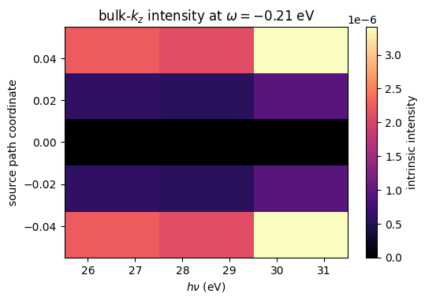
    


### Inspect the Middle Photon Energy

Keep the path and energy axes at 28 eV. This view shows the complete sampled energy dependence before a constant-energy reduction.


```python
fig, ax = plt.subplots(figsize=(5.8, 4.0))
image = ax.imshow(
    scan[1].T,
    origin="lower",
    aspect="auto",
    extent=(float(path_coordinate[0]), float(path_coordinate[-1]), float(energy_axis[0]), float(energy_axis[-1])),
    cmap="viridis",
)
ax.set_xlabel("source path coordinate")
ax.set_ylabel(r"$\omega$ (eV)")
ax.set_title(r"path-energy cut at $h\nu=28$ eV")
fig.colorbar(image, ax=ax, label="intrinsic intensity")
plt.show()
```


    
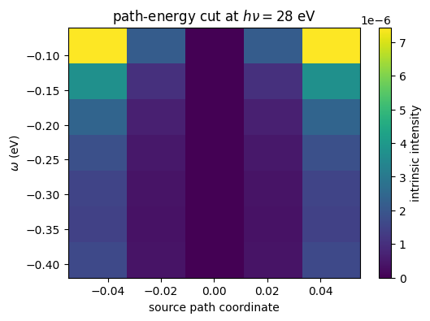
    


### Compare Central Energy Distribution Curves

Keep the central path point and compare all three photon energies. Peak shifts or weight changes now come only from the forward photon-energy response.


```python
fig, ax = plt.subplots(figsize=(5.8, 3.8))
for photon_energy_value, values in zip(photon_energies, scan[:, 2, :], strict=True):
    ax.plot(energy_axis, values, marker="o", label=f"{float(photon_energy_value):.1f} eV")
ax.set_xlabel(r"$\omega$ (eV)")
ax.set_ylabel("intrinsic intensity")
ax.set_title("central-path energy distribution curves")
ax.legend()
plt.show()
```


    
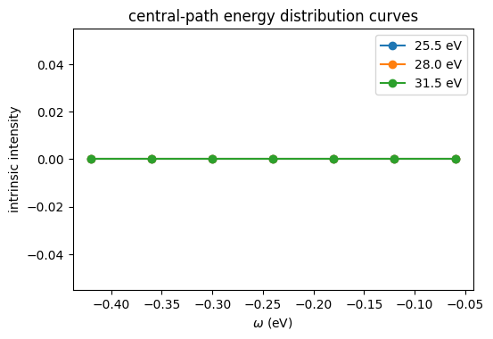
    


### Compare Constant-Energy Momentum Profiles

Keep minus 0.21 eV and compare all three photon energies. These profiles expose how the wrapped $k_z$ response changes the measured path.


```python
fig, ax = plt.subplots(figsize=(5.8, 3.8))
for index, photon_energy_value in enumerate(photon_energies):
    ax.plot(path_coordinate, constant_energy_map[:, index], marker="o", label=f"{float(photon_energy_value):.1f} eV")
ax.set_xlabel("source path coordinate")
ax.set_ylabel("intrinsic intensity")
ax.set_title(r"momentum profiles at $\omega=-0.21$ eV")
ax.legend()
plt.show()
```


    
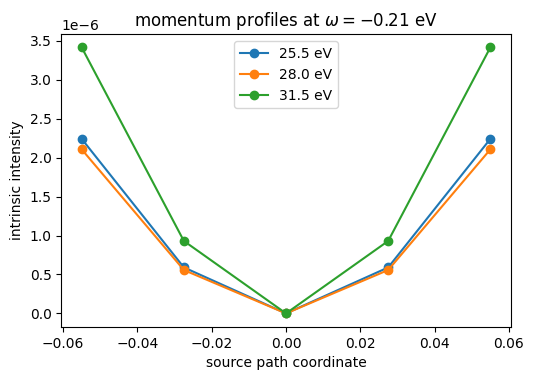
    


### Read Photon-Energy Traces at Fixed Momenta

Select the left, central, and right path points. The three traces show the photon-energy contrast available for geometry inference.


```python
fig, ax = plt.subplots(figsize=(5.8, 3.8))
for path_index in (0, 2, 4):
    ax.plot(photon_energies, constant_energy_map[path_index], marker="o", label=f"path {float(path_coordinate[path_index]):.3f}")
ax.set_xlabel(r"$h\nu$ (eV)")
ax.set_ylabel("intrinsic intensity")
ax.set_title(r"photon-energy traces at $\omega=-0.21$ eV")
ax.legend()
plt.show()
```


    
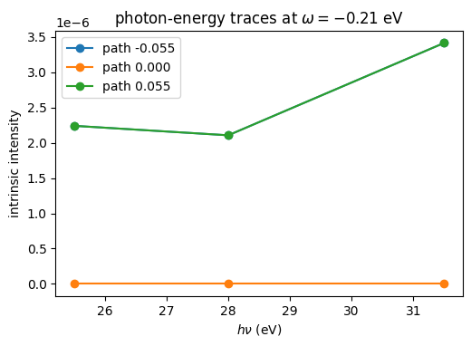
    


### Sum the Sampled Energy Axis

The final display sums only the seven requested energy samples. It gives a compact audit of the total sampled response across path and photon energy.


```python
sampled_energy_sum = scan.sum(axis=-1).T
fig, ax = plt.subplots(figsize=(5.8, 3.8))
image = ax.imshow(
    sampled_energy_sum,
    origin="lower",
    aspect="auto",
    extent=(float(photon_energies[0]), float(photon_energies[-1]), float(path_coordinate[0]), float(path_coordinate[-1])),
    cmap="cividis",
)
ax.set_xlabel(r"$h\nu$ (eV)")
ax.set_ylabel("source path coordinate")
ax.set_title("intensity summed over the sampled energy axis")
fig.colorbar(image, ax=ax, label="sampled intensity sum")
plt.show()
```


    
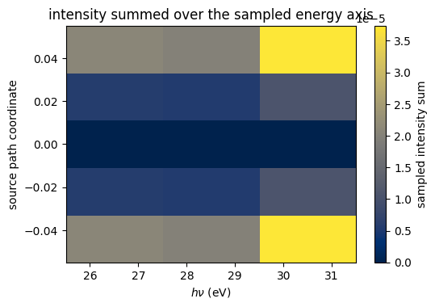
    


## 5. Interpret the Integration Boundary

Production bulk_kz consumes one scalar node and accumulates the path-energy observable. It does not materialize a full all-node spectral carrier.

The returned scan scales with the requested photon-energy axis because those maps are physical outputs. Validate new input domains with a separate convergence study.

Continue with the [coherent detector lesson](coherent-detector-paper-path.md) to apply analyser response and generate expected detector counts.
