# A Coherent Tight-Binding Model to Detector Counts

Follow one coherent ARPES source from a tight-binding model to detector counts. This lesson separates the source, calibration, expected counts, and one acquisition.


```python
import jax
import jax.numpy as jnp
import matplotlib.pyplot as plt

from diffpes.simul import (
    assemble_spectral_intensity_chunk,
    sample_poisson_counts,
    simulate_arpes,
    transmission_shape,
)
from diffpes.tightb import bloch_hamiltonian_batch, diagonalize_tb
from diffpes.types import (
    fermi_surface_map,
    make_arpes_cube,
    make_crystal_geometry,
    make_detector_calibration,
    make_detector_effects,
    make_experiment_geometry,
    make_final_state_spec,
    make_kgrid,
    make_matrix_element_params,
    make_orbital_basis,
    make_radial_quadrature_spec,
    make_radial_spec,
    make_self_energy_model,
    make_tb_model,
)
```

## 1. Declare the Source Model

Use one s orbital on a square lattice. Four paired hopping records close the Hamiltonian under Hermitian conjugation.

The one-orbital choice makes the coherent source easy to audit. A multi-orbital model uses the same public carriers and detector driver.


```python
crystal = make_crystal_geometry(
    lattice=2.0 * jnp.pi * jnp.eye(3),
    positions=jnp.zeros((1, 3)),
    species=("X",),
)
basis = make_orbital_basis(
    atom_indices=(0,),
    n=(1,),
    l=(0,),
    m=(0,),
    labels=("1s",),
)
model = make_tb_model(
    hopping_amplitudes=0.18 * jnp.ones(4, dtype=jnp.complex128),
    onsite_energies=jnp.asarray([-0.36]),
    soc_lambdas=jnp.zeros(0),
    geometry=crystal,
    basis=basis,
    hopping_pairs=((0, 0), (0, 0), (0, 0), (0, 0)),
    hopping_cells=((1, 0, 0), (-1, 0, 0), (0, 1, 0), (0, -1, 0)),
    shell_index=(-1,),
    depths=jnp.asarray([0.25]),
)
print("orbital count:", len(basis.labels))
print("hopping records:", model.hopping_amplitudes.shape[0])
```

    orbital count: 1
    hopping records: 4


### Build a Small Native Momentum Raster

Use a seven-by-seven raster for a short documentation run. The model uses fractional and sample-Cartesian in-plane coordinates with equal numerical values.


```python
k_axis = jnp.linspace(-0.22, 0.22, 7)
mesh_x, mesh_y = jnp.meshgrid(k_axis, k_axis, indexing="xy")
kpoints = jnp.stack((mesh_x, mesh_y, jnp.zeros_like(mesh_x)), axis=-1).reshape(
    (-1, 3)
)
kgrid = make_kgrid(kpoints, mesh_shape=(7, 7), kz=0.0)
hamiltonians = bloch_hamiltonian_batch(model, kpoints)
bands = diagonalize_tb(model, kpoints)
band_energy_map = bands.eigenvalues[:, 0].reshape((7, 7))
print("Hamiltonian raster:", hamiltonians.shape)
print("band-energy range (eV):", float(band_energy_map.min()), float(band_energy_map.max()))
```

    Hamiltonian raster: (49, 1, 1)
    band-energy range (eV): -0.2250854534982782 0.36


### Inspect the Band-Energy Surface

The energy map shows the native dispersion before matrix elements, occupation, or detector effects. This boundary is the electronic input to the source model.


```python
fig, ax = plt.subplots(figsize=(4.8, 4.0))
image = ax.imshow(
    band_energy_map,
    origin="lower",
    extent=(float(k_axis[0]), float(k_axis[-1]), float(k_axis[0]), float(k_axis[-1])),
    cmap="viridis",
)
ax.set_xlabel(r"$k_x$ ($\AA^{-1}$)")
ax.set_ylabel(r"$k_y$ ($\AA^{-1}$)")
ax.set_title("native tight-binding energy")
fig.colorbar(image, ax=ax, label="band energy (eV)")
plt.show()
```


    
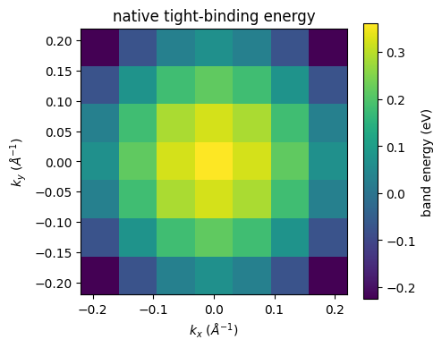
    


### Read a Central Momentum Cut

Take the central $k_y$ row from the same diagonalization. The curve exposes the band minimum and the available energy range along one cut.


```python
fig, ax = plt.subplots(figsize=(5.8, 3.6))
ax.plot(k_axis, band_energy_map[3], marker="o")
ax.axhline(float(bands.fermi_energy), color="0.5", linewidth=0.8)
ax.set_xlabel(r"$k_x$ ($\AA^{-1}$)")
ax.set_ylabel("band energy (eV)")
ax.set_title(r"central cut at $k_y=0$")
plt.show()
```


    
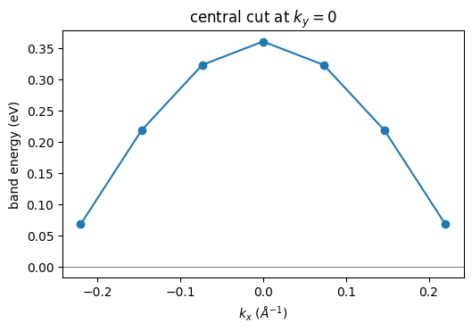
    


## 2. Assemble the Coherent Source Cube

Use one explicit coherent outgoing channel. The public resolvent assembly applies a causal self-energy and the Fermi occupation on the requested energy axis.

The operation keeps the sampled energy cube explicit. It does not apply detector resolution, transmission, exposure, or count sampling.


```python
energy_axis = jnp.linspace(-0.24, 0.08, 33)
self_energy = make_self_energy_model(gamma=0.035)
transition_sources = jnp.ones(
    (kpoints.shape[0], energy_axis.shape[0], 1, 1),
    dtype=jnp.complex128,
)
source_flat = assemble_spectral_intensity_chunk(
    hamiltonians,
    transition_sources,
    energy_axis,
    self_energy,
    bands.fermi_energy,
    25.0,
)
source_intensity = source_flat.reshape((7, 7, 33)).transpose((1, 0, 2))
source_cube = make_arpes_cube(
    source_intensity,
    k_axis,
    k_axis,
    energy_axis,
    provenance="one-orbital coherent resolvent tutorial",
)
fermi_map = fermi_surface_map(source_cube, tol_ev=0.02)
print("source cube shape:", source_cube.intensity.shape)
```

    source cube shape: (7, 7, 33)


### View the Fermi-Level Map

The display reduction averages an explicit top-hat window of plus or minus 20 meV. The complete source cube remains available for later operations.


```python
fig, ax = plt.subplots(figsize=(4.8, 4.0))
image = ax.imshow(
    fermi_map.T,
    origin="lower",
    extent=(float(k_axis[0]), float(k_axis[-1]), float(k_axis[0]), float(k_axis[-1])),
    cmap="inferno",
)
ax.set_xlabel(r"$k_x$ ($\AA^{-1}$)")
ax.set_ylabel(r"$k_y$ ($\AA^{-1}$)")
ax.set_title(r"coherent $E_F \pm 20$ meV map")
fig.colorbar(image, ax=ax, label="mean spectral intensity")
plt.show()
```


    
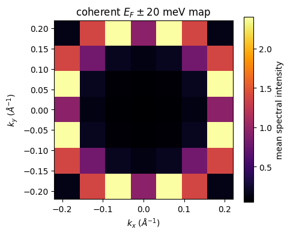
    


### Inspect a Momentum-Energy Cut

Select the central $k_y$ row without reducing the energy axis. The image reveals how the dispersive peak enters the occupied window.


```python
central_source_cut = source_intensity[:, 3, :].T
fig, ax = plt.subplots(figsize=(5.8, 4.0))
image = ax.imshow(
    central_source_cut,
    origin="lower",
    aspect="auto",
    extent=(float(k_axis[0]), float(k_axis[-1]), float(energy_axis[0]), float(energy_axis[-1])),
    cmap="magma",
)
ax.set_xlabel(r"$k_x$ ($\AA^{-1}$)")
ax.set_ylabel(r"$E-E_F$ (eV)")
ax.set_title(r"coherent source at $k_y=0$")
fig.colorbar(image, ax=ax, label="spectral intensity")
plt.show()
```


    
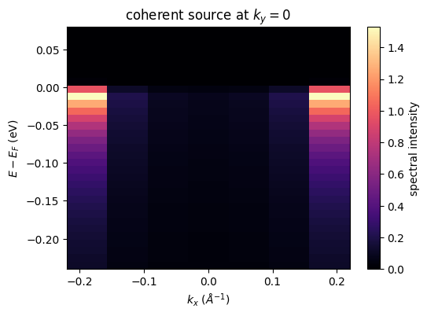
    


### Read an Occupied Energy Distribution Curve

An energy distribution curve retains one momentum pixel. Select the negative-momentum corner because its band peak lies inside the sampled occupied window.


```python
fig, ax = plt.subplots(figsize=(5.8, 3.6))
ax.plot(energy_axis, source_intensity[0, 0])
ax.axvline(0.0, color="0.5", linewidth=0.8)
ax.set_xlabel(r"$E-E_F$ (eV)")
ax.set_ylabel("spectral intensity")
ax.set_title(r"source EDC at $k_x=k_y=-0.22$ $\AA^{-1}$")
plt.show()
```


    
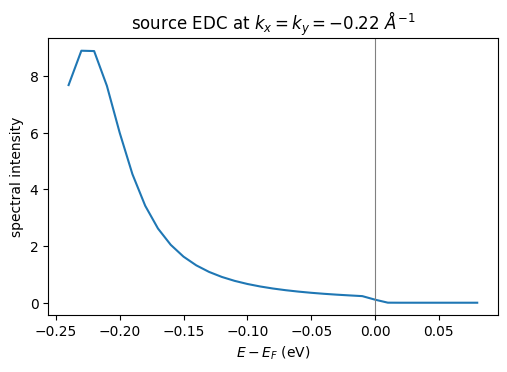
    


### Sum the Source Over Momentum

The momentum sum gives a compact energy profile for this finite raster. It remains a source-domain diagnostic and has no detector exposure.


```python
source_energy_profile = source_intensity.sum(axis=(0, 1))
fig, ax = plt.subplots(figsize=(5.8, 3.6))
ax.plot(energy_axis, source_energy_profile, color="tab:green")
ax.set_xlabel(r"$E-E_F$ (eV)")
ax.set_ylabel("summed spectral intensity")
ax.set_title("source intensity summed over momentum")
plt.show()
```


    
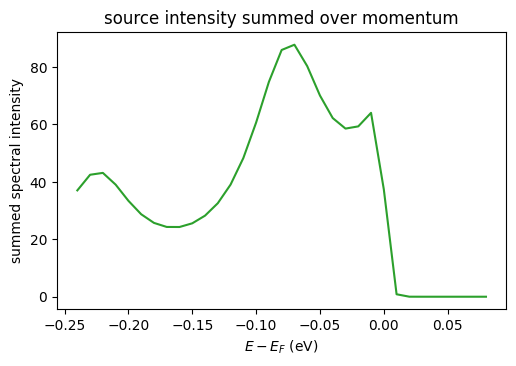
    


## 3. Load an Independent Analyser Calibration

Use two raw transmission slopes from a separate calibration scan. The declared reference domain fixes the basis and its mean-one normalization.

The slopes determine the response shape, not absolute throughput. Exposure remains a separate parameter in the detector effects carrier.


```python
calibration = make_detector_calibration(
    u_bin_edges=jnp.linspace(-0.050, 0.050, 9),
    v_bin_edges=jnp.linspace(-0.050, 0.050, 9),
    energy_bin_edges_ev=jnp.linspace(-0.22, 0.06, 15),
    psf_fwhm_u=0.008,
    psf_fwhm_v=0.010,
    psf_fwhm_energy_ev=0.025,
    transmission_reference_domain_ev=jnp.asarray([44.5, 46.0]),
)
calibration_energy = jnp.linspace(44.6, 45.9, 24)
calibration_slopes = jnp.asarray([-0.65, 0.30])
calibrated_transmission = transmission_shape(
    calibration_energy, calibration_slopes, calibration
)
print("mean normalized transmission:", float(calibrated_transmission.mean()))
```

    mean normalized transmission: 0.9934860810057434


### Inspect the Calibrated Transmission

The curve stays on the calibration energy domain. Its mean-one constraint prevents a crop of the ARPES query from redefining the response.


```python
fig, ax = plt.subplots(figsize=(5.8, 3.4))
ax.plot(calibration_energy, calibrated_transmission)
ax.set_xlabel("true kinetic energy (eV)")
ax.set_ylabel("normalized transmission")
ax.set_title("independent analyser calibration")
plt.show()
```


    
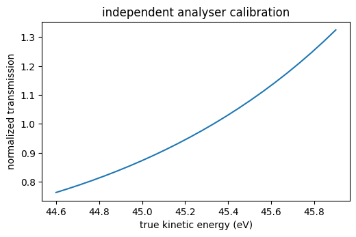
    


### Compare Calibration Coordinates

Change one raw slope at a time and call the same public response operation. The comparison shows which spectral region each coefficient controls.


```python
transmission_low_slope = transmission_shape(
    calibration_energy, jnp.asarray([-0.35, 0.30]), calibration
)
transmission_high_curvature = transmission_shape(
    calibration_energy, jnp.asarray([-0.65, 0.55]), calibration
)
fig, ax = plt.subplots(figsize=(5.8, 3.6))
ax.plot(calibration_energy, calibrated_transmission, label="declared calibration")
ax.plot(calibration_energy, transmission_low_slope, label="changed linear slope")
ax.plot(calibration_energy, transmission_high_curvature, label="changed curvature")
ax.set_xlabel("true kinetic energy (eV)")
ax.set_ylabel("normalized transmission")
ax.set_title("response to the raw calibration slopes")
ax.legend()
plt.show()
```


    
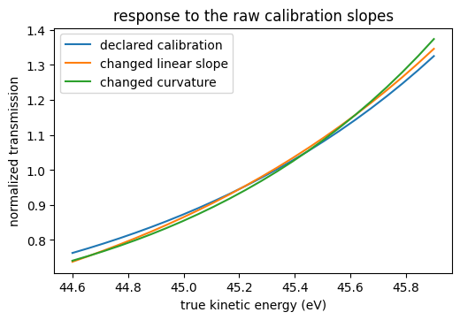
    


## 4. Configure the Canonical Detector Driver

The driver applies the registered order exactly once. It maps the source, mixes domains, applies transmission, and applies native detector resolution.

It then adds background, sensitivity, exposure, and bin volume. The explicit exposure targets approximately one hundred events for this small example.


```python
experiment = make_experiment_geometry(
    photon_energy_ev=50.0,
    polarization=jnp.asarray([1.0 + 0.0j, 0.25j, 0.0j]),
    work_function_ev=4.5,
    temperature_k=25.0,
    mean_free_path_ang=8.0,
)
radial_spec = make_radial_spec(
    basis,
    (0,),
    mode="fixed",
    fixed_integrals_shell=jnp.asarray([[0.0, 1.0]]),
)
matrix_element_params = make_matrix_element_params(
    basis,
    (0,),
    sigma_shell=jnp.asarray([1.0]),
    phase_shift_angles_shell=jnp.asarray([0.15]),
)
detector_effects = make_detector_effects(
    domain_logits=jnp.asarray([0.0]),
    domain_euler_angles_rad=jnp.zeros((1, 3)),
    transmission_raw_slopes=calibration_slopes,
    background_coefficients=jnp.asarray([-8.0]),
    sensitivity_coefficients=jnp.asarray([]),
    exposure=2.0e8,
    background_mode="flat",
    sensitivity_mode="constant",
    domain_frame_ids=("org.diffpes.frame.sample_cartesian",),
)
print("exposure:", float(detector_effects.exposure))
```

    exposure: 200000000.0


### Compute Expected Counts

Run the differentiable driver with checkpointed chunks. The returned carrier uses the native detector raster and stores expected counts before random sampling.


```python
detector = simulate_arpes(
    (hamiltonians,),
    (bands,),
    radial_spec,
    matrix_element_params,
    make_radial_quadrature_spec(),
    make_final_state_spec(),
    experiment,
    self_energy,
    kgrid,
    energy_axis,
    calibration,
    detector_effects,
    k_chunk=8,
    energy_chunk=8,
    checkpoint=True,
)
expected_map = detector.expected_counts[0].sum(axis=-1)
print("native detector raster:", detector.expected_counts.shape)
print("expected total:", float(expected_map.sum()))
```

    native detector raster: (1, 8, 8, 14)
    expected total: 223.90265747575592


### View the Expected Detector Map

Sum only the native detector energy bins for this display. The expected map remains a floating-point rate carrier for fitting and design.


```python
fig, ax = plt.subplots(figsize=(4.8, 4.0))
image = ax.imshow(expected_map.T, origin="lower", cmap="magma")
ax.set_xlabel("native detector u bin")
ax.set_ylabel("native detector v bin")
ax.set_title("expected detector counts")
fig.colorbar(image, ax=ax, label="expected events")
plt.show()
```


    
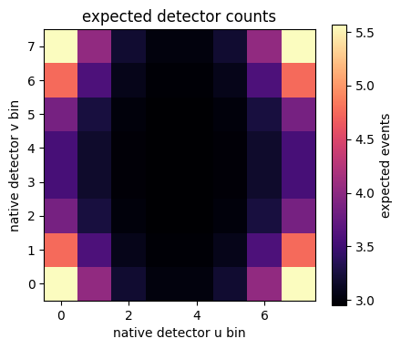
    


### Draw One Reproducible Acquisition

Use one explicit random key after the differentiable calculation. The integer draw represents an acquisition, not a model boundary for gradient fitting.


```python
observed_counts = sample_poisson_counts(
    jax.random.key(20260810), detector.expected_counts
)
observed_map = observed_counts[0].sum(axis=-1)
print("observed total:", int(observed_map.sum()))
```

    observed total: 204


### View the Observed Detector Map

The observed map contains integer fluctuations around the expected structure. A second random key would produce another valid acquisition.


```python
fig, ax = plt.subplots(figsize=(4.8, 4.0))
image = ax.imshow(observed_map.T, origin="lower", cmap="magma")
ax.set_xlabel("native detector u bin")
ax.set_ylabel("native detector v bin")
ax.set_title("one explicit-key Poisson acquisition")
fig.colorbar(image, ax=ax, label="observed events")
plt.show()
```


    
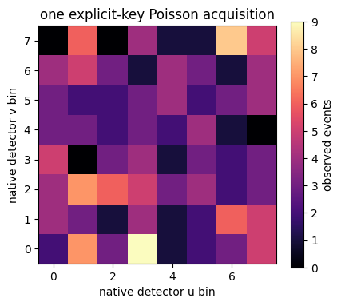
    


### Compare a Central Detector Profile

A one-dimensional profile makes the count fluctuations easier to inspect. Compare the expected and observed values on the same native detector row.


```python
native_u = jnp.arange(expected_map.shape[0])
fig, ax = plt.subplots(figsize=(5.8, 3.6))
ax.plot(native_u, expected_map[:, 4], marker="o", label="expected")
ax.step(native_u, observed_map[:, 4], where="mid", label="observed")
ax.set_xlabel("native detector u bin")
ax.set_ylabel("events after the energy sum")
ax.set_title("central detector profile")
ax.legend()
plt.show()
```


    
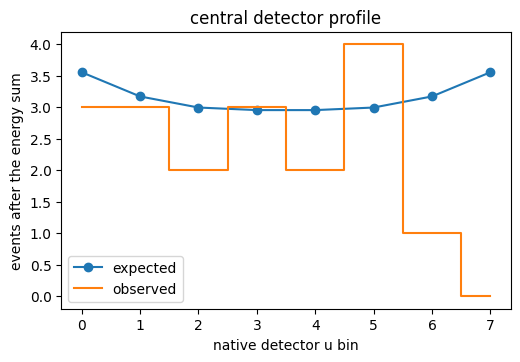
    


### Compare the Native Energy-Bin Totals

Sum the two detector-position axes and retain the native energy bins. This final view checks where the acquisition records its events.


```python
expected_energy_counts = detector.expected_counts[0].sum(axis=(0, 1))
observed_energy_counts = observed_counts[0].sum(axis=(0, 1))
native_energy_bin = jnp.arange(expected_energy_counts.shape[0])
fig, ax = plt.subplots(figsize=(5.8, 3.6))
ax.plot(native_energy_bin, expected_energy_counts, marker="o", label="expected")
ax.step(native_energy_bin, observed_energy_counts, where="mid", label="observed")
ax.set_xlabel("native detector energy bin")
ax.set_ylabel("events after the momentum sum")
ax.set_title("detector count spectrum")
ax.legend()
plt.show()
```


    
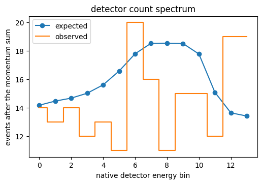
    


## 5. Keep the Inference Boundary Explicit

Fit or design against the expected-count carrier. Call the sampler only when a simulated acquisition realization is necessary.

Read the [spectral broadening guide](../guides/spectral-broadening-and-self-energy.md) for self-energy choices. Use [native tight-binding models](tight-binding-models.md) for richer orbital bases.
