# Geometry and Kinematics for an ARPES Experiment

Build a graphene momentum path and connect it to an ARPES geometry. This lesson shows each coordinate frame, the $k_z$ response, and its sensitivities.


```python
import jax
import jax.numpy as jnp
import matplotlib.pyplot as plt

from diffpes.simul import (
    kz_from_inner_potential,
    lab_polarization_to_sample,
    polarization_from_angles,
    polarization_to_spherical,
    sample_azimuth_rotation,
)
from diffpes.tightb import (
    build_bz_mesh,
    build_kpath,
    kpath_arc_length,
    kpoints_frac_to_cart,
)
from diffpes.types import make_crystal_geometry, make_experiment_geometry
```

## 1. Record the Geometry Assumptions

Use graphene as a transparent coordinate example. The model uses a 2.46 Angstrom in-plane lattice and a 20 Angstrom repeat along $z$.

The long third vector separates the repeated sheets. The experiment uses 50 eV photons, p polarization, and a 12 eV inner potential.


```python
a = 2.46
c = 20.0
lattice = jnp.array(
    [
        [a, 0.0, 0.0],
        [-0.5 * a, 0.5 * jnp.sqrt(3.0) * a, 0.0],
        [0.0, 0.0, c],
    ]
)
positions = jnp.array([[0.0, 0.0, 0.0], [1.0 / 3.0, 2.0 / 3.0, 0.0]])
crystal = make_crystal_geometry(lattice, positions, ("C", "C"))
polarization = polarization_from_angles(0.75, 0.0, "p")
experiment = make_experiment_geometry(
    50.0,
    polarization,
    incidence_theta=0.75,
    incidence_phi=0.0,
    inner_potential_ev=12.0,
)
print("reciprocal-row units: 1/Angstrom")
print("polarization norm:", float(jnp.linalg.norm(experiment.polarization)))
```

    reciprocal-row units: 1/Angstrom
    polarization norm: 1.0


### Inspect the Real-Space Basis

The lattice carrier stores real-space vectors as matrix rows. Plot the two in-plane rows before any reciprocal-space construction.


```python
fig, ax = plt.subplots(figsize=(5.4, 4.4))
origin = jnp.zeros(2)
for index, color in enumerate(("tab:blue", "tab:orange")):
    ax.quiver(
        origin[0],
        origin[1],
        crystal.lattice[index, 0],
        crystal.lattice[index, 1],
        angles="xy",
        scale_units="xy",
        scale=1.0,
        color=color,
        label=rf"$a_{index + 1}$",
    )
ax.set_xlim(-1.5, 3.0)
ax.set_ylim(-0.3, 2.6)
ax.set_xlabel(r"$x$ (Angstrom)")
ax.set_ylabel(r"$y$ (Angstrom)")
ax.set_title("real-space lattice rows")
ax.set_aspect("equal")
ax.legend()
plt.show()
```


    
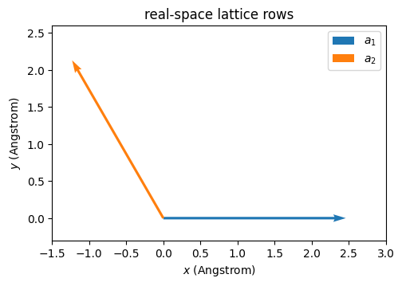
    


### Inspect the Reciprocal Basis

The crystal factory derives the reciprocal rows from the real-space carrier. These rows define all later Cartesian momentum values.


```python
fig, ax = plt.subplots(figsize=(5.4, 4.4))
for index, color in enumerate(("tab:green", "tab:red")):
    ax.quiver(
        origin[0],
        origin[1],
        crystal.reciprocal[index, 0],
        crystal.reciprocal[index, 1],
        angles="xy",
        scale_units="xy",
        scale=1.0,
        color=color,
        label=rf"$b_{index + 1}$",
    )
ax.set_xlim(-0.4, 3.4)
ax.set_ylim(-0.4, 3.4)
ax.set_xlabel(r"$k_x$ ($\AA^{-1}$)")
ax.set_ylabel(r"$k_y$ ($\AA^{-1}$)")
ax.set_title("reciprocal lattice rows")
ax.set_aspect("equal")
ax.legend()
plt.show()
```


    
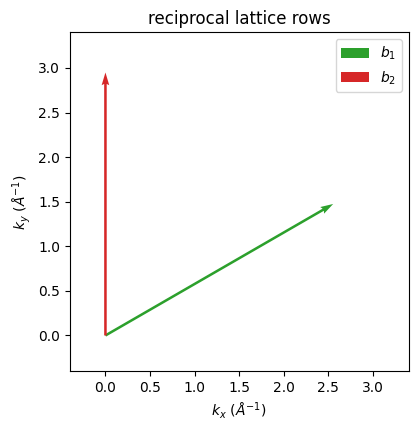
    


## 2. Build the Momentum Path and Zone Mesh

Follow the standard $\Gamma$-$K$-$M$-$\Gamma$ path. The path builder returns fractional coordinates and explicit anchor metadata.

Use the public conversion before a Cartesian distance or direction calculation. The zone builder marks points inside the first reciprocal zone.


```python
anchors = jnp.array(
    [
        [0.0, 0.0, 0.0],
        [1.0 / 3.0, 1.0 / 3.0, 0.0],
        [0.5, 0.0, 0.0],
        [0.0, 0.0, 0.0],
    ]
)
path = build_kpath(anchors, crystal, 41, ("Gamma", "K", "M", "Gamma"))
distance = kpath_arc_length(path, crystal)
path_cartesian = kpoints_frac_to_cart(path.kpoints, crystal)
grid, first_zone = build_bz_mesh(crystal, 17, shell_radius=11)
grid_cartesian = kpoints_frac_to_cart(grid.kpoints, crystal)
print("path points:", path.kpoints.shape[0])
print("first-zone mesh points:", int(first_zone.sum()))
```

    path points: 123
    first-zone mesh points: 657


### Confirm the Path Inside the First Zone

The grey points show the accepted first-zone mesh. The red line shows the requested experimental cut through the high-symmetry anchors.


```python
fig, ax = plt.subplots(figsize=(6.0, 5.0))
ax.scatter(
    grid_cartesian[first_zone, 0],
    grid_cartesian[first_zone, 1],
    s=6,
    color="0.7",
)
ax.plot(path_cartesian[:, 0], path_cartesian[:, 1], color="tab:red")
ax.set_xlabel(r"$k_x$ ($\AA^{-1}$)")
ax.set_ylabel(r"$k_y$ ($\AA^{-1}$)")
ax.set_title(r"first zone and $\Gamma$-$K$-$M$-$\Gamma$ path")
ax.set_aspect("equal")
plt.show()
```


    
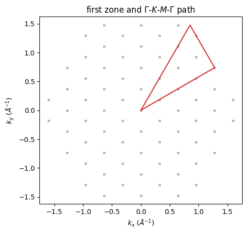
    


### Check the Cartesian Path Distance

The horizontal coordinate for a band cut must use Cartesian arc length. The monotonic curve confirms the ordered distance along all three segments.


```python
fig, ax = plt.subplots(figsize=(6.0, 3.5))
ax.plot(jnp.arange(distance.shape[0]), distance, color="tab:purple")
for label_index in path.label_indices:
    ax.axvline(label_index, color="0.75", linewidth=0.8)
ax.set_xlabel("path sample index")
ax.set_ylabel(r"arc length ($\AA^{-1}$)")
ax.set_title("Cartesian distance along the momentum path")
plt.show()
```


    
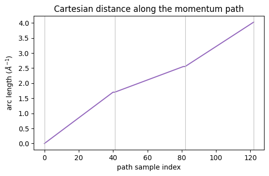
    


### Retain the Fractional Coordinates

The carrier also retains each fractional component. This view makes the segment directions auditable before the Hamiltonian uses them.


```python
fig, ax = plt.subplots(figsize=(6.0, 3.8))
ax.plot(distance, path.kpoints[:, 0], label=r"fractional $k_1$")
ax.plot(distance, path.kpoints[:, 1], label=r"fractional $k_2$")
ax.set_xlabel(r"arc length ($\AA^{-1}$)")
ax.set_ylabel("fractional coordinate")
ax.set_title("fractional coordinates along the path")
ax.legend()
plt.show()
```


    
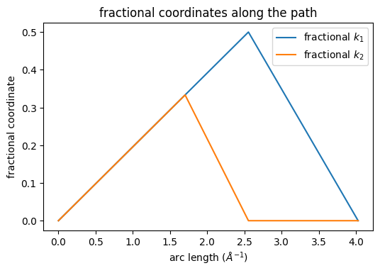
    


## 3. Inspect the Inner-Potential Response

Vary $V_0$ at fixed parallel momentum. The public kinematic operation returns the complex $k_z$ value and a propagating-channel mask.

The 20--150 eV range spans a typical photon-energy scan. The three curves expose the geometry uncertainty without changing another parameter.


```python
photon_energy = jnp.linspace(20.0, 150.0, 100)
k_parallel = jnp.asarray(0.5)
inner_potentials = jnp.asarray([8.0, 12.0, 16.0])
kz_values, propagating = jax.vmap(
    jax.vmap(
        kz_from_inner_potential,
        in_axes=(0, None, None, None, None),
    ),
    in_axes=(None, None, 0, None, None),
)(
    photon_energy,
    experiment.work_function_ev,
    inner_potentials,
    jnp.asarray(0.0),
    k_parallel,
)
kz_curves = jnp.real(kz_values)
print("all channels propagate:", bool(jnp.all(propagating)))
```

    all channels propagate: True


### Compare the Three Inner Potentials

Each curve gives the sampled $k_z$ in inverse Angstroms. The separation shows how an inner-potential estimate changes a photon-energy scan.


```python
fig, ax = plt.subplots(figsize=(6.0, 4.0))
for inner_potential, values in zip(inner_potentials, kz_curves, strict=True):
    ax.plot(
        photon_energy, values, label=rf"$V_0={float(inner_potential):.0f}$ eV"
    )
ax.set_xlabel(r"$h\nu$ (eV)")
ax.set_ylabel(r"$k_z$ ($\AA^{-1}$)")
ax.set_title(r"inner-potential response at $k_\parallel=0.5$ $\AA^{-1}$")
ax.legend()
plt.show()
```


    
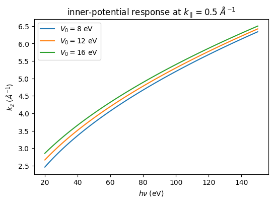
    


### Measure the Offset from the Nominal Curve

Use the 12 eV curve as the declared nominal geometry. The signed offsets show the systematic $k_z$ shift across the scan.


```python
kz_offsets = kz_curves - kz_curves[1]
fig, ax = plt.subplots(figsize=(6.0, 3.8))
ax.plot(photon_energy, kz_offsets[0], label=r"$V_0=8$ eV")
ax.plot(photon_energy, kz_offsets[2], label=r"$V_0=16$ eV")
ax.axhline(0.0, color="0.5", linewidth=0.8)
ax.set_xlabel(r"$h\nu$ (eV)")
ax.set_ylabel(r"$k_z-k_z(12\,\mathrm{eV})$ ($\AA^{-1}$)")
ax.set_title("inner-potential offsets from the nominal geometry")
ax.legend()
plt.show()
```


    
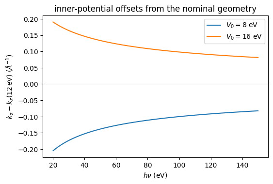
    


## 4. Follow the Polarization Through the Sample Frame

Map the fixed laboratory amplitude through the inverse sample orientation. The Cartesian components show what the sample receives from the beamline geometry.


```python
sample_orientation = sample_azimuth_rotation(experiment.sample_azimuth)
polarization_sample = lab_polarization_to_sample(
    experiment.polarization,
    sample_orientation,
)
spherical = polarization_to_spherical(polarization_sample)
print("sample-frame polarization norm:", float(jnp.linalg.norm(polarization_sample)))
```

    sample-frame polarization norm: 1.0


### Compare the Cartesian Amplitudes

Complex amplitudes carry phase information. Plot the real and imaginary parts separately before any modulus-square display reduction.


```python
component_index = jnp.arange(3)
fig, ax = plt.subplots(figsize=(5.6, 3.8))
ax.bar(component_index - 0.18, jnp.real(polarization_sample), 0.36, label="real")
ax.bar(component_index + 0.18, jnp.imag(polarization_sample), 0.36, label="imaginary")
ax.set_xticks(component_index, (r"$x$", r"$y$", r"$z$"))
ax.set_ylabel("sample-frame amplitude")
ax.set_title("complex Cartesian polarization")
ax.legend()
plt.show()
```


    
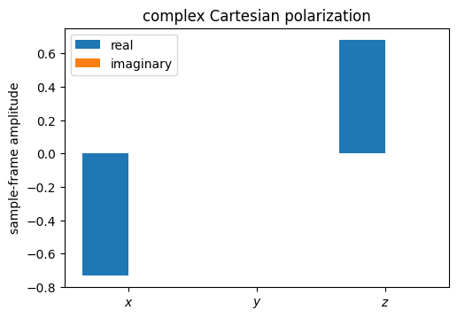
    


### Inspect the Spherical Weights Across the Analyser

Analyser angles rotate emission directions, not the incident beam. The spherical beam weights therefore stay fixed across these detector pixels.


```python
tx = jnp.deg2rad(jnp.linspace(-15.0, 15.0, 61))
weights = jnp.broadcast_to(jnp.abs(spherical) ** 2, (tx.shape[0], 3))
fig, ax = plt.subplots(figsize=(6.0, 4.0))
for index, label in enumerate(("q=-1", "q=0", "q=+1")):
    ax.plot(jnp.rad2deg(tx), weights[:, index], label=label)
ax.set_xlabel(r"$t_x$ (degrees)")
ax.set_ylabel(r"$|\epsilon_q|^2$")
ax.set_title("fixed beam weights across analyser angles")
ax.legend()
plt.show()
```


    
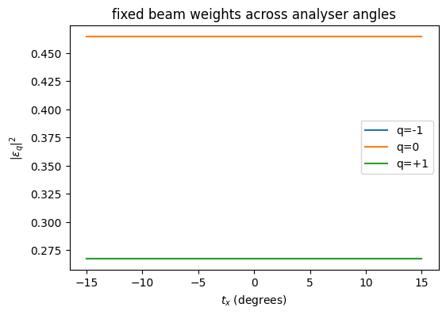
    


### Rotate the Sample Azimuth

A sample azimuth changes the beam components in the sample frame. This scan isolates that controlled geometry change from analyser coordinates.


```python
azimuth_values = jnp.deg2rad(jnp.linspace(-45.0, 45.0, 91))
azimuth_rotations = jax.vmap(sample_azimuth_rotation)(azimuth_values)
azimuth_polarizations = jax.vmap(
    lab_polarization_to_sample, in_axes=(None, 0)
)(experiment.polarization, azimuth_rotations)
azimuth_spherical = jax.vmap(polarization_to_spherical)(azimuth_polarizations)
azimuth_weights = jnp.abs(azimuth_spherical) ** 2
```

The three curves preserve their total weight while the sample rotates. Their exchange records how the fixed beam projects onto sample spherical channels.


```python
fig, ax = plt.subplots(figsize=(6.0, 4.0))
for index, label in enumerate(("q=-1", "q=0", "q=+1")):
    ax.plot(jnp.rad2deg(azimuth_values), azimuth_weights[:, index], label=label)
ax.set_xlabel("sample azimuth (degrees)")
ax.set_ylabel(r"$|\epsilon_q|^2$")
ax.set_title("spherical weights during sample rotation")
ax.legend()
plt.show()
```


    
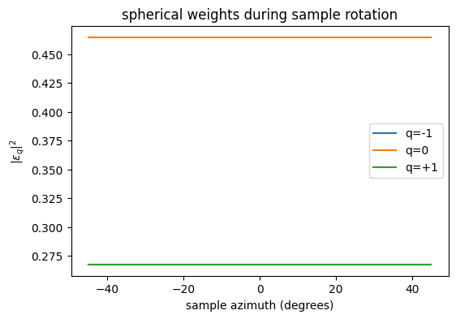
    


## 5. Build Geometry Directional Derivatives

Differentiate one photon-energy scan with respect to photon energy, $V_0$, and the work function. These slopes form a geometry information block.

The public operation stays unchanged. The directional derivatives expose which calibration variables can move the same measured $k_z$ values.


```python
scan_energy = jnp.linspace(25.0, 100.0, 8)
scan_operation = jax.vmap(
    kz_from_inner_potential,
    in_axes=(0, None, None, None, None),
)
zero = jnp.asarray(0.0)
scan_primals = (
    scan_energy,
    experiment.work_function_ev,
    experiment.inner_potential_ev,
    zero,
    k_parallel,
)
_, photon_tangent = jax.jvp(
    scan_operation,
    scan_primals,
    (jnp.ones_like(scan_energy), zero, zero, zero, zero),
)
_, inner_tangent = jax.jvp(
    scan_operation,
    scan_primals,
    (jnp.zeros_like(scan_energy), zero, jnp.asarray(1.0), zero, zero),
)
_, work_tangent = jax.jvp(
    scan_operation,
    scan_primals,
    (jnp.zeros_like(scan_energy), jnp.asarray(1.0), zero, zero, zero),
)
geometry_slopes = jnp.stack(
    (
        jnp.real(photon_tangent[0]),
        jnp.real(inner_tangent[0]),
        jnp.real(work_tangent[0]),
    ),
    axis=-1,
)
print("slope table shape:", geometry_slopes.shape)
```

    slope table shape: (8, 3)


### Compare the Three Geometry Slopes

The positive $V_0$ slope and negative work-function slope show an opposing calibration response. The photon-energy slope sets the scan-axis sensitivity.


```python
fig, ax = plt.subplots(figsize=(6.0, 4.0))
ax.plot(scan_energy, geometry_slopes[:, 0], marker="o", label=r"$h\nu$ axis")
ax.plot(scan_energy, geometry_slopes[:, 1], marker="s", label=r"$V_0$")
ax.plot(scan_energy, geometry_slopes[:, 2], marker="^", label="work function")
ax.axhline(0.0, color="0.5", linewidth=0.8)
ax.set_xlabel(r"$h\nu$ (eV)")
ax.set_ylabel(r"directional slope ($\AA^{-1}$ eV$^{-1}$)")
ax.set_title("geometry sensitivities of the photon-energy scan")
ax.legend()
plt.show()
```


    
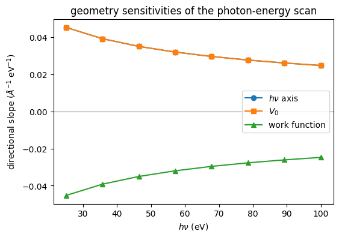
    


## 6. Interpret the Geometry Chain

The lesson keeps fractional momentum, Cartesian momentum, beam polarization, and detector angles distinct. Each public carrier records one boundary in that chain.

The [geometry guide](../guides/arpes-geometry-and-kinematics.md) gives the validity domain. It also explains the work-function and Fermi-level gauge.
